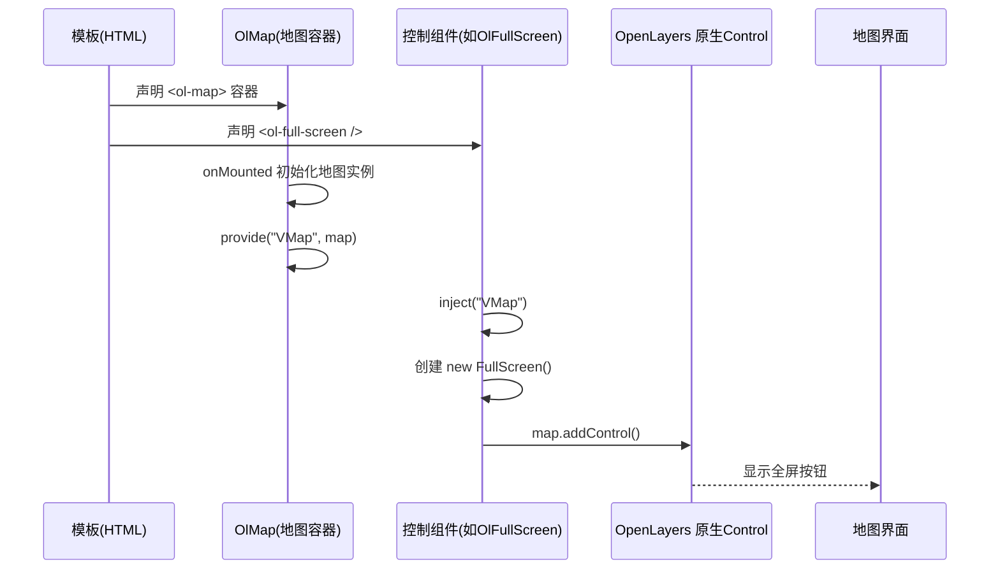
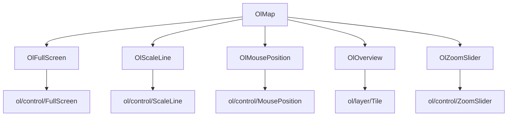

# 控制组件

<cite>
**本文档引用的文件**  
- [FullScreen/index.vue](file://src/packages/controls/FullScreen/index.vue)
- [ScaleLine/index.vue](file://src/packages/controls/ScaleLine/index.vue)
- [MousePosition/index.vue](file://src/packages/controls/MousePosition/index.vue)
- [OverviewMap/index.vue](file://src/packages/controls/OverviewMap/index.vue)
- [ZoomSlider/index.vue](file://src/packages/controls/ZoomSlider/index.vue)
- [index.vue](file://src/packages/map/index.vue)
- [components.ts](file://src/packages/components.ts)
- [mousePosition/index.vue](file://src/examples/mousePosition/index.vue)
- [overview/index.vue](file://src/examples/overview/index.vue)
- [controls/index.vue](file://src/examples/controls/index.vue)
</cite>

## 目录
1. [简介](#简介)
2. [项目结构](#项目结构)
3. [核心组件](#核心组件)
4. [架构概述](#架构概述)
5. [详细组件分析](#详细组件分析)
6. [依赖关系分析](#依赖关系分析)
7. [性能考虑](#性能考虑)
8. [故障排除指南](#故障排除指南)
9. [结论](#结论)

## 简介
本文档详细介绍了基于 OpenLayers 的 Vue 组件库中五种地图控制组件的实现原理与集成方式：全屏（OlFullScreen）、比例尺（OlScaleLine）、鼠标位置（OlMousePosition）、鹰眼图（OlOverview）和缩放滑块（OlZoomSlider）。这些组件作为 `OlMap` 的子组件，通过依赖注入机制与地图实例同步，并封装了 OpenLayers 原生 Control 类的功能。文档将结合源码与示例，说明其配置选项、布局定位、样式定制及事件交互机制。

## 项目结构
项目采用模块化设计，控制组件集中存放于 `/src/packages/controls/` 目录下，每个组件包含独立的 `index.vue` 和 `index.ts` 文件。`OlMap` 组件作为地图容器，通过 `provide/inject` 机制向子组件提供地图实例（`VMap`），使得控制组件能够动态注入到地图界面中。

```mermaid
graph TB
subgraph "控制组件目录"
FullScreen[全屏控制]
ScaleLine[比例尺控制]
MousePosition[鼠标位置]
OverviewMap[鹰眼图]
ZoomSlider[缩放滑块]
end
OlMap[OlMap 地图容器] --> FullScreen
OlMap --> ScaleLine
OlMap --> MousePosition
OlMap --> OverviewMap
OlMap --> ZoomSlider
FullScreen --> "ol/control/FullScreen"
ScaleLine --> "ol/control/ScaleLine"
MousePosition --> "ol/control/MousePosition"
OverviewMap --> "ol/layer/Tile"
ZoomSlider --> "ol/control/ZoomSlider"
```

**图示来源**  
- [src/packages/controls](file://src/packages/controls)
- [src/packages/map/index.vue](file://src/packages/map/index.vue)

## 核心组件
控制组件通过 Vue 的 `setup` 语法和响应式 API 实现动态初始化与销毁。所有组件均通过 `inject("VMap")` 获取父级 `OlMap` 实例，并在其 `onMounted` 或 `watchEffect` 中创建 OpenLayers 原生 Control 对象并添加至地图。组件支持属性配置、插槽扩展和响应式更新。

**组件来源**  
- [components.ts](file://src/packages/components.ts#L30-L95)
- [map/index.vue](file://src/packages/map/index.vue#L1-L219)

## 架构概述
控制组件遵循“声明式注入”模式，开发者在模板中以组件形式声明控制项，系统自动完成与地图实例的绑定。该架构解耦了地图核心与 UI 控件，提升了可维护性与复用性。



**图示来源**  
- [FullScreen/index.vue](file://src/packages/controls/FullScreen/index.vue#L1-L34)
- [map/index.vue](file://src/packages/map/index.vue#L1-L219)

## 详细组件分析

### 全屏控制 (OlFullScreen)
全屏组件封装了 OpenLayers 的 `FullScreen` 控件，允许用户将地图切换至全屏模式。

#### 配置选项
- `className`: 自定义 CSS 类名
- `label`: 按钮文本（进入全屏）
- `labelActive`: 按钮文本（退出全屏）
- `tipLabel`: 悬停提示文本
- `keys`: 是否监听键盘 ESC 键退出

#### 实现机制
组件通过 `watchEffect` 监听属性变化，自动移除并重新初始化控件以确保配置生效。

```vue
<ol-full-screen :label="'⛶'" :label-active="'⛶'" :tip-label="'全屏'" />
```

**组件来源**  
- [FullScreen/index.vue](file://src/packages/controls/FullScreen/index.vue#L1-L34)

### 比例尺控制 (OlScaleLine)
比例尺组件显示当前视图下的距离标尺，支持公制和英制单位。

#### 配置选项
- `className`: CSS 类名
- `minWidth`: 最小宽度（像素）
- `target`: 渲染目标 DOM 元素
- `units`: 单位（'metric', 'us', 'nautical'）

#### 实现机制
组件继承 `ScaleLine` 并通过 `props` 透传配置，自动响应地图缩放变化。

```vue
<ol-scale-line :units="'metric'" />
```

**组件来源**  
- [ScaleLine/index.vue](file://src/packages/controls/ScaleLine/index.vue#L1-L32)

### 鼠标位置控制 (OlMousePosition)
显示鼠标指针当前地理坐标，支持自定义格式化函数。

#### 配置选项
- `coordinateFormat`: 坐标格式化精度（默认6位小数）
- `projection`: 坐标系（如 EPSG:4326）
- `undefinedHTML`: 无坐标时显示内容

#### 格式化实现
使用 `createStringXY` 工具函数生成格式化器：
```ts
coordinateFormat: createStringXY(Number(props.coordinateFormat))
```

#### 样式定制
内置 CSS 样式控制位置与外观：
```css
.ol-mouse-position {
  top: 96%;
  right: 92%;
  background-color: rgba(0, 0, 0, 0.5);
  color: #fff;
}
```

**组件来源**  
- [MousePosition/index.vue](file://src/packages/controls/MousePosition/index.vue#L1-L50)
- [mousePosition/index.vue](file://src/examples/mousePosition/index.vue)

### 鹰眼图控制 (OlOverview)
提供一个缩略图形式的全局视图，帮助用户定位当前视野范围。

#### 配置选项
- `tileType`: 底图类型（如 TDT 天地图）
- `layerId`: 图层唯一标识
- `collapsed`: 是否默认折叠
- `collapsible`: 是否可折叠

#### 实现机制
组件依赖 `useTileLayer` Hook 初始化缩略图图层，并通过 `setOverviewMapOptions` 动态配置。

```vue
<ol-overview :tile-type="'TDT'" :collapsed="false" />
```

**组件来源**  
- [OverviewMap/index.vue](file://src/packages/controls/OverviewMap/index.vue#L1-L35)
- [overview/index.vue](file://src/examples/overview/index.vue)

### 缩放滑块控制 (OlZoomSlider)
提供垂直滑块用于调整地图缩放级别。

#### 配置选项
- `className`: 自定义类名
- `duration`: 动画持续时间（毫秒）

#### 实现机制
封装 `ZoomSlider` 控件，通过 `watchEffect` 实现响应式更新。

```vue
<ol-zoom-slider :duration="300" />
```

**组件来源**  
- [ZoomSlider/index.vue](file://src/packages/controls/ZoomSlider/index.vue#L1-L36)

## 依赖关系分析
控制组件依赖于 `OlMap` 提供的地图实例，通过 `inject("VMap")` 获取。各组件独立封装 OpenLayers 原生 Control 类，形成清晰的依赖层级。



**图示来源**  
- [components.ts](file://src/packages/components.ts#L30-L95)
- [map/index.vue](file://src/packages/map/index.vue#L1-L219)

## 性能考虑
- 所有控制组件使用 `shallowRef` 管理实例，避免深度响应式开销。
- `watchEffect` 确保配置变更时及时更新控件，但需注意频繁更新可能触发多次 `addControl/removeControl`。
- 鹰眼图使用独立图层，建议选择轻量级底图以减少资源消耗。

## 故障排除指南
- **控制组件未显示**：检查是否被正确嵌套在 `<ol-map>` 内部。
- **坐标显示异常**：确认 `projection` 与地图视图坐标系一致。
- **全屏失效**：浏览器安全策略可能阻止全屏 API，需用户手动触发。
- **样式不生效**：确保未被全局样式覆盖，可使用深度选择器或提升优先级。

**组件来源**  
- [map/index.vue](file://src/packages/map/index.vue#L1-L219)
- [MousePosition/index.vue](file://src/packages/controls/MousePosition/index.vue#L1-L50)

## 结论
本文档系统性地解析了五种地图控制组件的实现机制与集成方式。这些组件通过 Vue 的组合式 API 与依赖注入，实现了与 OpenLayers 原生功能的无缝对接。开发者可通过属性配置快速定制功能与样式，适用于各类地理信息应用的开发需求。