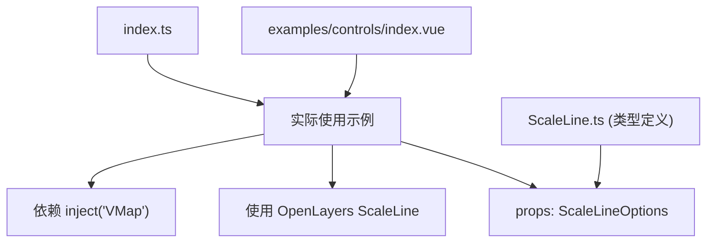
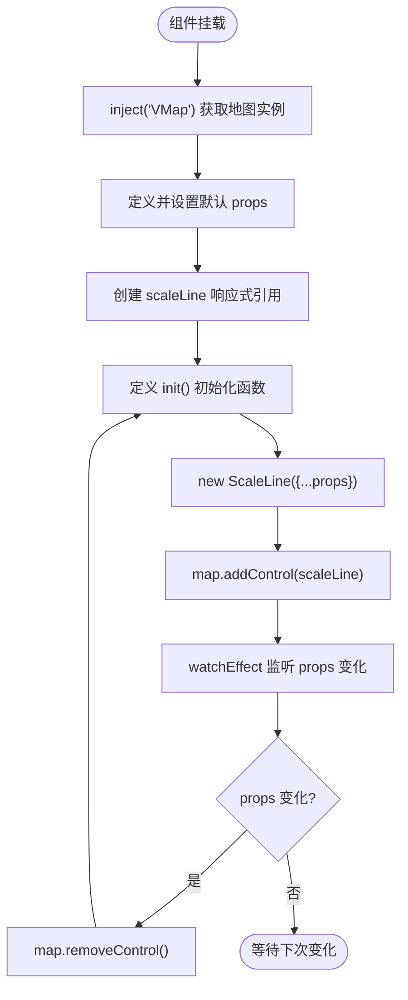

# 比例尺控制 (OlScaleLine)

<cite>
**本文档引用文件**  
- [index.vue](file://src/packages/controls/ScaleLine/index.vue#L1-L32)
- [ScaleLine.ts](file://src/packages/types/ScaleLine.ts#L1-L6)
- [index.ts](file://src/packages/controls/ScaleLine/index.ts#L1-L7)
- [index.vue](file://src/examples/controls/index.vue#L1-L35)
</cite>

## 目录
1. [简介](#简介)
2. [项目结构](#项目结构)
3. [核心组件分析](#核心组件分析)
4. [属性与配置机制](#属性与配置机制)
5. [自动更新机制](#自动更新机制)
6. [示例应用](#示例应用)
7. [样式自定义](#样式自定义)
8. [投影坐标系下的准确性保障](#投影坐标系下的准确性保障)
9. [总结](#总结)

## 简介
`OlScaleLine` 是一个基于 OpenLayers 的 `ScaleLine` 控件封装的 Vue 组件，用于在地图界面上动态显示当前视图的比例尺。该组件支持多种单位（metric、us、nautical），可配置为条形或文本形式，并能自动响应地图视图变化实时更新显示值。本文档将深入解析其内部实现机制、属性作用、使用方式及扩展能力。

## 项目结构
`OlScaleLine` 组件位于项目的 `/src/packages/controls/ScaleLine/` 目录下，包含三个核心文件：
- `index.vue`：主组件实现
- `index.ts`：组件注册逻辑
- 类型定义通过 `types/ScaleLine.ts` 引入 OpenLayers 原生类型

该组件遵循 Vue 3 的 Composition API 风格，利用 `defineProps` 接收配置项，并通过依赖注入获取地图实例。



**图示来源**
- [index.vue](file://src/packages/controls/ScaleLine/index.vue#L1-L32)
- [ScaleLine.ts](file://src/packages/types/ScaleLine.ts#L1-L6)
- [index.ts](file://src/packages/controls/ScaleLine/index.ts#L1-L7)
- [index.vue](file://src/examples/controls/index.vue#L1-L35)

## 核心组件分析
`OlScaleLine` 的核心逻辑集中在 `index.vue` 文件中，采用 `<script setup>` 语法糖实现响应式控制。

### 组件初始化流程


**图示来源**
- [index.vue](file://src/packages/controls/ScaleLine/index.vue#L1-L32)

### 关键代码解析
```typescript
const VMap = inject("VMap") as OlMap;
const map = unref(VMap).map;
```
通过依赖注入从父级地图组件获取 `OlMap` 实例，确保与当前地图上下文一致。

```typescript
const props = withDefaults(defineProps<ScaleLineOptions>(), {});
```
使用 `defineProps` 定义组件属性接口，继承自 OpenLayers 的 `ScaleLineOptions` 类型，支持所有原生配置项。

```typescript
const init = () => {
  scaleLine.value = new ScaleLine({ ...props });
  map.addControl(scaleLine.value);
};
```
创建 OpenLayers 原生 `ScaleLine` 实例并添加到地图控件列表中。

```typescript
watchEffect(() => {
  if (scaleLine.value) map.removeControl(scaleLine.value);
  init();
});
```
使用 `watchEffect` 自动监听所有响应式依赖（即 `props`），当任意属性变化时重新初始化控件，保证配置即时生效。

**组件来源**
- [index.vue](file://src/packages/controls/ScaleLine/index.vue#L1-L32)

## 属性与配置机制
`ScaleLineOptions` 类型源自 OpenLayers 的 `ol/control/ScaleLine` 模块，支持以下关键属性：

### 主要属性说明
:renderer: 自定义渲染函数，允许完全控制比例尺的 DOM 结构和绘制逻辑。适用于需要非标准视觉表现的场景。

:units: 指定比例尺单位，可选值包括：
- `"metric"`：公制（米、千米）
- `"us"`：英制（英尺、英里）
- `"nautical"`：海里制

:bar: 布尔值，是否显示条形比例尺（默认 `false`）。

:text: 布尔值，是否显示文本格式的比例值（默认 `false`）。

:steps: 数值，定义条形比例尺的分段数量（仅在 `bar: true` 时有效）。

: minWidth: 数值，比例尺最小显示宽度（像素）。

这些属性通过 `withDefaults` 传入 `new ScaleLine()` 构造函数，实现灵活配置。

**属性来源**
- [ScaleLine.ts](file://src/packages/types/ScaleLine.ts#L1-L4)
- [index.vue](file://src/packages/controls/ScaleLine/index.vue#L1-L32)

## 自动更新机制
`OlScaleLine` 利用 `watchEffect` 实现了自动重绘机制：

1. `watchEffect` 会自动追踪 `props` 中所有被访问的响应式字段
2. 当任一 prop 发生变化（如 `units` 切换、`bar` 启用等），回调函数触发
3. 先移除旧的 `ScaleLine` 控件
4. 调用 `init()` 重建新控件并添加至地图

此机制确保了组件状态与地图控件的一致性，无需手动调用刷新方法。

此外，OpenLayers 内部会自动监听地图视图（View）的分辨率变化，并在每次渲染帧中更新比例尺显示值，因此用户缩放或平移地图时，比例尺实时动态更新。

**机制来源**
- [index.vue](file://src/packages/controls/ScaleLine/index.vue#L1-L32)

## 示例应用
在 `/src/examples/controls/index.vue` 中展示了 `OlScaleLine` 的典型用法：

```vue
<ol-map :controls="controls">
  <ol-tile tile-type="BAIDU"></ol-tile>
  <ol-scale-line></ol-scale-line>
</ol-map>
```

该示例中：
- 使用 `<ol-map>` 创建地图容器
- 添加百度地图瓦片图层
- 注册 `<ol-scale-line>` 组件，默认显示公制文本比例尺

虽然未显式配置 `bar` 或 `units`，但组件会使用 OpenLayers 的默认行为（通常为 metric 文本模式）。

**示例来源**
- [index.vue](file://src/examples/controls/index.vue#L1-L35)

## 样式自定义
尽管 `OlScaleLine` 本身没有提供内联样式，但可通过 CSS 深度定制其外观。OpenLayers 生成的比例尺 DOM 结构具有固定类名，例如：
- `.ol-scale-line`：外层容器
- `.ol-scale-line-inner`：条形部分
- `.ol-scale-text`：文本部分

可通过全局 CSS 覆盖样式，例如：

```css
.ol-scale-line {
  background: rgba(255, 255, 255, 0.8);
  border: 1px solid #ccc;
  border-radius: 4px;
  font-family: "Arial", sans-serif;
}

.ol-scale-line-inner {
  background-image: linear-gradient(to right, #4CAF50, #8BC34A);
}
```

建议在项目全局样式文件中定义，避免使用 `scoped` 样式导致无法穿透。

**样式来源**
- [index.vue](file://src/packages/controls/ScaleLine/index.vue#L1-L32)

## 投影坐标系下的准确性保障
`OlScaleLine` 的准确性依赖于 OpenLayers 的底层计算机制：

1. OpenLayers 根据当前地图视图的投影（Projection）自动选择合适的单位换算公式
2. 在 Web 墨卡托（EPSG:3857）等常用投影中，比例尺会基于纬度进行动态校正
3. 对于非等距投影，OpenLayers 会在视图中心点附近计算局部比例关系，确保显示值接近真实距离

因此，只要地图使用的是 OpenLayers 支持的标准投影，`OlScaleLine` 即可保证高精度显示。开发者无需额外处理坐标转换逻辑。

**准确性来源**
- [index.vue](file://src/packages/controls/ScaleLine/index.vue#L1-L32)
- OpenLayers 框架内部实现（`ol/control/ScaleLine`）

## 总结
`OlScaleLine` 是一个轻量且功能完整的比例尺控件封装，具备以下特点：
- 完全兼容 OpenLayers 原生 `ScaleLine` 所有配置项
- 支持 metric、us、nautical 多种单位制
- 可配置条形与文本混合显示模式
- 利用 `watchEffect` 实现属性变更自动更新
- 通过标准 CSS 类名支持深度样式定制
- 在各种投影下保持比例计算准确性

结合示例代码，开发者可快速集成并根据设计需求进行个性化调整。