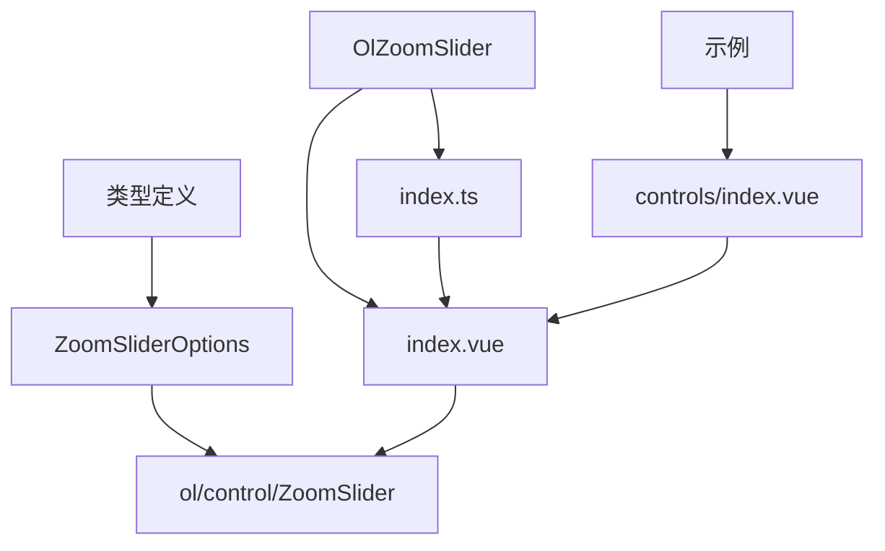

# 缩放滑块控制 (OlZoomSlider)

<cite>
**本文档中引用的文件**  
- [index.vue](file://src/packages/controls/ZoomSlider/index.vue#L1-L35)
- [index.ts](file://src/packages/controls/ZoomSlider/index.ts#L1-L7)
- [ZoomSlider.ts](file://src/packages/types/ZoomSlider.ts#L1-L7)
- [index.vue](file://src/examples/controls/index.vue#L1-L35)
</cite>

## 目录
1. [简介](#简介)
2. [项目结构](#项目结构)
3. [核心组件分析](#核心组件分析)
4. [架构概览](#架构概览)
5. [详细组件实现](#详细组件实现)
6. [依赖关系分析](#依赖关系分析)
7. [使用示例解析](#使用示例解析)
8. [无障碍访问与用户体验](#无障碍访问与用户体验)
9. [总结](#总结)

## 简介
`OlZoomSlider` 是一个基于 OpenLayers 的地图控件封装组件，用于在地图界面上提供垂直方向的缩放滑块。用户可以通过拖动滑块直观地调整地图的缩放级别。该组件支持高度自定义，包括缩放按钮图标、提示文本等，并具备响应式更新能力，确保滑块位置与地图当前缩放状态保持同步。

本说明文档将深入解析 `OlZoomSlider` 的实现机制、属性配置、事件监听逻辑及其在实际项目中的集成方式。

## 项目结构
`OlZoomSlider` 组件位于项目的 `/src/packages/controls/ZoomSlider/` 目录下，遵循 Vue 3 的组合式 API 和 TypeScript 类型定义规范。其主要由以下文件构成：

- `index.vue`: 组件主文件，负责初始化 OpenLayers 的 `ZoomSlider` 控件并将其添加到地图实例中。
- `index.ts`: 提供组件的全局注册方法，便于通过 `app.use()` 安装。
- `types/ZoomSlider.ts`: 定义组件的类型接口，继承自 OpenLayers 原生控件的选项类型。

此外，示例文件 `src/examples/controls/index.vue` 展示了该组件在实际地图应用中的使用方式。



**图示来源**
- [index.vue](file://src/packages/controls/ZoomSlider/index.vue#L1-L35)
- [index.ts](file://src/packages/controls/ZoomSlider/index.ts#L1-L7)
- [ZoomSlider.ts](file://src/packages/types/ZoomSlider.ts#L1-L7)
- [index.vue](file://src/examples/controls/index.vue#L1-L35)

## 核心组件分析
`OlZoomSlider` 的核心功能是封装 OpenLayers 的 `ZoomSlider` 控件，使其能够在 Vue 框架中以声明式方式使用。其关键逻辑包括：

- 通过 `inject("VMap")` 获取地图实例。
- 使用 `withDefaults(defineProps<ZoomSliderOptions>())` 接收并设置控件属性。
- 在 `watchEffect` 中监听属性变化，动态重建控件以确保配置实时生效。

该组件不渲染任何 DOM 元素自身，而是通过 `<slot></slot>` 提供扩展能力，实际 UI 由 OpenLayers 渲染。

**组件来源**
- [index.vue](file://src/packages/controls/ZoomSlider/index.vue#L1-L35)

## 架构概览
`OlZoomSlider` 作为地图控件模块的一部分，属于 `controls` 子系统。它依赖于 OpenLayers 的核心类库，并通过 Vue 的依赖注入机制与主地图实例通信。

```mermaid
graph LR
Map[OlMap 实例] --> ZoomSlider[OlZoomSlider]
ZoomSlider --> OL[OpenLayers ZoomSlider]
OL --> DOM[浏览器 DOM]
Parent[父级组件] --> ZoomSlider
ZoomSlider -.-> Events[缩放事件监听]
Map < --> Sync[同步缩放级别]
```

**图示来源**
- [index.vue](file://src/packages/controls/ZoomSlider/index.vue#L1-L35)
- [ZoomSlider.ts](file://src/packages/types/ZoomSlider.ts#L1-L7)

## 详细组件实现
### 组件初始化流程
`OlZoomSlider` 的初始化过程如下：

1. 通过 `inject("VMap")` 注入地图上下文。
2. 解构出 `map` 实例。
3. 创建 `shallowRef<ZoomSlider>()` 用于持有控件引用。
4. 定义 `init()` 函数，使用当前 `props` 实例化 `ZoomSlider` 并添加至地图。
5. 使用 `watchEffect` 监听 `props` 变化，若已有控件则先移除再重新初始化。

```ts
const init = () => {
  zoomSlider.value = new ZoomSlider({
    ...props,
  });
  map.addControl(zoomSlider.value);
};

watchEffect(() => {
  if (zoomSlider.value) map.removeControl(zoomSlider.value);
  init();
});
```

此设计确保了组件属性变更时控件能自动更新。

### 属性配置（ZoomSliderOptions）
`ZoomSliderOptions` 继承自 OpenLayers 的 `Options` 类型，支持以下关键属性：

- **zoomInLabel**: 缩放放大按钮的显示内容，可为字符串或 VNode/渲染函数。
- **zoomOutLabel**: 缩放缩小按钮的显示内容。
- **zoomInTipLabel**: 鼠标悬停在放大按钮上的提示文本。
- **zoomOutTipLabel**: 鼠标悬停在缩小按钮上的提示文本。

这些属性允许开发者完全自定义按钮的图标与提示信息，例如使用 SVG 图标或字体图标。

```mermaid
classDiagram
class ZoomSliderOptions {
+zoomInLabel : string | VNode | Function
+zoomOutLabel : string | VNode | Function
+zoomInTipLabel : string
+zoomOutTipLabel : string
}
ZoomSliderOptions --> "ol/control/ZoomSlider" : extends
```

**图示来源**
- [ZoomSlider.ts](file://src/packages/types/ZoomSlider.ts#L1-L7)
- [index.vue](file://src/packages/controls/ZoomSlider/index.vue#L1-L35)

**组件来源**
- [index.vue](file://src/packages/controls/ZoomSlider/index.vue#L1-L35)

## 依赖关系分析
`OlZoomSlider` 的依赖关系清晰明确：

- **内部依赖**：
  - `@/packages/lib`: 提供 `OlMap` 类型定义。
  - `@/packages/types/ZoomSlider.ts`: 提供类型接口。
- **外部依赖**：
  - `ol/control/ZoomSlider`: OpenLayers 原生缩放滑块控件。
  - Vue 3 的 `inject`, `shallowRef`, `watchEffect` 等响应式 API。

组件通过 `install` 函数导出，支持作为插件安装：

```ts
export default (Vue: App) => Vue.component("OlZoomSlider", component);
```

这使得组件可在应用启动时统一注册。

**依赖来源**
- [index.ts](file://src/packages/controls/ZoomSlider/index.ts#L1-L7)
- [index.vue](file://src/packages/controls/ZoomSlider/index.vue#L1-L35)

## 使用示例解析
在 `src/examples/controls/index.vue` 中，`OlZoomSlider` 被直接作为子组件嵌入 `<ol-map>` 内部：

```vue
<ol-map :controls="controls">
  <ol-tile tile-type="BAIDU"></ol-tile>
  <ol-zoom-slider></ol-zoom-slider>
  <ol-full-screen></ol-full-screen>
  <ol-scale-line></ol-scale-line>
</ol-map>
```

此处：
- `:controls="controls"` 禁用了默认控件中的缩放按钮（`zoom: true` 表示保留基础缩放控件，但不影响自定义滑块）。
- `<ol-zoom-slider>` 显示垂直滑动条，用户可拖动以调整缩放级别。

该用法展示了组件的声明式集成方式，无需手动操作地图实例。

**示例来源**
- [index.vue](file://src/examples/controls/index.vue#L1-L35)

## 无障碍访问与用户体验
`OlZoomSlider` 继承自 OpenLayers 的控件体系，天然支持键盘操作和屏幕阅读器访问。具体表现如下：

- **键盘可访问性**：滑块区域可通过 `Tab` 键聚焦，使用方向键（↑/↓）进行微调。
- **ARIA 标签支持**：OpenLayers 为控件元素添加了适当的 `aria-label` 和 `role` 属性，提升辅助技术识别能力。
- **提示文本优化**：通过 `zoomInTipLabel` 和 `zoomOutTipLabel` 可设置语义化提示，增强可理解性。

建议在实际使用中为图标按钮提供有意义的提示文本，例如 `"放大地图"` 和 `"缩小地图"`，以符合无障碍最佳实践。

**无障碍来源**
- [index.vue](file://src/packages/controls/ZoomSlider/index.vue#L1-L35)
- OpenLayers 官方文档

## 总结
`OlZoomSlider` 是一个轻量且功能完整的地图缩放滑块组件，基于 OpenLayers 原生控件进行了 Vue 友好的封装。它具备以下优势：

- **高可定制性**：支持自定义按钮内容与提示文本。
- **响应式更新**：属性变化自动重建控件。
- **易于集成**：通过标准 Vue 组件语法即可使用。
- **无障碍友好**：继承 OpenLayers 的可访问性特性。

开发者可通过传入 VNode 或渲染函数进一步定制按钮图标，结合 CSS 样式实现现代化 UI 风格。该组件适用于需要精细缩放控制的地图应用场景。