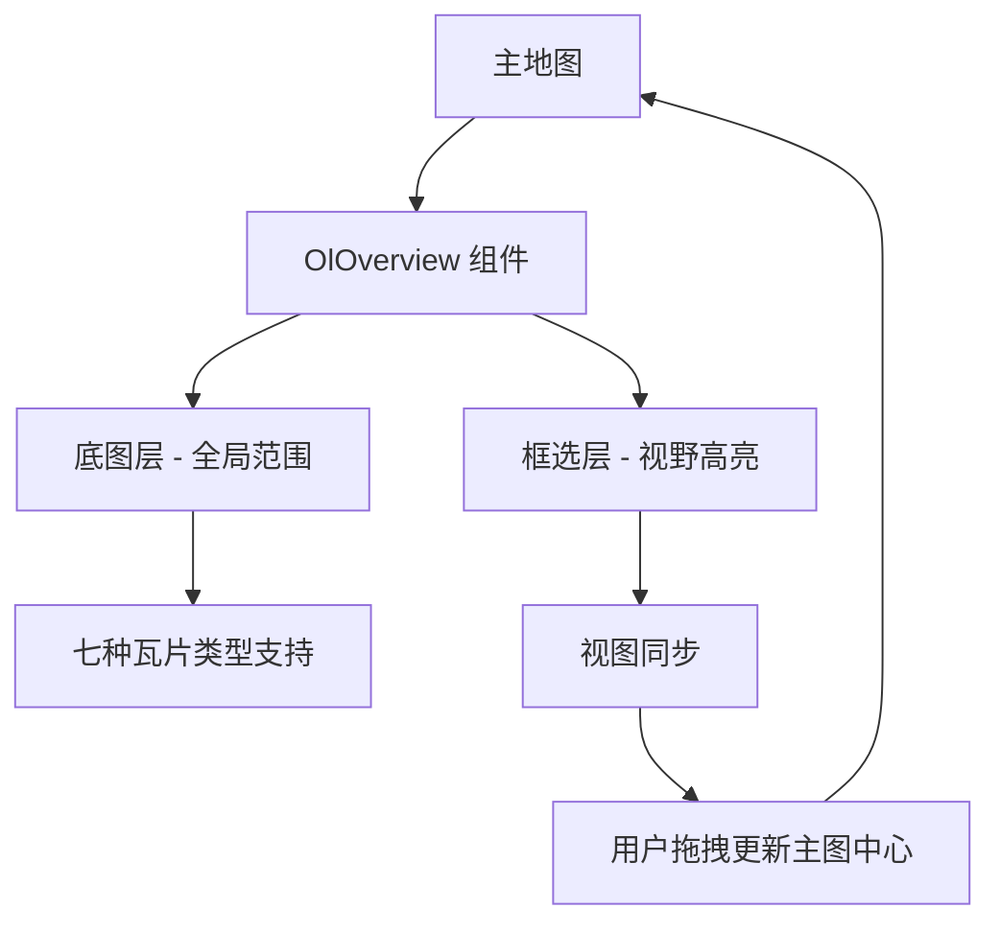
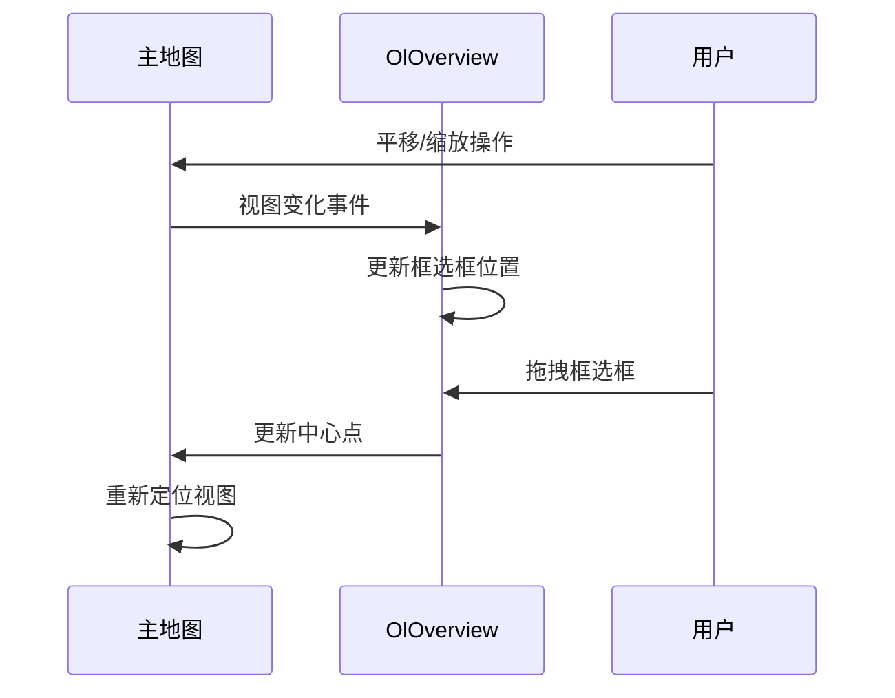

# 鹰眼图控制 (OlOverview)

<cite>
**本文档引用文件**   
- [index.vue](file://src/packages/controls/OverviewMap/index.vue#L1-L43)
- [index.ts](file://src/packages/controls/OverviewMap/index.ts#L1-L7)
- [useTile.ts](file://src/packages/layers/tile/useTile.ts#L1-L338)
- [Overview.ts](file://src/packages/types/Overview.ts#L1-L8)
- [Tile.ts](file://src/packages/types/Tile.ts#L1-L74)
- [index.vue](file://src/examples/overview/index.vue)
- [ol-overview.md](file://docs/examples/ol-overview.md)
</cite>

## 更新摘要
**变更内容**   
- 新增卫星图和地形图变体支持，包括天地图卫星图、天地图地形图、百度地图卫星图、高德地图卫星图
- 增强动态瓦片切换示例，支持七种不同瓦片类型的实时切换
- 更新组件支持的瓦片类型枚举，扩展底图选择范围
- 完善样式定制指南，包含自定义类名和定位方式

## 目录
1. [简介](#简介)
2. [核心功能与设计原理](#核心功能与设计原理)
3. [属性（Props）详解](#属性props详解)
4. [支持的瓦片类型](#支持的瓦片类型)
5. [内部实现机制分析](#内部实现机制分析)
6. [使用示例解析](#使用示例解析)
7. [视图同步机制](#视图同步机制)
8. [样式与布局定制](#样式与布局定制)
9. [总结](#总结)

## 简介
鹰眼图控制组件（OlOverview）是地图交互系统中的一个重要辅助工具，用于创建一个小型缩略图地图，帮助用户在主地图上进行导航。该组件通过显示主地图的全局范围，并高亮当前视野区域，使用户能够直观地了解当前位置与整体地理范围的关系。组件支持展开/折叠行为，可灵活配置其在地图角落的定位方式，适用于需要空间感知的地图应用。

**Section sources**
- [index.vue](file://src/packages/controls/OverviewMap/index.vue#L1-L43)

## 核心功能与设计原理
OlOverview 组件的核心功能是提供一个缩略图地图，其内部采用双图层结构：
- **底图层**：显示全局地理范围，作为背景参考。
- **框选层**：高亮显示主地图当前的视野范围，通常以矩形框形式呈现。

该组件基于 OpenLayers 的 `OverviewMap` 控件封装，通过 Vue 的组合式 API 实现响应式更新。它依赖于 `useTileLayer` 工具函数来初始化和管理图层，并通过 `OverviewMapOptions` 接口定义可配置项。



**Diagram sources**
- [index.vue](file://src/packages/controls/OverviewMap/index.vue#L1-L43)
- [useTile.ts](file://src/packages/layers/tile/useTile.ts#L1-L338)

**Section sources**
- [index.vue](file://src/packages/controls/OverviewMap/index.vue#L1-L43)
- [useTile.ts](file://src/packages/layers/tile/useTile.ts#L1-L338)

## 属性（Props）详解
OlOverview 组件通过 `defineProps<OverviewMapOptions>()` 定义了一系列可配置属性，支持默认值设置。

### 核心属性说明
- **layers**: 用于传入自定义的底图图层。若未指定，则使用默认图层。
- **collapsed**: 控制鹰眼图是否初始为折叠状态。默认为 `false`。
- **collapsible**: 是否允许用户手动展开/折叠鹰眼图。默认为 `true`。
- **collapseLabel**: 折叠按钮的显示文本标签。
- **tipLabel**: 鼠标悬停时的提示文本。
- **tileType**: 指定底图类型，支持七种不同瓦片类型选择。
- **layerId**: 图层唯一标识符，用于图层管理。
- **visible**: 控制组件是否可见。

这些属性通过 `withDefaults` 设置默认值，并在组件挂载后通过 `watchEffect` 监听变化，动态更新鹰眼图配置。

**Section sources**
- [index.vue](file://src/packages/controls/OverviewMap/index.vue#L1-L43)
- [Overview.ts](file://src/packages/types/Overview.ts#L1-L8)

## 支持的瓦片类型
组件支持七种不同的瓦片类型，包括基础地图和高级变体：

### 基础瓦片类型
- **TDT**: 天地图（矢量图）
- **BAIDU**: 百度地图（矢量图）
- **AMAP**: 高德地图（矢量图）
- **OSM**: OpenStreetMap

### 卫星图变体
- **TDT_SATELLITE**: 天地图-卫星影像
- **BAIDU_SATELLITE**: 百度-卫星影像
- **AMAP_SATELLITE**: 高德-卫星影像

### 地形图变体
- **TDT_TERRAIN**: 天地图-地形图

### 其他类型
- **BAIDU_MIDNIGHT**: 百度-午夜蓝
- **MAPBOX**: MAPBOX
- **GEOTIFF**: GeoTIFF
- **CUSTOMER**: 自定义
- **XYZ**: XYZ格式

**Section sources**
- [Tile.ts](file://src/packages/types/Tile.ts#L13-L27)
- [useTile.ts](file://src/packages/layers/tile/useTile.ts#L37-L75)

## 内部实现机制分析
组件通过 `useTileLayer` 钩子函数实现图层初始化与控制。该函数封装了多种地图服务（如天地图、百度地图、高德地图、OSM 等）的图层渲染逻辑。

### 初始化流程
1. 组件挂载时调用 `init(true)`，触发图层初始化。
2. 根据 `tileType` 判断图层类型，调用对应初始化函数（如 `initTileTD`、`initTileOSM` 等）。
3. 创建 `OverviewMap` 实例，并将其添加到主地图中。

### 鹰眼图控制逻辑
在 `useTile.ts` 中，`addOverviewMap` 函数负责创建并添加 `OverviewMap` 控件：
```ts
const addOverviewMap = () => {
  if (!layer.value) return;
  overviewMapTarget.value = new OverviewMap({
    ...OverviewMapOptions.value,
    layers: [layer.value],
  });
  overviewMapTarget.value.setMap(unref(VMap).map);
};
```
此过程将当前图层作为底图注入鹰眼图控件，并绑定到主地图实例。

**Section sources**
- [useTile.ts](file://src/packages/layers/tile/useTile.ts#L281-L299)
- [index.vue](file://src/packages/controls/OverviewMap/index.vue#L1-L43)

## 使用示例解析
参考示例文件 `src/examples/overview/index.vue`，典型用法如下：

```vue
<template>
  <ol-map class="map-container">
    <select v-model="tileType" class="tile-type-selections">
      <option v-for="item in tileTypeList" :key="item.value" :value="item.value">
        {{ item.label }}
      </option>
    </select>
    <ol-tile :tile-type="tileType"></ol-tile>
    <ol-overview
      :tile-type="tileType"
      :collapse-label="overviewMapOptions.collapseLabel"
      :label="overviewMapOptions.label"
      class-name="ol-overviewmap ol-custom-overviewmap"
    ></ol-overview>
  </ol-map>
</template>
```

### 动态瓦片切换配置
示例展示了如何实现动态瓦片切换：
- 使用 `v-model` 绑定 `tileType` 实现双向数据绑定
- 定义包含七种瓦片类型的选项列表
- 通过 `:tile-type="tileType"` 实时更新鹰眼图底图

### 配置说明
- 将 `collapsed` 设为 `true` 可使鹰眼图初始处于折叠状态
- `collapseLabel` 和 `tipLabel` 提供了本地化文本支持
- 通过 `tileType="TDT"` 指定使用天地图作为底图
- `className` 属性为控件容器添加自定义类名

该示例展示了如何将鹰眼图集成到主地图中，并配置其交互行为与视觉表现，同时支持动态瓦片类型切换。

**Section sources**
- [index.vue](file://src/examples/overview/index.vue#L1-L87)
- [ol-overview.md](file://docs/examples/ol-overview.md)

## 视图同步机制
OlOverview 组件实现了双向视图同步：
- **主地图 → 鹰眼图**：当主地图视图发生变化（如平移、缩放），鹰眼图中的框选区域会自动更新位置和大小。
- **鹰眼图 → 主地图**：当用户在鹰眼图中拖拽框选区域时，主地图的中心点会随之更新，实现反向导航。

这一机制由 OpenLayers 的 `OverviewMap` 控件原生支持，组件仅需正确传递图层和选项即可实现无缝同步。



**Diagram sources**
- [useTile.ts](file://src/packages/layers/tile/useTile.ts#L281-L299)

**Section sources**
- [useTile.ts](file://src/packages/layers/tile/useTile.ts#L281-L299)

## 样式与布局定制
虽然组件本身未暴露大量样式接口，但可通过以下方式定制外观：
- **CSS 覆盖**：通过外部样式表覆盖 `.ol-overviewmap` 类名下的默认样式
- **尺寸调整**：通过 CSS 设置 `.ol-overviewmap` 的宽度和高度
- **框选框样式**：修改 `.ol-overviewmap-box` 的边框、背景色等属性
- **自定义类名**：通过 `className` 属性为控件容器添加自定义类名

### 示例样式配置
```css
.ol-custom-overviewmap {
  bottom: auto;
  left: auto;
  right: 0;
  top: 0;
}

.ol-custom-overviewmap:not(.ol-collapsed) {
  border: 1px solid black;
}

.ol-custom-overviewmap .ol-overviewmap-map {
  border: none;
  width: 300px;
}

.ol-custom-overviewmap .ol-overviewmap-box {
  border: 2px solid red;
}

.ol-custom-overviewmap:not(.ol-collapsed) button {
  bottom: auto;
  left: auto;
  right: 1px;
  top: 1px;
}
```

### 定位方式
示例中展示了如何通过 CSS 实现自定义定位：
- 使用 `position: absolute` 和 `transform` 实现居中定位
- 通过 `bottom: auto`、`left: auto`、`right: 0`、`top: 0` 实现右上角定位
- 支持响应式布局和不同屏幕尺寸适配

**Section sources**
- [index.vue](file://src/examples/overview/index.vue#L44-L87)

## 总结
鹰眼图控制组件（OlOverview）是一个功能完整、易于集成的地图辅助工具。它通过双图层结构实现了主地图与缩略图之间的双向视图同步，支持灵活的配置选项（如展开/折叠、标签文本、底图类型等），并可通过 CSS 进行外观定制。

**主要特性更新**：
- **扩展的瓦片类型支持**：新增卫星图和地形图变体，包括天地图卫星图、天地图地形图、百度地图卫星图、高德地图卫星图
- **动态瓦片切换**：支持七种不同瓦片类型的实时切换，提升用户体验
- **增强的样式定制**：通过自定义类名和定位方式实现更灵活的布局控制

组件的核心依赖于 `useTileLayer` 钩子和 OpenLayers 的 `OverviewMap` 控件，确保了高性能与稳定性。适用于各类需要空间导航的地图应用，特别是需要多类型底图选择和动态切换的场景。