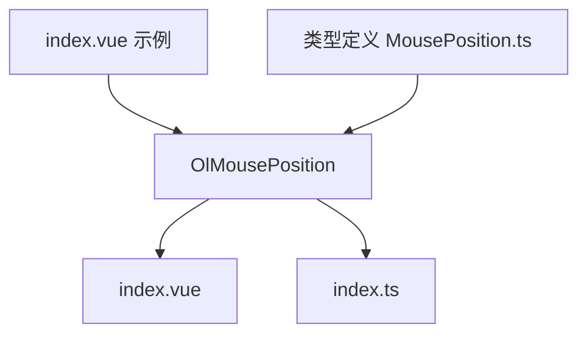
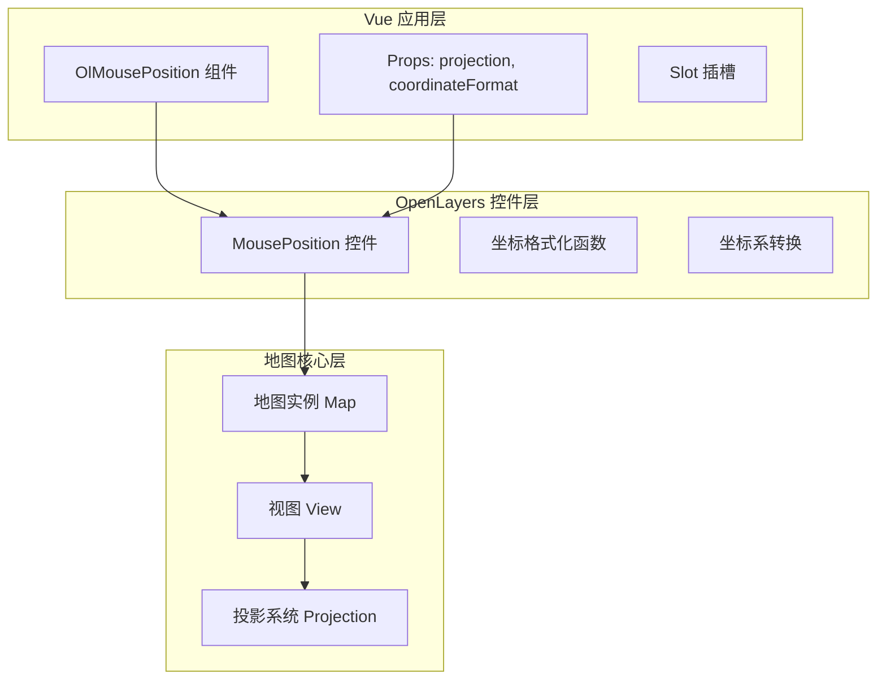
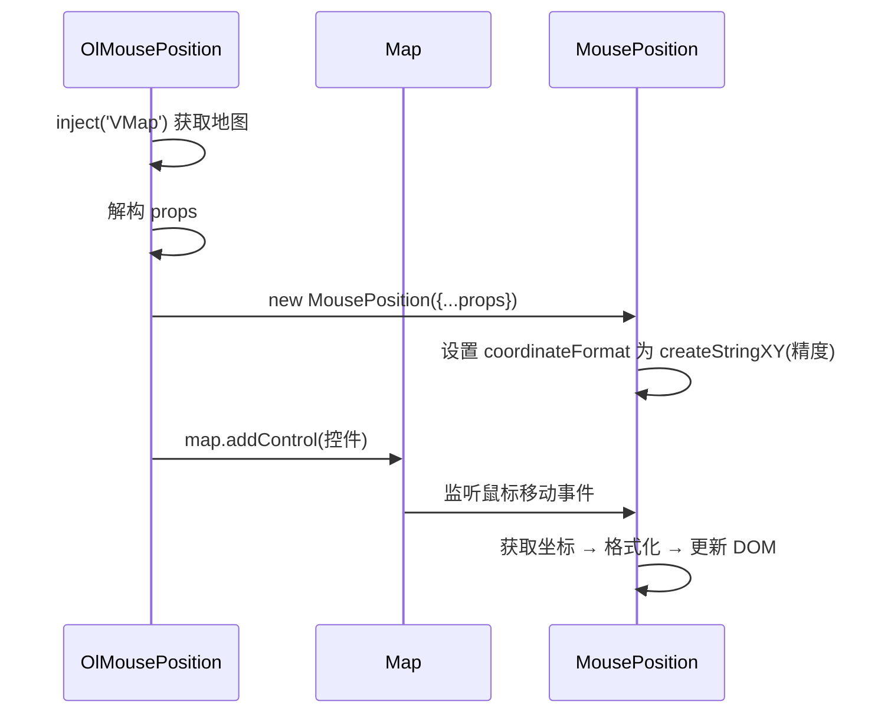
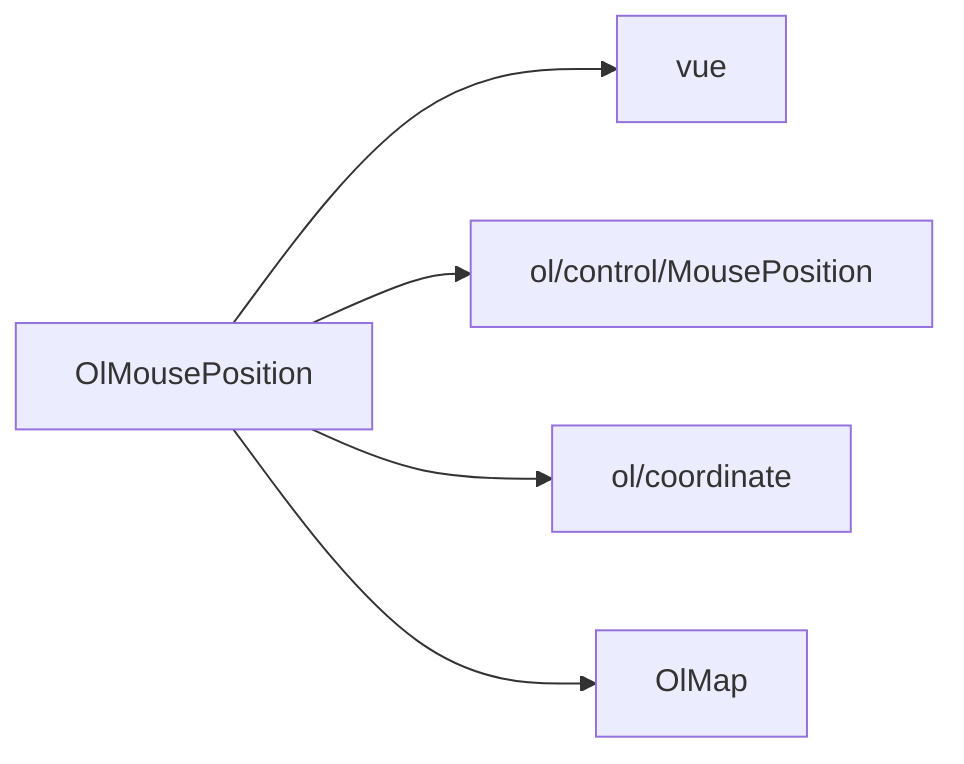

# 鼠标位置控制 (OlMousePosition)

<cite>
**本文档引用文件**  
- [index.vue](file://src/packages/controls/MousePosition/index.vue#L0-L50)
- [index.ts](file://src/packages/controls/MousePosition/index.ts#L0-L7)
- [MousePosition.ts](file://src/packages/types/MousePosition.ts#L0-L11)
- [index.vue](file://src/examples/mousePosition/index.vue#L0-L40)
</cite>

## 目录
1. [简介](#简介)
2. [项目结构](#项目结构)
3. [核心组件分析](#核心组件分析)
4. [架构概览](#架构概览)
5. [详细组件实现](#详细组件实现)
6. [依赖关系分析](#依赖关系分析)
7. [性能优化建议](#性能优化建议)
8. [异常处理与调试](#异常处理与调试)
9. [总结](#总结)

## 简介
`OlMousePosition` 是一个用于在地图界面上实时显示鼠标当前位置的 Vue 组件。该组件基于 OpenLayers 的 `MousePosition` 控件封装，支持动态坐标系转换（如 EPSG:4326 与 EPSG:3857）和自定义坐标格式化输出。通过 `coordinateFormat` 属性可控制精度或使用自定义格式化函数，结合 `projection` 属性实现跨坐标系的坐标显示。本文档将深入解析其技术实现、使用方式及优化策略。

## 项目结构
`OlMousePosition` 组件位于 `src/packages/controls/MousePosition/` 目录下，包含两个核心文件：
- `index.vue`：组件主体，使用 Vue 3 的 `<script setup>` 语法实现逻辑与样式
- `index.ts`：提供组件全局注册方法 `install`

该组件被 `src/examples/mousePosition/index.vue` 示例调用，用于演示交互式坐标显示功能。



**图示来源**
- [index.vue](file://src/packages/controls/MousePosition/index.vue#L0-L50)
- [index.ts](file://src/packages/controls/MousePosition/index.ts#L0-L7)
- [index.vue](file://src/examples/mousePosition/index.vue#L0-L40)
- [MousePosition.ts](file://src/packages/types/MousePosition.ts#L0-L11)

**本节来源**
- [index.vue](file://src/packages/controls/MousePosition/index.vue#L0-L50)
- [index.ts](file://src/packages/controls/MousePosition/index.ts#L0-L7)

## 核心组件分析
`OlMousePosition` 的核心功能由 `index.vue` 实现，其主要职责包括：
- 注入地图实例（通过 `inject("VMap")`）
- 接收 `projection` 和 `coordinateFormat` 等属性
- 创建并管理 OpenLayers 的 `MousePosition` 控件实例
- 在属性变化时自动重新初始化控件

组件使用 `shallowRef` 和 `watchEffect` 实现响应式更新，确保地图控件能及时反映配置变更。

**本节来源**
- [index.vue](file://src/packages/controls/MousePosition/index.vue#L0-L50)

## 架构概览
`OlMousePosition` 作为 Vue 组件，遵循“声明式属性 + 命令式 OpenLayers 控件”的集成模式。其架构分为三层：
1. **UI 层**：Vue 模板与样式，控制 DOM 渲染
2. **逻辑层**：`<script setup>` 中的响应式逻辑与 OpenLayers 控件绑定
3. **数据层**：OpenLayers 地图实例与坐标系统



**图示来源**
- [index.vue](file://src/packages/controls/MousePosition/index.vue#L0-L50)
- [MousePosition.ts](file://src/packages/types/MousePosition.ts#L0-L11)

## 详细组件实现

### 组件初始化流程
组件通过 `onMounted` 阶段（隐式在 `watchEffect` 中）初始化 `MousePosition` 控件，并将其添加到地图实例中。



**图示来源**
- [index.vue](file://src/packages/controls/MousePosition/index.vue#L15-L35)

### 坐标格式化机制
`coordinateFormat` 支持两种形式：
- **数字**：表示小数点后保留位数（如 `6` 表示六位小数）
- **字符串/函数**：可传入自定义格式化器（当前默认使用 `createStringXY`）

```typescript
coordinateFormat: createStringXY(Number(props.coordinateFormat))
```

此行代码将 `props.coordinateFormat` 转换为 OpenLayers 可识别的格式化函数。

#### 自定义度分秒格式化示例
虽然示例中未直接实现，但可通过以下方式扩展：

```ts
const formatDMS = (coordinate) => {
  const lon = ol.coordinate.toStringHDMS(coordinate, 2);
  const lat = ol.coordinate.toStringHDMS([coordinate[1], coordinate[0]], 2);
  return `经度: ${lon}, 纬度: ${lat}`;
};
```

然后在模板中使用：
```vue
<ol-mouse-position :coordinate-format="formatDMS" />
```

**本节来源**
- [index.vue](file://src/packages/controls/MousePosition/index.vue#L25-L30)
- [MousePosition.ts](file://src/packages/types/MousePosition.ts#L6-L8)

### UI 显示控制属性
| 属性名 | 说明 |
|-------|------|
| `placeholder` | 当坐标不可用时显示的占位符文本 |
| `undefinedHTML` | 类似 placeholder，用于自定义空值 HTML 内容 |

这些属性继承自 OpenLayers 的 `MousePositionOptions`，可在组件中直接使用。

**本节来源**
- [MousePosition.ts](file://src/packages/types/MousePosition.ts#L6-L8)

## 依赖关系分析
`OlMousePosition` 依赖以下模块：
- `vue`：提供响应式系统与组件机制
- `ol/control/MousePosition`：核心控件类
- `ol/coordinate`：提供 `createStringXY` 等格式化工具
- `@/packages/lib`：封装的 `OlMap` 类，用于地图注入



**图示来源**
- [index.vue](file://src/packages/controls/MousePosition/index.vue#L1-L10)

## 性能优化建议

### 使用 condition 函数节流更新
默认情况下，鼠标移动会频繁触发坐标更新。可通过 `condition` 属性节流：

```vue
<ol-mouse-position 
  :condition="(mapBrowserEvent) => mapBrowserEvent.frameState.time % 100 < 10"
  :coordinate-format="6" 
/>
```

此条件表示每 100ms 更新一次，减少 DOM 重绘频率。

### 避免不必要的重新初始化
当前实现中 `watchEffect` 会在每次 `props` 变化时移除并重建控件。建议优化为仅在关键属性（如 `projection`）变化时重建：

```ts
watch([projection, coordinateFormat], () => {
  // 仅当这些属性变化时重新 init
  init();
}, { immediate: true });
```

**本节来源**
- [index.vue](file://src/packages/controls/MousePosition/index.vue#L37-L40)

## 异常处理与调试

### 坐标转换失败处理
若目标投影未注册（如拼写错误 `EPSG:4326` 写成 `EPSG:432`），OpenLayers 将抛出异常。建议在应用层捕获：

```ts
try {
  mousePosition.value = new MousePosition({ projection: props.projection });
} catch (e) {
  console.warn("投影转换失败:", e.message);
  // 可设置 fallback 投影
}
```

### 调试建议
- 检查浏览器控制台是否报 `Projection not found` 错误
- 确保 `proj4js` 已加载并注册自定义投影（如使用非标准 EPSG）
- 使用 `console.log(map.getView().getProjection())` 验证地图当前投影

**本节来源**
- [index.vue](file://src/packages/controls/MousePosition/index.vue#L25-L35)

## 总结
`OlMousePosition` 是一个轻量且功能完整的鼠标坐标显示组件，具备以下特点：
- 支持动态投影转换
- 提供灵活的坐标格式化接口
- 响应式设计，属性变更自动更新
- 易于集成与扩展

通过合理使用 `coordinateFormat` 和 `condition` 属性，可在精度与性能间取得平衡。未来可扩展支持度分秒（DMS）等常用地理格式，提升用户体验。