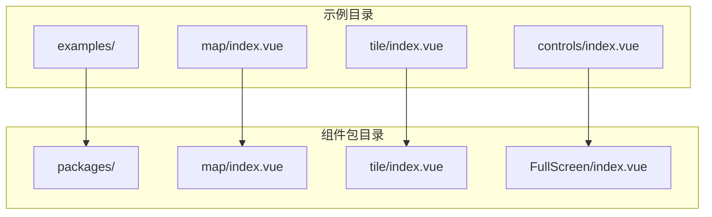
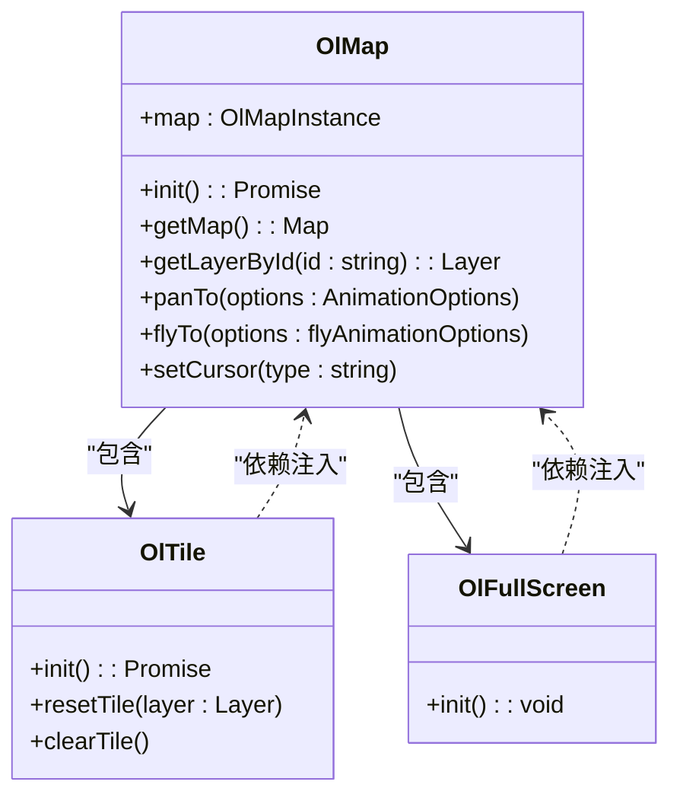
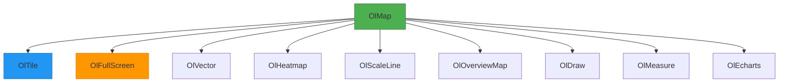

# 组件库使用

<cite>
**本文档引用的文件**   
- [src/packages/map/index.vue](file://src/packages/map/index.vue)
- [src/packages/map/index.ts](file://src/packages/map/index.ts)
- [src/packages/layers/tile/index.vue](file://src/packages/layers/tile/index.vue)
- [src/packages/layers/tile/index.ts](file://src/packages/layers/tile/index.ts)
- [src/packages/controls/FullScreen/index.vue](file://src/packages/controls/FullScreen/index.vue)
- [src/packages/controls/FullScreen/index.ts](file://src/packages/controls/FullScreen/index.ts)
- [src/examples/map/index.vue](file://src/examples/map/index.vue)
- [src/examples/tile/index.vue](file://src/examples/tile/index.vue)
- [src/examples/controls/index.vue](file://src/examples/controls/index.vue)
</cite>

## 目录
1. [简介](#简介)
2. [项目结构](#项目结构)
3. [核心组件](#核心组件)
4. [架构概览](#架构概览)
5. [详细组件分析](#详细组件分析)
6. [依赖关系分析](#依赖关系分析)
7. [性能考虑](#性能考虑)
8. [故障排除指南](#故障排除指南)
9. [结论](#结论)

## 简介
本文档旨在系统性地介绍基于 OpenLayers 的 Vue 3 组件库，涵盖所有可用组件及其使用方式。组件按功能分类组织，包括基础地图、图层、控制、交互及高级功能组件。通过结合实际示例，提供详细的使用说明、参数说明、事件触发机制和插槽支持，帮助开发者快速上手并高效集成地图功能。

## 项目结构
项目采用模块化设计，主要分为 `src/examples`（示例）和 `src/packages`（组件包）两大目录。`src/packages` 包含所有可复用的 Vue 组件，按功能划分为 `map`、`layers`、`controls`、`interaction` 等子模块。每个组件通常包含 `.vue` 文件和 `.ts` 安装脚本，遵循 Vue 3 Composition API 规范。



**图示来源**
- [src/examples/map/index.vue](file://src/examples/map/index.vue)
- [src/packages/map/index.vue](file://src/packages/map/index.vue)
- [src/packages/layers/tile/index.vue](file://src/packages/layers/tile/index.vue)
- [src/packages/controls/FullScreen/index.vue](file://src/packages/controls/FullScreen/index.vue)

## 核心组件
核心组件是构建地图应用的基础，主要包括 `OlMap`（地图容器）和 `OlTile`（瓦片图层）。`OlMap` 是所有地图组件的根容器，负责初始化 OpenLayers 地图实例并管理子组件的生命周期。`OlTile` 用于加载和显示瓦片地图服务，如天地图（TDT）。

**组件关系说明**：`OlTile` 必须作为 `OlMap` 的子组件使用，通过依赖注入（`provide/inject`）机制获取父级地图实例。

**Section sources**
- [src/packages/map/index.vue](file://src/packages/map/index.vue#L1-L219)
- [src/packages/layers/tile/index.vue](file://src/packages/layers/tile/index.vue#L1-L64)

## 架构概览
整个组件库基于 Vue 3 的 Composition API 和 OpenLayers 底层库构建，采用组件化、模块化设计。`OlMap` 作为核心容器，通过 `provide` 向子组件暴露地图实例。各功能组件（图层、控制、交互等）通过 `inject` 获取地图实例并进行操作。



**图示来源**
- [src/packages/map/index.vue](file://src/packages/map/index.vue#L1-L219)
- [src/packages/layers/tile/index.vue](file://src/packages/layers/tile/index.vue#L1-L64)
- [src/packages/controls/FullScreen/index.vue](file://src/packages/controls/FullScreen/index.vue#L1-L34)

## 详细组件分析

### 基础组件分析

#### OlMap 组件
`OlMap` 是地图的根容器组件，封装了 OpenLayers 的 `Map` 类。它接收地图视图（view）、控件（controls）、交互（interactions）等配置，并通过 `provide("VMap", map)` 将地图实例暴露给子组件。

**关键属性（Props）**：
- `width`: 地图容器宽度，默认为 "100%"
- `height`: 地图容器高度，默认为 "100%"
- 其他继承自 OpenLayers `Map` 的属性

**关键事件（Emits）**：
- `load`: 地图初始化完成后触发
- `changeZoom`: 地图缩放级别变化时触发
- `click`, `dblclick`, `singleclick`: 鼠标事件

**关键方法（通过 defineExpose 暴露）**：
- `getMap()`: 获取底层 OpenLayers 地图实例
- `getLayerById(id)`: 根据 ID 获取图层
- `panTo(options)`: 平滑移动到指定位置
- `flyTo(options)`: 飞行动画到指定位置
- `setCursor(type)`: 设置鼠标光标样式

**典型用法**：
```vue
<template>
  <OlMap :width="800" :height="600" @load="onMapLoad">
    <!-- 子组件如 OlTile、OlFullScreen 等 -->
  </OlMap>
</template>
```

**Section sources**
- [src/packages/map/index.vue](file://src/packages/map/index.vue#L1-L219)
- [src/examples/map/index.vue](file://src/examples/map/index.vue)

#### OlTile 组件
`OlTile` 用于加载瓦片地图图层。它依赖 `useTileLayer` 组合式函数来初始化和管理图层。支持通过 `tileType` 属性快速配置不同类型的瓦片服务（如 TDT）。

**关键属性（Props）**：
- `tileType`: 瓦片类型（如 "TDT"）
- `layerId`: 图层唯一标识
- `visible`: 图层可见性
- `source`: 自定义瓦片源配置

**响应式逻辑**：组件监听 `tileType` 和 `source` 的变化，当它们更新时，会自动重置图层以应用新配置。

**典型用法**：
```vue
<template>
  <OlMap>
    <OlTile tileType="TDT" layerId="tdt-layer" />
  </OlMap>
</template>
```

**Section sources**
- [src/packages/layers/tile/index.vue](file://src/packages/layers/tile/index.vue#L1-L64)
- [src/examples/tile/index.vue](file://src/examples/tile/index.vue)

### 控制组件分析

#### OlFullScreen 组件
`OlFullScreen` 是一个地图控制组件，用于切换地图的全屏显示状态。它通过 `inject("VMap")` 获取父级 `OlMap` 实例，并在其上添加 OpenLayers 的 `FullScreen` 控件。

**关键属性（Props）**：
- 继承自 OpenLayers `FullScreenOptions` 的所有配置项，如 `className`、`label`、`tipLabel` 等。

**生命周期逻辑**：使用 `watchEffect` 监听属性变化，当属性更新时，先移除旧控件，再重新初始化并添加新控件，确保配置实时生效。

**典型用法**：
```vue
<template>
  <OlMap>
    <OlFullScreen />
  </OlMap>
</template>
```

**Section sources**
- [src/packages/controls/FullScreen/index.vue](file://src/packages/controls/FullScreen/index.vue#L1-L34)
- [src/examples/controls/index.vue](file://src/examples/controls/index.vue)

## 依赖关系分析
组件库内部存在明确的父子依赖关系。`OlMap` 作为根容器，是所有其他地图相关组件的直接或间接父组件。子组件通过 `inject` 从上下文中获取 `OlMap` 实例，从而实现与地图的交互。



**图示来源**
- [src/packages/map/index.vue](file://src/packages/map/index.vue#L1-L219)
- [src/packages/controls/FullScreen/index.vue](file://src/packages/controls/FullScreen/index.vue#L1-L34)
- [src/packages/layers/tile/index.vue](file://src/packages/layers/tile/index.vue#L1-L64)

## 性能考虑
- **懒加载**：`OlTile` 等图层组件在 `onMounted` 钩子中才初始化，避免不必要的资源加载。
- **事件管理**：`OlMap` 在 `onBeforeUnmount` 中调用 `dispose` 清理事件监听，防止内存泄漏。
- **响应式优化**：使用 `shallowRef` 存储地图实例，避免对复杂对象进行深度响应式处理。
- **动画性能**：`panTo` 和 `flyTo` 方法封装了 OpenLayers 的动画 API，提供流畅的视觉体验。

## 故障排除指南
- **地图不显示**：检查 `OlMap` 的 `width` 和 `height` 是否有有效值，确保容器有尺寸。
- **子组件无反应**：确认子组件（如 `OlTile`）是否直接嵌套在 `OlMap` 内，依赖注入链是否完整。
- **全屏控件不工作**：检查浏览器是否允许全屏操作，或 `OlFullScreen` 的 `target` 属性是否正确设置。
- **瓦片加载失败**：检查 `tileType` 是否拼写正确，或 `source` 配置是否符合 OpenLayers 要求。

**Section sources**
- [src/packages/map/index.vue](file://src/packages/map/index.vue#L1-L219)
- [src/packages/layers/tile/index.vue](file://src/packages/layers/tile/index.vue#L1-L64)
- [src/packages/controls/FullScreen/index.vue](file://src/packages/controls/FullScreen/index.vue#L1-L34)

## 结论
本组件库通过 Vue 3 的 Composition API 和依赖注入机制，为 OpenLayers 提供了一套现代化、易用的封装。通过清晰的组件划分和良好的 API 设计，开发者可以快速构建功能丰富的地图应用。建议在使用时遵循父子组件的嵌套规则，并充分利用暴露的方法进行高级定制。