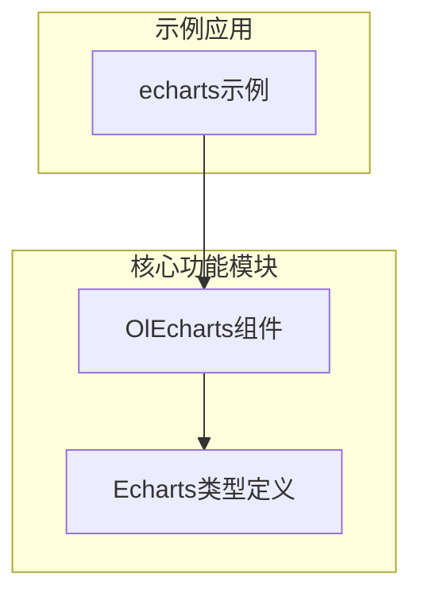
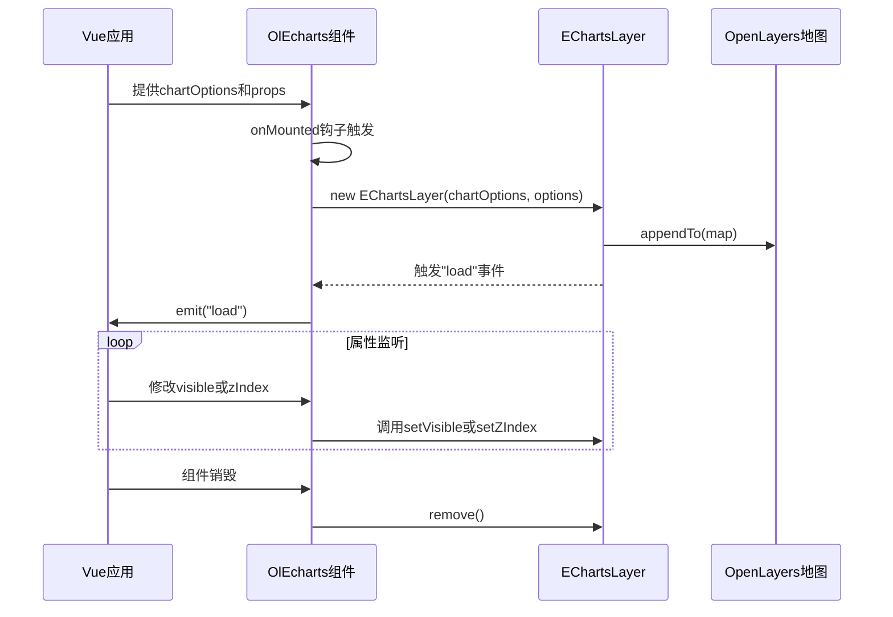
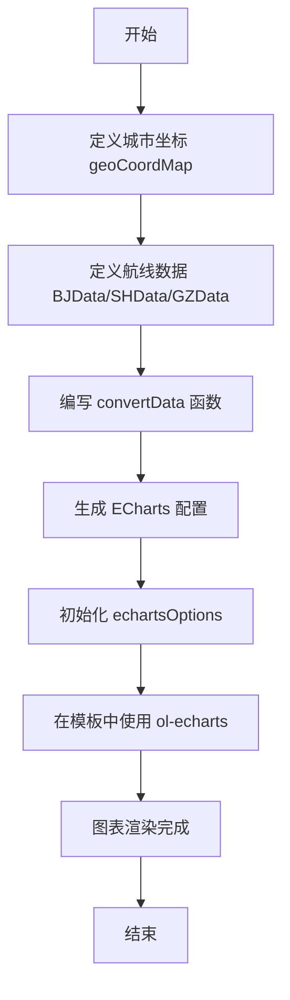
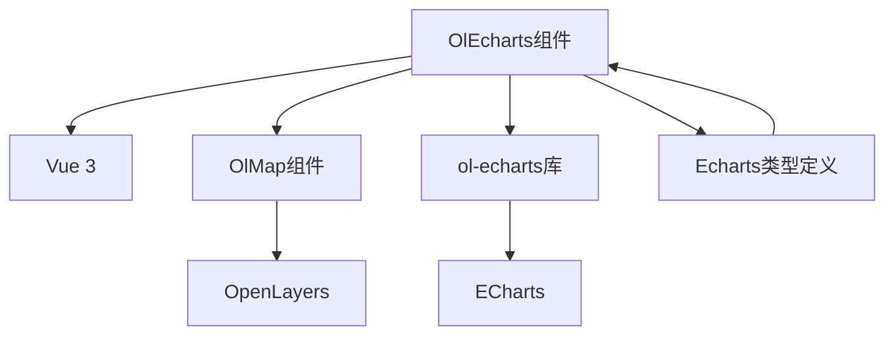

# ECharts 集成 (OlEcharts)

<cite>
**本文档引用的文件**  
- [index.vue](file://src/packages/echarts/index.vue#L1-L62)
- [index.vue](file://src/examples/echarts/index.vue#L1-L283)
- [Echarts.ts](file://src/packages/types/Echarts.ts#L1-L26)
- [index.ts](file://src/packages/echarts/index.ts#L1-L5)
</cite>

## 目录
1. [简介](#简介)
2. [项目结构](#项目结构)
3. [核心组件](#核心组件)
4. [架构概述](#架构概述)
5. [详细组件分析](#详细组件分析)
6. [依赖分析](#依赖分析)
7. [性能考虑](#性能考虑)
8. [故障排除指南](#故障排除指南)
9. [结论](#结论)

## 简介
本文档详细介绍了如何在 OpenLayers 地图上集成 ECharts 图表，实现地理数据的可视化叠加。通过 `OlEcharts` 组件，开发者可以将柱状图、热力图、散点图、航线图等丰富的 ECharts 可视化图表无缝叠加在地图图层之上，实现动态、交互式的地理信息展示。文档涵盖组件实现机制、配置项说明、响应式更新策略、性能优化建议及常见问题解决方案。

## 项目结构
`OlEcharts` 组件位于 `src/packages/echarts/` 目录下，是整个项目地图可视化功能的重要组成部分。该组件通过封装 `ol-echarts` 库，为 Vue 应用提供了一个声明式的地图图表集成接口。

**图示来源**  
- [index.vue](file://src/packages/echarts/index.vue#L1-L62)
- [Echarts.ts](file://src/packages/types/Echarts.ts#L1-L26)
- [index.vue](file://src/examples/echarts/index.vue#L1-L283)

## 核心组件
`OlEcharts` 是一个 Vue 3 组件，其核心功能是作为 OpenLayers 地图与 ECharts 图表之间的桥梁。它通过 `ol-echarts` 库创建一个特殊的图层（`EChartsLayer`），并将此图层添加到 OpenLayers 的地图实例中。

**组件职责**：
- **图层管理**：创建、挂载和销毁 ECharts 图层。
- **状态同步**：响应 `visible` 和 `zIndex` 属性的变化，实时更新图层的可见性和层级。
- **数据驱动**：监听 `chartOptions` 的变化，动态更新图表内容。
- **事件传递**：在图表渲染完成后，通过 `load` 事件通知父组件。

**关键属性**：
- `chartOptions`：ECharts 的完整配置对象，定义了图表的类型、数据、样式等。
- `options`：`ol-echarts` 库的特定配置，用于控制坐标转换、渲染行为等。
- `zIndex`：设置图层的堆叠顺序。
- `visible`：控制图层的显示与隐藏。

**关键事件**：
- `load`：当 ECharts 图表成功渲染并加载到地图上时触发。

**组件生命周期**：
1. **挂载时** (`onMounted`)：调用 `init` 方法，创建 `EChartsLayer` 实例，并将其附加到地图。
2. **卸载前** (`onBeforeUnmount`)：调用 `remove` 方法，从地图中移除图层，防止内存泄漏。

**中文化标签**  
- **组件名称**: "OlEcharts"
- **属性**: chartOptions, options, zIndex, visible
- **事件**: load

**组件来源**  
- [index.vue](file://src/packages/echarts/index.vue#L1-L62)

## 架构概述
`OlEcharts` 组件的架构设计遵循了 Vue 的组合式 API 模式，并与 OpenLayers 的图层系统紧密结合。

**图示来源**  
- [index.vue](file://src/packages/echarts/index.vue#L1-L62)

## 详细组件分析

### OlEcharts 组件实现分析
`OlEcharts` 组件的实现主要依赖于 `ol-echarts` 这个第三方库。该库的核心是 `EChartsLayer` 类，它继承自 OpenLayers 的 `Layer` 类，因此可以像普通图层一样被添加到地图中。

#### 初始化流程
1. **依赖注入**：组件通过 `inject("VMap")` 获取父级地图组件 `OlMap` 的实例，从而访问底层的 OpenLayers `map` 对象。
2. **创建图层**：在 `onMounted` 生命周期中，使用 `new EChartsLayer(props.chartOptions, props.options)` 创建图层实例。
3. **事件监听**：监听图层的 `load` 事件，当图表渲染完成时，将 `rendered` 状态设为 `true` 并向外发射 `load` 事件。
4. **附加图层**：调用 `layer.value?.appendTo(map)` 将 ECharts 图层作为覆盖物（overlay）添加到地图上。

#### 响应式更新机制
组件使用 `watch` 函数监听关键属性的变化，实现动态更新：
- **图表数据更新**：监听 `props.chartOptions`，当其变化时，调用 `layer.value?.setChartOptions(val)` 更新图表。`{ deep: true }` 选项确保了深层嵌套的对象变化也能被检测到。
- **可见性控制**：监听 `props.visible`，调用 `layer.value?.setVisible(val)` 实时切换图层的显示状态。
- **层级调整**：监听 `props.zIndex`，调用 `layer.value?.setZIndex(val)` 调整图层的堆叠顺序。

#### 插槽机制
组件使用 `<slot v-if="rendered"></slot>` 来管理子内容的渲染。只有当 ECharts 图表成功加载（`rendered` 为 `true`）后，才会渲染其插槽内容。这确保了任何依赖于图表渲染完成的子组件都能在正确的时机被挂载。

**中文化标签**  
- **方法**: init, setVisible, setZIndex, setChartOptions, appendTo, remove
- **变量**: VMap, map, layer, rendered, props, emit
- **生命周期钩子**: onMounted, onBeforeUnmount

**组件来源**  
- [index.vue](file://src/packages/echarts/index.vue#L1-L62)

### 示例分析：航线与散点图
`src/examples/echarts/index.vue` 文件提供了一个完整的使用示例，展示了如何在地图上绘制从北京、上海、广州出发的航线和散点图。

#### 数据准备
- **地理坐标映射**：`geoCoordMap` 对象存储了中国主要城市的经纬度坐标。
- **航线数据**：`BJData`, `SHData`, `GZData` 数组定义了从三个城市出发的航线，每条航线包含起点、终点和一个数值（代表流量或权重）。
- **数据转换**：`convertData` 函数将航线数据转换为 ECharts 所需的 `coords` 格式（即包含起点和终点坐标的二维数组）。

#### 图表配置
示例通过 `getEchartsOptions` 函数动态生成 ECharts 配置。其 `series` 数组为每个城市生成三组数据：
1. **基础线条** (`type: "lines"`)：绘制一条细的、带有涟漪效果的基础航线。
2. **动画飞机** (`type: "lines"`)：在同一路径上绘制一条更粗的、带有飞机图标（`planePath`）的动画航线，实现飞机飞行的视觉效果。
3. **散点图** (`type: "effectScatter"`)：在航线的终点城市位置绘制一个带有涟漪扩散效果的散点，其大小与航线的数值成正比。

#### 坐标系与层级
- **coordinateSystem: "geo"**：明确指定图表使用地理坐标系，使其能与 OpenLayers 地图的坐标对齐。
- **zlevel**：通过设置不同的 `zlevel` 值（1, 2），确保基础线条在最底层，动画飞机和散点图在上层，避免视觉遮挡。

#### 组件使用
在模板中，`<ol-echarts>` 组件被直接用在 `<ol-map>` 内部。通过 `:chart-options="echartsOptions"` 绑定动态生成的图表配置，并通过 `:options="options"` 传递 `ol-echarts` 的特定选项（如 `hideOnMoving: false`，表示在地图移动时不隐藏图表）。

**图示来源**  
- [index.vue](file://src/examples/echarts/index.vue#L1-L283)

## 依赖分析
`OlEcharts` 组件的正常运行依赖于多个内部和外部模块。

**图示来源**  
- [index.vue](file://src/packages/echarts/index.vue#L1-L62)
- [Echarts.ts](file://src/packages/types/Echarts.ts#L1-L26)

## 性能考虑
1. **大数据量渲染**：对于包含大量数据点的图表（如热力图），应考虑使用 `ol-echarts` 的 `forcedPrecomposeRerender` 选项，或对数据进行聚合、抽样处理，以避免卡顿。
2. **节流与防抖**：在频繁更新 `chartOptions` 的场景下，建议在应用层对数据更新进行节流（throttle）或防抖（debounce），避免触发过于频繁的 `setChartOptions` 调用。
3. **图层管理**：确保在组件销毁时正确调用 `remove()` 方法，及时清理图层和事件监听，防止内存泄漏。

## 故障排除指南
1. **图层错位**：最常见的原因是坐标系不匹配。确保 `ol-echarts` 的 `options` 中正确设置了 `source` 和 `destination` 投影（例如，从 WGS84 转换到地图使用的投影）。检查 `geoCoordMap` 中的坐标是否为正确的经纬度。
2. **图表不显示**：检查 `chartOptions` 是否正确传递，`series` 中的 `coordinateSystem` 是否设置为 `"geo"`。确认 `ol-echarts` 库已正确安装且版本兼容。
3. **事件冲突**：如果地图的交互（如拖拽、缩放）与图表的交互发生冲突，可以尝试设置 `options.stopEvent = true` 或 `options.polyfillEvents = true` 来控制事件冒泡。
4. **性能卡顿**：对于复杂图表，尝试将 `options.hideOnMoving` 或 `hideOnZooming` 设置为 `true`，在地图交互时暂时隐藏图表以提升流畅度。

**中文化标签**  
- **问题**: 图层错位, 图表不显示, 事件冲突, 性能卡顿
- **解决方案**: 检查投影设置, 确认配置项, 调整事件选项, 优化数据量

**故障排除来源**  
- [index.vue](file://src/packages/echarts/index.vue#L1-L62)
- [Echarts.ts](file://src/packages/types/Echarts.ts#L1-L26)

## 结论
`OlEcharts` 组件为在 OpenLayers 地图上集成 ECharts 提供了一个简洁、高效的解决方案。通过深入理解其初始化流程、响应式机制和与 `ol-echarts` 库的交互方式，开发者可以轻松地在地图上实现复杂的地理数据可视化。结合提供的示例，可以快速上手并根据实际需求定制各种图表类型。在使用过程中，注意坐标系对齐、性能优化和事件处理，可以有效避免常见问题，构建出稳定、流畅的地理信息应用。