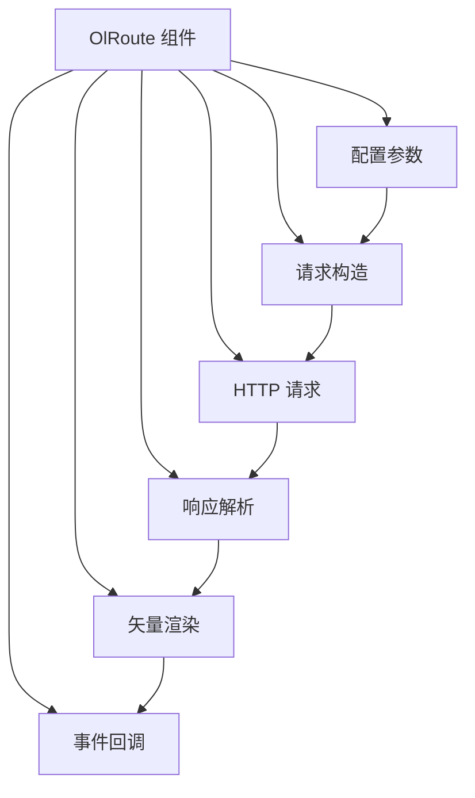
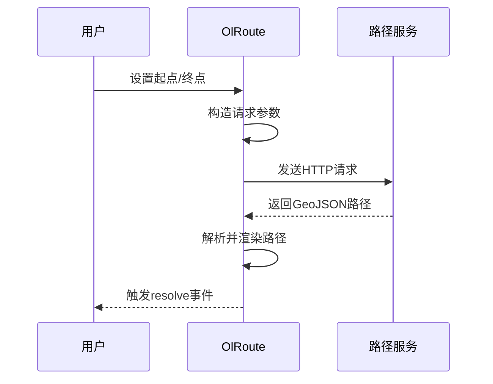

# 路径规划 (OlRoute)

<cite>
**本文档引用文件**  
- [index.vue](file://src/examples/route/index.vue)
- [index.vue](file://src/packages/route/index.vue)
- [Route.ts](file://src/packages/types/Route.ts)
</cite>

## 目录
1. [路径规划组件概述](#路径规划组件概述)  
2. [架构设计与集成方式](#架构设计与集成方式)  
3. [核心功能实现](#核心功能实现)  
4. [外部路径服务接入](#外部路径服务接入)  
5. [路线绘制与交互机制](#路线绘制与交互机制)  
6. [状态管理与响应流程](#状态管理与响应流程)  
7. [API文档](#api文档)  
8. [性能优化与异常处理](#性能优化与异常处理)  

## 路径规划组件概述

`OlRoute` 是一个基于 Vue 3 和 OpenLayers 的地图路径规划组件，支持接入多种外部路径规划服务（如 ArcGIS、GraphHopper），实现起点、终点及多个途经点的路径计算与可视化展示。该组件封装了请求构造、响应解析、地图渲染和用户交互逻辑，提供简洁的 API 接口供开发者快速集成。

通过 `ol-route` 组件标签即可在地图上添加路径规划功能，并支持自定义样式、避障设置、交通状况模拟等高级特性。

**Section sources**  
- [index.vue](file://src/packages/route/index.vue#L1-L510)

## 架构设计与集成方式

`OlRoute` 组件采用分层架构设计，主要包括以下模块：

- **配置层**：接收外部传入的 `type`、`url`、`params` 等参数，决定使用何种路径服务。
- **请求层**：根据服务类型（ArcGIS 或 GraphHopper）构造符合规范的请求参数。
- **数据层**：发送 HTTP 请求并解析返回的 GeoJSON 格式路径数据。
- **渲染层**：利用 `ol-vector` 和 `ol-feature` 将路径、起点、终点、途经点以矢量图层形式绘制在地图上。
- **交互层**：暴露 `setStartPoint`、`setEndPoint`、`setStopsPoints` 等方法供外部调用，实现动态更新。

组件通过 `defineExpose` 暴露关键方法，确保父组件可直接操作路径状态。



**Diagram sources**  
- [index.vue](file://src/packages/route/index.vue#L88-L165)

## 核心功能实现

### 起点终点设置

组件通过 `startPoint` 和 `endPoint` 响应式变量存储坐标，并提供 `setStartPoint()` 和 `setEndPoint()` 方法供外部调用。当坐标更新后，自动触发路径重算。

```ts
const setStartPoint = async (coordinate?: number[]) => {
  startPointSet.value = !!coordinate;
  setStartFeature(coordinate);
  reset();
};
```

### 多路径选择

支持设置多个途经点（`stops`），通过 `setStopsPoints(coordinates)` 方法批量更新。内部使用 `stopsFeaturesJson` 管理所有途经点的 GeoJSON 数据。

### 路线详情展示

路径计算完成后，通过 `@resolve` 事件向外发射完整响应数据，包含路径信息、方向指引、耗时距离等元数据，可用于构建路线详情面板。

**Section sources**  
- [index.vue](file://src/packages/route/index.vue#L344-L385)

## 外部路径服务接入

`OlRoute` 支持两种主流路径服务：ArcGIS Network Analyst 和 GraphHopper。

### ArcGIS 接入

- **请求方式**：GET/POST
- **参数格式**：
  ```json
  {
    "stops": "lng1,lat1;lng2,lat2",
    "f": "pjson",
    "returnStops": true,
    "directionsLengthUnits": "esriNAUMeters"
  }
  ```
- **响应解析**：从 `routes.features[0].geometry.paths[0]` 提取路径坐标数组。

### GraphHopper 接入

- **请求方式**：GET/POST
- **GET 参数示例**：
  ```
  point=lat,lng&point=lat,lng&profile=car
  ```
- **POST 参数示例**：
  ```json
  { "points": [[lng, lat], [lng, lat]], "profile": "car" }
  ```
- **响应解析**：从 `paths[0].points.coordinates` 获取路径点。



**Diagram sources**  
- [index.vue](file://src/packages/route/index.vue#L259-L304)

## 路线绘制与交互机制

### 路径样式定制

支持通过 `startStyle`、`endStyle`、`lineStyle`、`stopsStyle` 属性自定义图标或图形样式。例如使用图片标记起点：

```vue
<ol-route
  :start-style="{ icon: { src: iconStart } }"
/>
```

默认样式使用圆形标记，颜色可配置。

### 箭头动画支持

通过 `arrow` 属性设置路径上的移动箭头密度（像素间隔）。组件在 `postrender` 事件中动态生成箭头矢量特征，实现流动效果。

```ts
arrowLine({
  map,
  coordinates: route,
  layer,
  pixel: props.arrow,
});
```

### 鼠标交互

示例中通过监听地图点击事件 `@singleclick`，结合 `pointPick` 状态判断当前操作目标（起点、终点、途经点），实现“点击地图标记位置”功能。

```ts
const handleClickMap = (event: any) => {
  if (pointPick.value === "start") {
    routeRef.value?.setStartPoint(event.coordinate);
  }
};
```

**Section sources**  
- [index.vue](file://src/examples/route/index.vue#L51-L114)

## 状态管理与响应流程

组件内部使用 Vue 的响应式系统管理路径状态：

| 状态变量 | 类型 | 说明 |
|--------|------|------|
| `startPointSet` | boolean | 起点是否已设置 |
| `endPointSet` | boolean | 终点是否已设置 |
| `ableToSetRoute` | computed | 是否满足路径计算条件 |
| `routeFeaturesCollection` | FeatureCollection | 所有地图要素集合 |

当起点和终点均设置后，`reset()` 方法触发路径请求流程。

```mermaid
flowchart TD
A[设置起点] --> B{是否已设终点?}
C[设置终点] --> B
B --> |是| D[触发reset()]
D --> E[根据type调用对应服务]
E --> F[发送请求]
F --> G[解析响应]
G --> H[更新路径要素]
H --> I[发射resolve事件]
```

**Diagram sources**  
- [index.vue](file://src/packages/route/index.vue#L88-L165)

## API文档

### 输入参数（Props）

| 参数 | 类型 | 默认值 | 说明 |
|------|------|--------|------|
| `type` | "arcgis" \| "graphhopper" | "graphhopper" | 路径服务类型 |
| `url` | string | - | 服务地址 |
| `method` | "GET" \| "POST" | "GET" | 请求方法 |
| `params` | object | {} | 附加查询参数 |
| `arrow` | number | undefined | 路径箭头间隔（像素） |
| `startStyle` | FeatureStyle | 绿色圆圈 | 起点样式 |
| `endStyle` | FeatureStyle | 红色圆圈 | 终点样式 |
| `lineStyle` | FeatureStyle | 蓝色线条 | 路径线样式 |
| `stopsStyle` | FeatureStyle | 橙色圆圈 | 途经点样式 |

### 输出事件（Emits）

| 事件 | 参数 | 说明 |
|------|------|------|
| `resolve` | data: any | 路径计算完成时触发，携带原始响应数据 |

### 暴露方法（Expose）

| 方法 | 参数 | 说明 |
|------|------|------|
| `setStartPoint` | coordinate: number[] | 设置起点坐标 |
| `setEndPoint` | coordinate: number[] | 设置终点坐标 |
| `setStopsPoints` | points: StopPoint[] | 设置途经点列表 |
| `reset` | - | 重新计算路径 |
| `clear` | - | 清除所有路径与标记 |

**Section sources**  
- [Route.ts](file://src/packages/types/Route.ts#L1-L127)

## 性能优化与异常处理

### 网络异常处理

使用 `fetch` 进行请求，通过 `.catch()` 捕获网络错误并输出日志，避免阻塞主线程。

```ts
return fetch(url).then(res => res.json()).catch(err => {
  console.log(err);
  return Promise.reject(err);
});
```

### 缓存策略

当前版本未实现本地缓存，每次调用 `reset()` 均发起新请求。建议在上层应用中加入坐标对缓存机制以减少重复请求。

### 性能优化建议

1. **防抖机制**：对频繁调用的 `reset()` 添加防抖，避免短时间内多次请求。
2. **要素复用**：已存在的起点/终点特征在更新时先移除再添加，防止内存泄漏。
3. **事件清理**：`postrender` 监听器在每次路径更新后注销旧监听，避免重复绑定。

```ts
eventRender.value.forEach(listenerKey => unByKey(listenerKey));
eventRender.value = [];
```

**Section sources**  
- [index.vue](file://src/packages/route/index.vue#L344-L385)