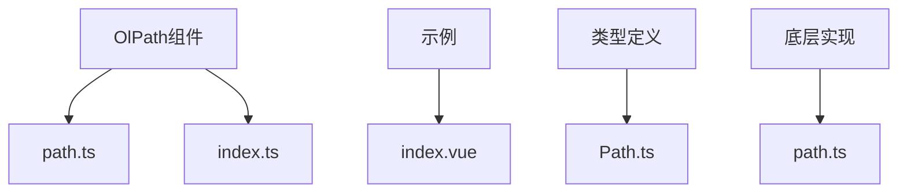

# 轨迹回放 (OlPath)

<cite>
**本文档引用文件**   
- [path.ts](file://src/packages/path/path.ts)
- [index.ts](file://src/packages/path/index.ts)
- [index.vue](file://src/examples/path/index.vue)
- [Path.ts](file://src/packages/types/Path.ts)
- [path.ts](file://src/packages/lib/path.ts)
</cite>

## 目录
1. [简介](#简介)
2. [项目结构分析](#项目结构分析)
3. [核心组件分析](#核心组件分析)
4. [轨迹数据格式与加载](#轨迹数据格式与加载)
5. [动画播放控制逻辑](#动画播放控制逻辑)
6. [速度调节与时间轴同步](#速度调节与时间轴同步)
7. [路径插值与性能优化](#路径插值与性能优化)
8. [API参考](#api参考)
9. [常见问题与解决方案](#常见问题与解决方案)

## 简介
OlPath组件是基于OpenLayers开发的轨迹回放功能模块，用于在地图上可视化展示移动对象的轨迹路径。该组件支持多种播放模式、速度调节、标签显示等功能，能够加载真实轨迹数据并进行动态回放。通过分析源码，本文档将深入解析其技术实现细节，包括轨迹数据格式要求、动画播放控制、性能优化策略等，帮助开发者更好地理解和使用该组件。

## 项目结构分析
OlPath组件位于`src/packages/path/`目录下，主要由`path.ts`和`index.ts`两个文件构成。`path.ts`文件定义了核心的`OlPath`组件，而`index.ts`文件负责组件的注册和安装。示例代码位于`src/examples/path/index.vue`，展示了如何在实际项目中使用该组件。



**图示来源**
- [path.ts](file://src/packages/path/path.ts)
- [index.ts](file://src/packages/path/index.ts)
- [index.vue](file://src/examples/path/index.vue)

## 核心组件分析
OlPath组件的核心实现位于`src/packages/path/path.ts`文件中，采用Vue 3的Composition API进行开发。组件通过`defineComponent`定义，包含多个props和emits，以及一个setup函数来处理组件的逻辑。

### 组件属性
组件提供了丰富的属性来控制轨迹回放的行为：

- **bubble**: 布尔值，控制事件触发是否穿透
- **showTracePoint**: 布尔值，控制是否显示轨迹点
- **tracePointsModePlay**: 字符串，播放模式，可选值为"animation"或"skip"
- **path**: 数组，包含轨迹点信息的PathInfo数组
- **options**: 对象，包含各种配置选项
- **autoPlay**: 布尔值，是否自动播放
- **visible**: 布尔值，是否可见
- **labelVisible**: 布尔值，是否显示标签

### 组件事件
组件通过emits定义了多个事件，用于通知外部组件状态变化：

- **load**: 组件加载完成时触发
- **nodeClick**: 轨迹点被点击时触发
- **nodeMouseover**: 鼠标悬停在轨迹点上时触发
- **nodeMouseout**: 鼠标离开轨迹点时触发
- **pathClick**: 轨迹线被点击时触发
- **pathMouseover**: 鼠标悬停在轨迹线上时触发
- **pathMouseout**: 鼠标离开轨迹线时触发
- **move**: 动画播放过程中触发，包含当前位置信息

### 组件方法
组件通过expose暴露了多个公共方法，供外部调用：

- **init**: 初始化轨迹回放
- **start**: 开始播放
- **stop**: 停止播放
- **pause**: 暂停播放
- **resume**: 继续播放
- **getStatus**: 获取当前播放状态
- **destroy**: 销毁组件
- **setFitView**: 设置视图以适应轨迹
- **getPaths**: 获取轨迹数据
- **setPaths**: 设置轨迹数据
- **getSpeed**: 获取播放速度
- **setSpeed**: 设置播放速度
- **getSpeedUp**: 获取加速倍数
- **setSpeedUp**: 设置加速倍数
- **getPercent**: 获取播放进度
- **setPercent**: 设置播放进度

**组件来源**
- [path.ts](file://src/packages/path/path.ts)

## 轨迹数据格式与加载
OlPath组件要求轨迹数据以特定的格式提供，每个轨迹点包含经度、纬度、索引、简化标志和GNSS时间等信息。

### 轨迹数据格式
轨迹数据的格式定义在`src/packages/types/Path.ts`文件中：

```typescript
export interface PathInfo {
  longitude: number;
  latitude: number;
  node_idx: number;
  isSimplify: boolean;
  gnssTime: string;
}
```

每个轨迹点必须包含以下字段：
- **longitude**: 经度
- **latitude**: 纬度
- **node_idx**: 节点索引
- **isSimplify**: 是否已简化
- **gnssTime**: GNSS时间

### 数据加载示例
在`src/examples/path/index.vue`文件中，展示了如何加载轨迹数据：

```vue
<script setup lang="ts">
const getPathData = async () => {
  fetch(`${import.meta.env.VITE_BASE_URL}/heatmap/data-6k.json`)
    .then(res => res.json())
    .then(data => {
      path.path = data;
      showPath.value = true;
    });
};
</script>
```

该示例通过fetch API从服务器获取轨迹数据，并将其赋值给组件的path属性。

**数据格式来源**
- [Path.ts](file://src/packages/types/Path.ts)
- [index.vue](file://src/examples/path/index.vue)

## 动画播放控制逻辑
OlPath组件提供了完整的动画播放控制逻辑，包括播放、暂停、继续、停止等操作。

### 播放模式
组件支持两种播放模式：
- **animation**: 根据路径长度进行动画播放
- **skip**: 按节点进行动画播放

播放模式通过`tracePointsModePlay`属性设置。

### 播放控制方法
组件提供了以下方法来控制播放：

- **start**: 开始播放，可指定从哪个节点开始
- **stop**: 停止播放，重置播放状态
- **pause**: 暂停播放
- **resume**: 继续播放

这些方法通过组件的setup函数中的expose暴露给外部使用。

### 播放状态管理
组件内部通过`_status`变量管理播放状态，可能的值包括：
- **stop**: 停止
- **moving**: 播放中
- **pause**: 暂停

状态管理确保了播放控制的正确性和一致性。

**播放控制来源**
- [path.ts](file://src/packages/path/path.ts)

## 速度调节与时间轴同步
OlPath组件提供了灵活的速度调节机制和时间轴同步功能。

### 速度调节
组件通过`setSpeed`和`setSpeedUp`方法支持速度调节：

- **setSpeed**: 设置基础播放速度，单位为km/h
- **setSpeedUp**: 设置加速倍数，实际播放速度为基础速度乘以加速倍数

```typescript
const setSpeed = (speed: number) => {
  pathObj.value?.setSpeed(speed);
};

const setSpeedUp = (speedUp: number) => {
  pathObj.value?.setSpeedUp(speedUp);
};
```

### 时间轴同步
组件通过`getPercent`和`setPercent`方法支持时间轴同步：

- **getPercent**: 获取当前播放进度，返回0到1之间的数值
- **setPercent**: 设置播放进度，参数为0到1之间的数值

这些方法使得用户可以精确控制播放进度，实现时间轴同步功能。

**速度调节来源**
- [path.ts](file://src/packages/path/path.ts)

## 路径插值与性能优化
为了提高轨迹回放的流畅性和性能，OlPath组件采用了路径插值和多种性能优化策略。

### 路径插值算法
组件使用`simplify-js`库对轨迹数据进行简化，减少渲染负担。在`src/packages/lib/path.ts`文件中，`simplifyOpera`方法实现了这一功能：

```typescript
const res: SimplifyPoint[] = simplify(path, 2, false);
```

该方法根据当前视图的分辨率对轨迹点进行简化，只保留必要的点，从而提高渲染性能。

### 性能优化策略
组件采用了以下性能优化策略：

- **分层渲染**: 将轨迹线、轨迹点、动画线等分别放在不同的图层中，便于管理和优化
- **事件监听优化**: 只在需要时监听地图事件，减少不必要的计算
- **异步渲染**: 使用Promise进行异步渲染，避免阻塞主线程
- **数据缓存**: 缓存简化后的轨迹数据，避免重复计算

这些优化策略确保了即使在处理大量轨迹数据时，组件也能保持良好的性能。

**性能优化来源**
- [path.ts](file://src/packages/lib/path.ts)

## API参考
本节提供OlPath组件的完整API参考，包括props、events和methods。

### Props
| 属性 | 类型 | 默认值 | 描述 |
| --- | --- | --- | --- |
| bubble | Boolean | true | 事件触发是否穿透 |
| showTracePoint | Boolean | true | 是否显示轨迹点 |
| tracePointsModePlay | String | "" | 播放模式，可选值为"animation"或"skip" |
| path | Array | [] | 轨迹数据数组 |
| options | Object | {} | 配置选项 |
| autoPlay | Boolean | false | 是否自动播放 |
| visible | Boolean | true | 是否可见 |
| labelVisible | Boolean | false | 是否显示标签 |

### Events
| 事件 | 参数 | 描述 |
| --- | --- | --- |
| load | pathObj | 组件加载完成时触发 |
| nodeClick | infos | 轨迹点被点击时触发 |
| nodeMouseover | infos | 鼠标悬停在轨迹点上时触发 |
| nodeMouseout | infos | 鼠标离开轨迹点时触发 |
| pathClick | pathInfos | 轨迹线被点击时触发 |
| pathMouseover | pathInfos | 鼠标悬停在轨迹线上时触发 |
| pathMouseout | pathInfos | 鼠标离开轨迹线时触发 |
| move | moveInfo | 动画播放过程中触发 |

### Methods
| 方法 | 参数 | 返回值 | 描述 |
| --- | --- | --- | --- |
| init | paths? | void | 初始化轨迹回放 |
| start | index? | void | 开始播放 |
| stop |  | void | 停止播放 |
| pause |  | void | 暂停播放 |
| resume |  | void | 继续播放 |
| getStatus |  | "stop" \| "moving" \| "pause" | 获取当前播放状态 |
| destroy |  | void | 销毁组件 |
| setFitView | fitView? | void | 设置视图以适应轨迹 |
| getPaths |  | PathInfo[] | 获取轨迹数据 |
| setPaths | paths | void | 设置轨迹数据 |
| getSpeed |  | number \| undefined | 获取播放速度 |
| setSpeed | speed | void | 设置播放速度 |
| getSpeedUp |  | number \| undefined | 获取加速倍数 |
| setSpeedUp | speedUp | void | 设置加速倍数 |
| getPercent |  | number | 获取播放进度 |
| setPercent | percent | void | 设置播放进度 |

**API来源**
- [path.ts](file://src/packages/path/path.ts)
- [Path.ts](file://src/packages/types/Path.ts)

## 常见问题与解决方案
本节列举使用OlPath组件时可能遇到的常见问题及其解决方案。

### 轨迹跳跃
**问题描述**: 轨迹在播放过程中出现跳跃现象，不连续。

**可能原因**:
- 轨迹数据点之间的时间间隔不均匀
- 播放速度设置过高
- 地图渲染性能不足

**解决方案**:
- 确保轨迹数据点之间的时间间隔均匀
- 适当降低播放速度
- 使用路径插值算法平滑轨迹

### 卡顿
**问题描述**: 轨迹播放过程中出现卡顿现象。

**可能原因**:
- 轨迹数据量过大
- 地图渲染性能不足
- 浏览器性能不足

**解决方案**:
- 使用路径简化算法减少数据量
- 优化地图渲染设置
- 在Web Worker中处理大量数据

### 标签显示异常
**问题描述**: 轨迹标签显示位置不正确或重叠。

**可能原因**:
- 标签避让算法未正确应用
- 地图缩放级别不合适

**解决方案**:
- 确保正确使用AvoidanceLayer进行标签避让
- 调整地图缩放级别

**问题解决方案来源**
- [path.ts](file://src/packages/lib/path.ts)
- [index.vue](file://src/examples/path/index.vue)