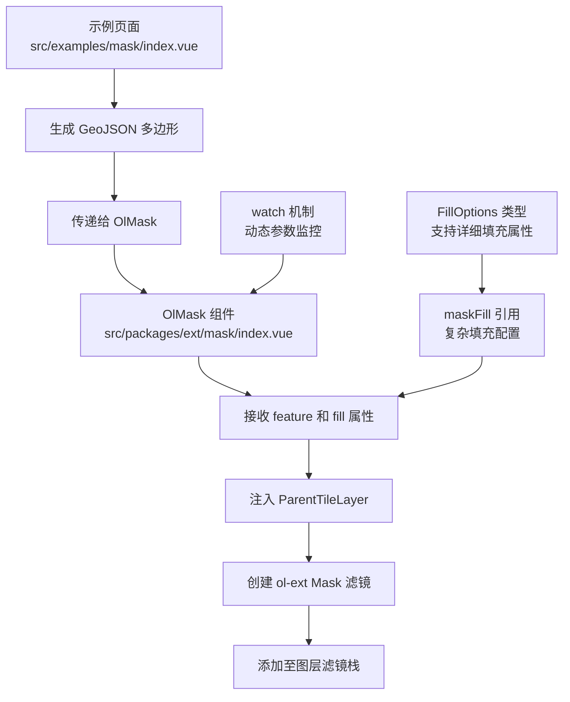

# 遮罩功能 (OlMask)

<cite>
**本文档引用文件**  
- [index.vue](file://src/examples/mask/index.vue#L0-L106)
- [index.vue](file://src/packages/ext/mask/index.vue#L0-L64)
- [Mask.ts](file://src/packages/types/Mask.ts#L0-L12)
- [style.ts](file://src/packages/utils/style.ts#L65-L123)
- [index.ts](file://src/packages/types/index.ts#L24-L24)
</cite>

## 更新摘要
**变更内容**  
- 新增对FillOptions类型的完整支持，允许传入复杂的填充配置
- 实现Vue的watch机制，支持动态参数监控和响应式更新
- 增强遮罩填充样式的灵活性和可定制性
- 优化组件的响应式行为和性能表现

## 目录
1. [简介](#简介)
2. [项目结构](#项目结构)
3. [核心组件分析](#核心组件分析)
4. [遮罩实现原理](#遮罩实现原理)
5. [API 参考](#api-参考)
6. [常见问题与调试建议](#常见问题与调试建议)

## 简介
`OlMask` 是一个基于 OpenLayers 扩展库（ol-ext）实现的地图遮罩组件，用于在地图上创建局部高亮或信息隐藏效果。通过该组件，开发者可以定义任意几何形状（如多边形、圆形等）作为遮罩区域，并控制其样式（颜色、透明度、边缘模糊）和显示状态。本组件常用于突出显示特定地理区域、保护敏感信息或引导用户注意力。

**更新** 新增了对FillOptions类型的完整支持，允许传入复杂的填充配置，包括颜色、透明度等详细属性。同时实现了Vue的watch机制，支持动态参数监控和响应式更新。

示例中展示了如何结合随机生成的厦门岛范围多边形数据，在百度地图底图上应用半透明遮罩，实现局部地图高亮。通过`maskFill`引用传入复杂的填充配置。

## 项目结构
`OlMask` 组件位于项目的 `src/packages/ext/mask/` 目录下，属于地图功能扩展模块。其使用示例位于 `src/examples/mask/index.vue`，通过 Vue 组件方式集成到地图系统中。

主要相关路径：
- **组件实现**：`src/packages/ext/mask/index.vue`
- **类型定义**：`src/packages/types/Mask.ts`
- **样式工具**：`src/packages/utils/style.ts`
- **类型导出**：`src/packages/types/index.ts`
- **使用示例**：`src/examples/mask/index.vue`

该结构体现了模块化设计思想，将功能组件与类型定义分离，便于维护和复用。



**图示来源**
- [index.vue](file://src/packages/ext/mask/index.vue#L0-L64)
- [index.vue](file://src/examples/mask/index.vue#L32-L34)
- [Mask.ts](file://src/packages/types/Mask.ts#L6-L9)

## 核心组件分析

### OlMask 组件实现
`OlMask` 是一个 Vue 3 的 `<script setup>` 组件，封装了 `ol-ext` 的 `Mask` 滤镜功能，使其能够在 Vue 环境中以声明式方式使用。

**更新** 新增了对FillOptions类型的完整支持和动态参数监控功能。

#### 关键逻辑解析
- **图层注入**：通过 `inject("ParentTileLayer")` 获取当前所在的图层实例（如 `TileLayer`），确保遮罩能正确作用于目标图层。
- **属性定义**：使用 `defineProps<MaskOptions>()` 接收外部配置，包括 `feature`（GeoJSON 几何对象）、`fill`（复杂填充配置）等。
- **初始化流程**：在 `onMounted` 钩子中调用 `init()` 方法，将传入的 GeoJSON 数据转换为 OpenLayers 的 `Feature` 对象，并创建 `Mask` 实例添加至图层滤镜。
- **动态监控**：通过 `watch` 机制监听 `props.feature` 和 `props.fill` 的变化，实现响应式更新。

```vue
<template>
  <slot></slot>
</template>
```
组件本身不渲染任何 DOM 元素，仅作为逻辑容器，通过 `<slot>` 支持嵌套内容扩展。

**本节来源**
- [index.vue](file://src/packages/ext/mask/index.vue#L0-L64)
- [Mask.ts](file://src/packages/types/Mask.ts#L0-L12)

## 遮罩实现原理

### DOM 层与地图层叠加关系
`OlMask` 并非创建独立的 DOM 遮罩层，而是利用 OpenLayers 的**滤镜机制**（Filter）直接在 WebGL 渲染层对地图像素进行处理。这意味着遮罩效果是在地图图像渲染过程中实时计算的，具有较高的性能表现。

其工作流程如下：
1. 地图底图（如百度瓦片）正常加载并渲染。
2. `Mask` 滤镜根据指定的 `feature` 几何范围，计算出需要保留显示的区域。
3. 在 WebGL 着色器中，对非遮罩区域应用透明或模糊效果。
4. 最终合成图像输出至 canvas。

### 坐标转换处理
组件接收的 `feature` 为标准 GeoJSON 格式，坐标系通常为 `EPSG:4326`（经纬度）。OpenLayers 内部会自动完成坐标转换，确保遮罩区域与地图投影（如 `EPSG:3857`）对齐。开发者无需手动处理坐标变换。

### 响应式更新逻辑
**更新** 新增了完整的动态参数监控功能，支持以下响应式更新：

- **动态遮罩区域更新**：通过 `watch(() => props.feature, () => { init(); }, { deep: true })` 监听遮罩几何变化
- **动态填充配置更新**：通过 `watch(() => props.fill, () => { init(); }, { deep: true })` 监听填充样式变化
- **自动清理机制**：每次初始化前自动清理现有滤镜，避免重复叠加

```ts
// 监听props.feature的变化，重新加载遮罩
watch(
  () => props.feature,
  () => {
    init();
  },
  { deep: true },
);

// 监听props.fill的变化，重新加载填充配置
watch(
  () => props.fill,
  () => {
    init();
  },
  { deep: true },
);
```

### 性能影响评估
- **优点**：基于 WebGL 滤镜，渲染效率高，适用于大范围遮罩；支持动态更新，响应式体验好。
- **缺点**：复杂几何图形可能导致着色器计算压力增大，尤其在移动设备上可能影响帧率。
- **优化建议**：简化遮罩几何顶点数量，避免使用过多细节的多边形；合理使用深度监听，避免不必要的频繁更新。

**本节来源**
- [index.vue](file://src/packages/ext/mask/index.vue#L45-L52)
- [useTile.ts](file://src/packages/layers/tile/useTile.ts#L29)

## API 参考

### 可配置属性 (Props)

**更新** 新增了对FillOptions类型的完整支持。

:feature:  
- **类型**: `GeoJSON | undefined`  
- **说明**: 定义遮罩区域的几何对象，支持 Point、LineString、Polygon 等类型。若未提供，则无遮罩效果。

:fill:  
- **类型**: `FillOptions`  
- **说明**: 复杂的填充配置对象，支持 `ol/style/Fill` 的所有选项，包括颜色、透明度等详细属性。示例中使用 `rgba(0, 0, 0, 0.6)` 实现半透明黑色填充。

:opacity:  
- **类型**: `number`  
- **默认值**: `1`  
- **说明**: 遮罩区域外的透明度，取值范围 `0`（完全透明）至 `1`（完全不透明）。示例中设置为 `0.5` 实现半透明遮罩。

:blur:  
- **类型**: `number`  
- **默认值**: `0`  
- **说明**: 遮罩边缘的模糊半径（像素），用于实现羽化效果，使边界更柔和。

:shadow-width:  
- **类型**: `number`  
- **默认值**: `0`  
- **说明**: 阴影宽度，用于创建阴影效果。

### 事件回调
当前组件未暴露自定义事件。如需监听遮罩状态变化，可通过 Vue 的 `v-model` 或 `$refs` 手动管理状态。

### 类型定义
```ts
export declare type MaskOptions = Omit<Options, "feature" | "fill"> & {
  feature?: GeoJSON;
  fill: FillOptions;
};
```
继承自 `ol-ext/filter/Mask` 的 `Options`，但将 `fill` 字段从 `Fill` 类型改为 `FillOptions` 类型，允许传入更灵活的配置对象。

**本节来源**
- [Mask.ts](file://src/packages/types/Mask.ts#L6-L9)
- [index.vue](file://src/packages/ext/mask/index.vue#L32-L38)

## 常见问题与调试建议

### 遮罩错位
**现象**：遮罩区域与实际地理坐标不匹配。  
**原因**：GeoJSON 坐标系与地图视图投影不一致，或数据格式错误。  
**解决方案**：
1. 确保 GeoJSON 坐标为 `[经度, 纬度]` 格式。
2. 检查地图 `view` 的 `projection` 设置是否正确（通常为 `"EPSG:4326"` 或 `"EPSG:3857"`）。
3. 使用 `new GeoJSON().readFeature()` 确保数据被正确解析。

### 渲染闪烁或不更新
**现象**：更改 `feature` 或 `fill` 后遮罩未更新或出现闪烁。  
**原因**：组件未正确监听 `props` 变化，导致滤镜未重新创建。  
**解决方案**：
```ts
import { watch } from 'vue';
// 在 init 后添加
watch(() => props.feature, () => {
  layer.value?.getFilters()?.clear();
  init();
}, { deep: true });

watch(() => props.fill, () => {
  layer.value?.getFilters()?.clear();
  init();
}, { deep: true });
```

### 遮罩无效（全黑或全透明）
**现象**：整个地图变黑或无遮罩效果。  
**原因**：`ParentTileLayer` 注入失败，或 `Mask` 滤镜未正确添加。  
**解决方案**：
1. 确保 `OlMask` 被包裹在支持滤镜的图层组件内（如 `ol-tile`）。
2. 检查 `useTile.ts` 是否在父组件中正确提供了 `ParentTileLayer` 上下文。
3. 确认 `ol-ext` 库已正确安装且版本兼容。

### 填充配置问题
**现象**：填充样式不生效或显示异常。  
**原因**：`FillOptions` 配置不正确或与遮罩类型不兼容。  
**解决方案**：
1. 确保 `fill` 参数符合 `ol/style/Fill` 的 `Options` 接口要求。
2. 检查颜色格式是否正确（如 `"rgba(0, 0, 0, 0.6)"`）。
3. 验证遮罩组件是否正确创建了 `Fill` 实例。

**本节来源**
- [index.vue](file://src/packages/ext/mask/index.vue#L20-L43)
- [index.vue](file://src/examples/mask/index.vue#L32-L34)