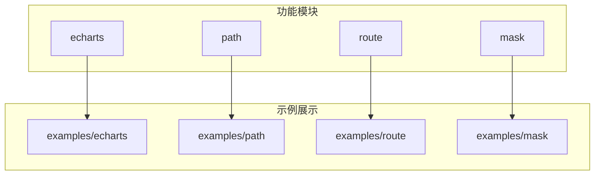
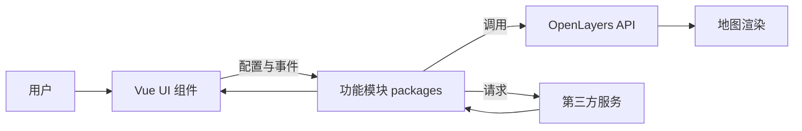
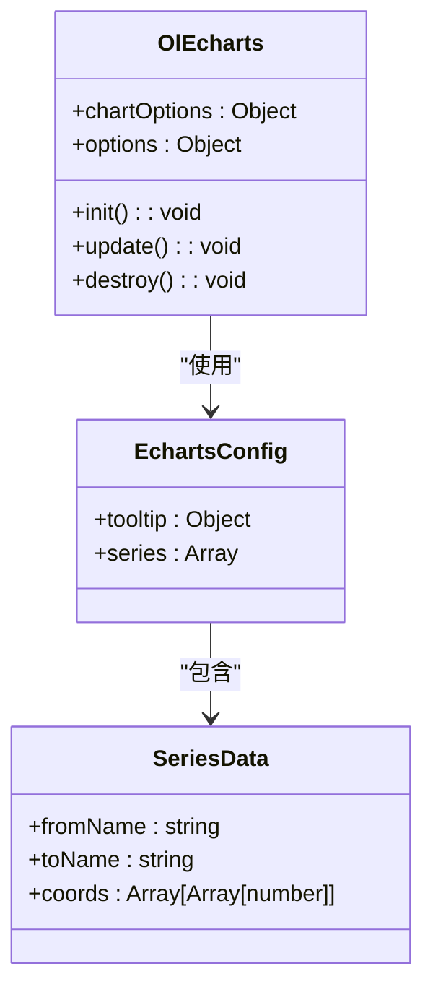
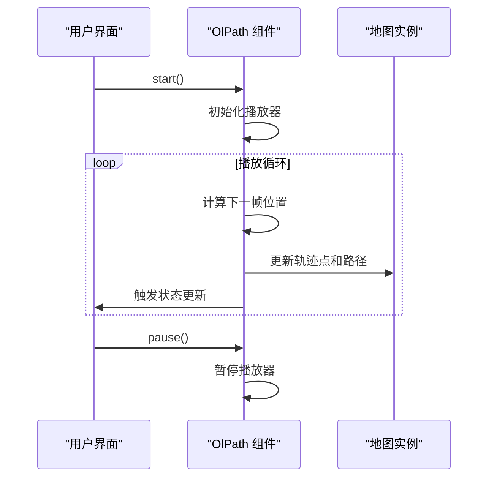
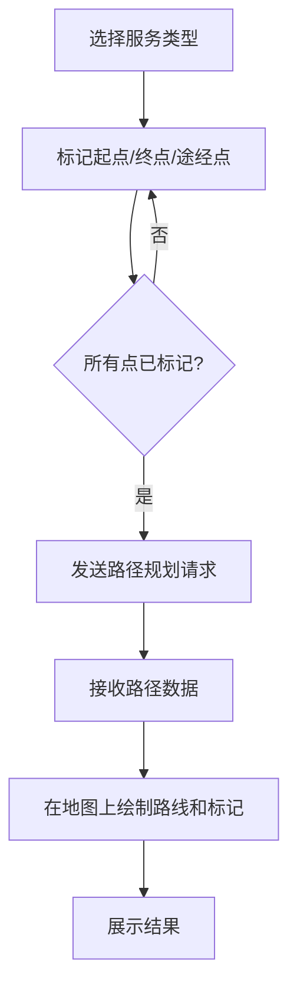
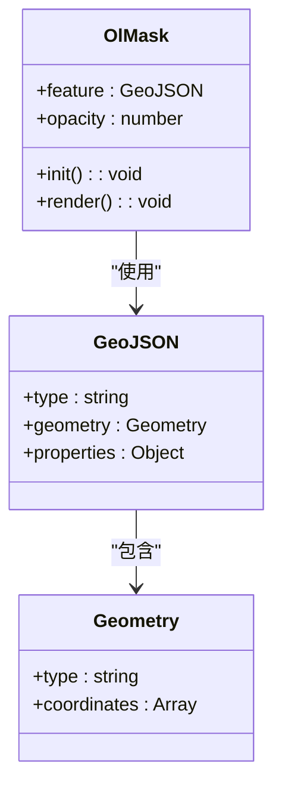
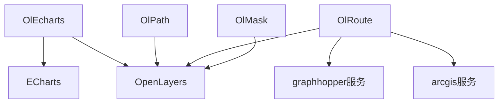

# 高级功能

<cite>
**本文档引用文件**  
- [index.vue](file://src/examples/echarts/index.vue)
- [index.vue](file://src/examples/path/index.vue)
- [index.vue](file://src/examples/route/index.vue)
- [index.vue](file://src/examples/mask/index.vue)
- [index.ts](file://src/packages/echarts/index.ts)
- [index.ts](file://src/packages/path/index.ts)
</cite>

## 目录
1. [简介](#简介)
2. [项目结构](#项目结构)
3. [核心组件](#核心组件)
4. [架构概览](#架构概览)
5. [详细组件分析](#详细组件分析)
6. [依赖关系分析](#依赖关系分析)
7. [性能考量](#性能考量)
8. [故障排除指南](#故障排除指南)
9. [结论](#结论)

## 简介
本文档深入解析 `v3-ol-map` 项目中的四大高级功能模块：**ECharts集成（OlEcharts）**、**轨迹回放（OlPath）**、**路径规划（OlRoute）** 和 **遮罩（OlMask）**。通过分析 `src/examples` 中的示例代码，详细阐述各功能的实现机制、配置选项和使用方法，旨在为开发者提供一份全面的技术参考。

## 项目结构
项目采用模块化设计，核心功能封装在 `src/packages` 目录下，示例代码位于 `src/examples` 目录中。`packages` 目录下的每个子目录（如 `echarts`, `path`, `route`, `mask`）都对应一个独立的功能模块，包含其 TypeScript 实现（`.ts`）和 Vue 组件（`.vue`）。`examples` 目录则提供了这些功能的使用范例。



**图示来源**
- [src/packages/echarts/index.ts](file://src/packages/echarts/index.ts)
- [src/examples/echarts/index.vue](file://src/examples/echarts/index.vue)

## 核心组件
本项目的核心是将 OpenLayers 地图引擎与多种高级可视化和交互功能相结合。`OlEcharts` 实现了 ECharts 图表与地图的无缝叠加；`OlPath` 提供了轨迹数据的动态播放能力；`OlRoute` 集成了第三方路径规划服务；`OlMask` 则用于创建地图遮罩区域。

**组件来源**
- [src/examples/echarts/index.vue](file://src/examples/echarts/index.vue#L1-L283)
- [src/examples/path/index.vue](file://src/examples/path/index.vue#L1-L109)
- [src/examples/route/index.vue](file://src/examples/route/index.vue#L1-L225)
- [src/examples/mask/index.vue](file://src/examples/mask/index.vue#L1-L44)

## 架构概览
系统架构遵循典型的 Vue 3 + TypeScript + OpenLayers 模式。用户通过 `examples` 中的 Vue 组件进行交互，这些组件通过 props 和事件与封装在 `packages` 中的底层功能模块通信。功能模块内部调用 OpenLayers API 或第三方服务（如路径规划）来实现具体功能。



**图示来源**
- [src/packages/echarts/index.ts](file://src/packages/echarts/index.ts)
- [src/packages/path/index.ts](file://src/packages/path/index.ts)

## 详细组件分析

### OlEcharts 组件分析
`OlEcharts` 组件负责将 ECharts 图表叠加在 OpenLayers 地图上，实现数据可视化。

#### 实现机制
该组件通过监听地图的视图变化（如缩放、平移），动态调整 ECharts 图表的坐标系，使其与地图坐标对齐。它利用 `ol/Overlay` 或自定义渲染层来承载 ECharts 实例。

#### 数据格式与配置
示例代码中，`echartsOptions` 定义了 ECharts 的配置。关键数据结构如下：
- **`geoCoordMap`**: 一个对象，存储城市名称到经纬度坐标的映射。
- **`BJData`, `SHData`, `GZData`**: 数组，存储起点和终点信息及权重值。
- **`convertData` 函数**: 将原始数据转换为 ECharts `lines` 系列所需的 `coords` 格式。



**图示来源**
- [src/examples/echarts/index.vue](file://src/examples/echarts/index.vue#L10-L280)
- [src/packages/echarts/index.ts](file://src/packages/echarts/index.ts)

**组件来源**
- [src/examples/echarts/index.vue](file://src/examples/echarts/index.vue#L1-L283)

### OlPath 组件分析
`OlPath` 组件用于在地图上播放轨迹数据。

#### 轨迹数据格式
组件期望的轨迹数据是一个包含时间戳和坐标的对象数组。示例中通过 `fetch` 加载 `data-6k.json` 文件，其数据结构应为：
```json
[
  {"lng": 118.1, "lat": 24.6, "timestamp": 1678886400},
  {"lng": 118.2, "lat": 24.7, "timestamp": 1678886460}
]
```

#### 动画播放控制
组件提供了完整的播放控制接口：
- **`start()`**: 开始播放。
- **`pause()`**: 暂停播放。
- **`resume()`**: 继续播放。
- **`stop()`**: 停止播放。
- **`destroy()`**: 销毁组件。

#### 速度调节机制
通过 `path.options.speed` 配置项（单位：km/h）来控制动画播放速度。组件内部会根据速度和轨迹点之间的距离计算出播放的时间间隔。



**图示来源**
- [src/examples/path/index.vue](file://src/examples/path/index.vue#L1-L109)
- [src/packages/path/index.ts](file://src/packages/path/index.ts)

**组件来源**
- [src/examples/path/index.vue](file://src/examples/path/index.vue#L1-L109)

### OlRoute 组件分析
`OlRoute` 组件集成了第三方路径规划服务。

#### 集成方式
组件支持多种服务类型（如 `arcgis`, `graphhopper`），通过 `type` 和 `url` 属性指定。它会根据服务类型构造相应的请求参数（`params`），并通过 `GET` 或 `POST` 请求发送到指定的 `url`。

#### 路线展示方法
- **起点、终点、途经点**: 使用自定义图标（`iconStart`, `iconEnd`, `iconStop`）进行标记。
- **路线**: 服务返回的路径数据会被解析并以矢量线的形式绘制在地图上。

#### 交互流程
1. 用户通过界面选择服务类型。
2. 用户点击“标记”按钮进入点选取模式。
3. 用户在地图上单击，坐标被捕获并赋值给起点、终点或途经点。
4. 组件自动调用路径规划服务并展示结果。



**图示来源**
- [src/examples/route/index.vue](file://src/examples/route/index.vue#L1-L225)

**组件来源**
- [src/examples/route/index.vue](file://src/examples/route/index.vue#L1-L225)

### OlMask 组件分析
`OlMask` 组件用于创建地图遮罩。

#### 遮罩区域创建
遮罩区域通过 `feature` 属性传入，其数据格式为 GeoJSON。示例中使用 `mockCoordinates()` 函数生成随机坐标点，并构建一个 `Polygon` 类型的 GeoJSON 对象。

#### 样式定制
通过 `opacity` 属性控制遮罩的透明度。示例中设置为 `0.5`，形成半透明效果。

#### 显示/隐藏控制
组件本身没有提供显式的显示/隐藏开关，其可见性由父组件（`ol-tile`）的插槽机制控制。若 `ol-mask` 标签存在，则遮罩显示；移除标签则隐藏。



**图示来源**
- [src/examples/mask/index.vue](file://src/examples/mask/index.vue#L1-L44)

**组件来源**
- [src/examples/mask/index.vue](file://src/examples/mask/index.vue#L1-L44)

## 依赖关系分析
各功能模块之间相对独立，均依赖于核心的 OpenLayers 库和项目自身的 `VMap` 类型定义。`OlRoute` 组件依赖于外部的路径规划服务。



**图示来源**
- [src/packages/echarts/index.ts](file://src/packages/echarts/index.ts)
- [src/packages/path/index.ts](file://src/packages/path/index.ts)

## 性能考量
- **大规模轨迹数据**: 对于 `OlPath`，建议实现分段加载，避免一次性加载过多数据导致内存溢出。可以结合 `timeStep` 参数进行数据抽稀。
- **ECharts 渲染性能**: 对于 `OlEcharts`，应避免在高频率的地图交互（如快速拖拽）时频繁重绘图表。可通过 `options.hideOnMoving` 等配置项优化。
- **网络请求**: `OlRoute` 的性能受网络延迟影响较大，应做好加载状态提示和错误处理。

## 故障排除指南
- **ECharts 图表不显示**: 检查 `chartOptions` 是否正确生成，确保 `geoCoordMap` 中的坐标与地图投影一致。
- **轨迹播放卡顿**: 检查轨迹数据量是否过大，尝试降低 `speed` 或增加 `timeStep`。
- **路径规划无响应**: 检查 `url` 是否正确，确认第三方服务是否可用，检查浏览器控制台是否有网络错误。
- **遮罩不生效**: 确认 `feature` 属性传入的 GeoJSON 格式正确，且坐标在当前地图视图范围内。

## 结论
`v3-ol-map` 项目通过模块化设计，成功集成了 ECharts 可视化、轨迹回放、路径规划和地图遮罩等高级功能。各组件接口清晰，易于使用。开发者可基于此框架，结合具体业务需求，快速构建出功能丰富的地理信息系统应用。