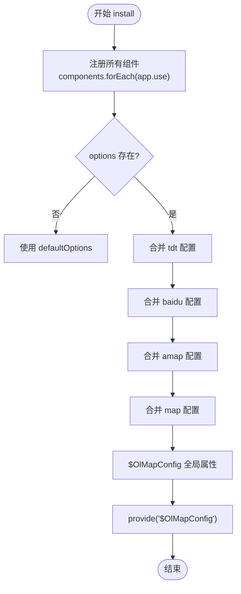
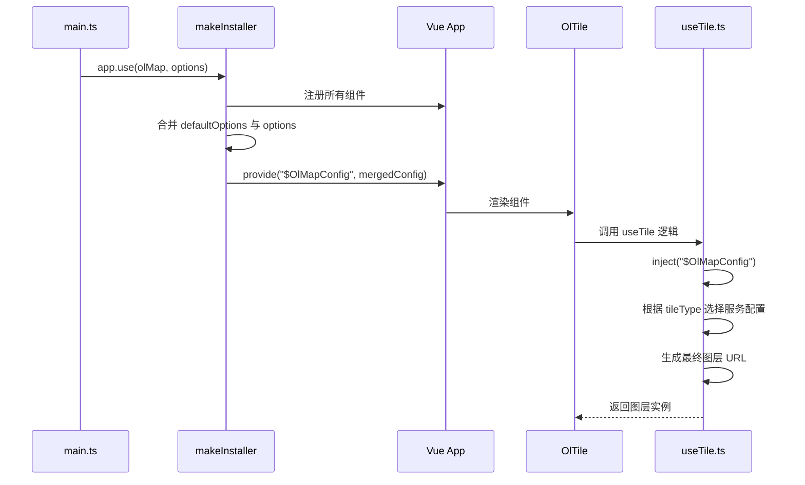

# 全局配置

<cite>
**本文档引用文件**  
- [default.ts](file://src/packages/default.ts#L1-L163)
- [main.ts](file://src/main.ts#L1-L25)
- [Map.ts](file://src/packages/types/Map.ts#L1-L28)
- [useTile.ts](file://src/packages/layers/tile/useTile.ts#L174-L210)
- [index.vue](file://src/examples/config/index.vue#L1-L29)
- [config/index.vue](file://src/packages/config/index.vue#L1-L25)
</cite>

## 目录
1. [全局配置机制概述](#全局配置机制概述)
2. [默认配置结构与类型定义](#默认配置结构与类型定义)
3. [makeInstaller 安装逻辑分析](#makeinstaller-安装逻辑分析)
4. [配置注入流程与 provide/inject 机制](#配置注入流程与-provideinject-机制)
5. [实际使用示例：main.ts 中的配置传入](#实际使用示例：maints-中的配置传入)
6. [配置继承与默认值回退机制](#配置继承与默认值回退机制)
7. [环境变量与 API 密钥管理最佳实践](#环境变量与-api-密钥管理最佳实践)
8. [常见配置错误与解决方案](#常见配置错误与解决方案)

## 全局配置机制概述

本组件库通过 `makeInstaller` 函数实现全局配置机制，允许开发者在调用 `app.use()` 时传入自定义配置对象，覆盖默认的地图服务参数、中心点、缩放级别等设置。该机制基于 Vue 3 的插件系统和依赖注入（`provide/inject`）实现，确保配置在整个组件树中可访问。

核心流程包括：
- 在 `default.ts` 中定义默认配置 `defaultOptions`
- 使用 `makeInstaller` 创建可接受配置参数的安装函数
- 通过 `app.provide` 将合并后的配置暴露给所有子组件
- 各地图组件通过 `inject` 获取配置并动态生成图层 URL

**Section sources**
- [default.ts](file://src/packages/default.ts#L1-L163)

## 默认配置结构与类型定义

### 配置类型定义：Map.ts

在 `types/Map.ts` 文件中，定义了地图核心配置接口 `VMap`，它扩展自 OpenLayers 的 `MapOptions`，并支持自定义视图、控件和交互行为。

```typescript
export declare type VMap = defMapOptions & {
  controls?: import("ol/control/defaults").DefaultsOptions;
  interactions?: import("ol/interaction/defaults").DefaultsOptions;
  view?: View;
  target?: string;
};
```

其中 `view` 接口扩展了 `ViewOptions`，增加了城市字段支持：

```typescript
export interface View extends ViewOptions {
  city?: string;
}
```

### 服务提供商配置结构

在 `default.ts` 中，定义了三大地图服务的配置结构：

- **天地图 (TDT)**：包含 `ak`（访问密钥）及多种图层模板 URL
- **百度地图 (Baidu)**：支持普通、卫星、标签及夜间模式
- **高德地图 (AMap)**：提供标准与卫星图层 URL 模板

```typescript
type TDT = {
  ak: string;
  Normal?: string;
  Normal_Label?: string;
  Satellite?: string;
  Satellite_Label?: string;
  Terrain?: string;
  Terrain_Label?: string;
};

type Baidu = {
  ak: string;
  Normal?: string;
  Satellite?: string;
  Satellite_Label?: string;
  midnight?: string;
};

type AMap = {
  Normal?: string;
  Satellite?: string;
  Satellite_Label?: string;
};
```

这些类型共同构成 `ConfigProviderProps`，作为全局配置的类型契约。

**Section sources**
- [Map.ts](file://src/packages/types/Map.ts#L1-L28)

## makeInstaller 安装逻辑分析

`makeInstaller` 是全局配置机制的核心函数，其职责是创建一个可配置的 Vue 插件安装器。

### 函数签名与参数

```typescript
export const makeInstaller = (components: Plugin[] = []) => { ... }
```

接收一个组件插件数组作为参数，并返回一个具有 `install` 方法的对象。

### install 方法执行流程



**Diagram sources**
- [default.ts](file://src/packages/default.ts#L119-L162)

### 关键逻辑说明

1. **组件注册**：遍历传入的组件列表，依次调用 `app.use()` 注册
2. **配置合并**：以 `defaultOptions` 为基础，使用扩展运算符逐层合并用户传入的 `options`
   - 天地图配置：`{ ...defaultOptions.tdt, ...options.tdt }`
   - 百度地图配置：同上
   - 高德地图配置：同上
   - 地图视图配置：直接覆盖 `config.map = options.map`
3. **全局属性设置**：将用户原始配置挂载到 `app.config.globalProperties.$OlMapConfig`
4. **依赖注入**：通过 `app.provide("$OlMapConfig", config)` 向组件树提供配置

```typescript
app.provide("$OlMapConfig", {
  map: config.map,
  TDT: config.tdt,
  Baidu: config.tdt, // 注意：此处应为 config.baidu，可能是笔误
  AMap: config.tdt,  // 注意：此处应为 config.amap，可能是笔误
});
```

> ⚠️ 注意：代码中存在潜在 bug，`Baidu` 和 `AMap` 错误地引用了 `config.tdt`，应修正为 `config.baidu` 和 `config.amap`。

**Section sources**
- [default.ts](file://src/packages/default.ts#L119-L162)

## 配置注入流程与 provide/inject 机制

### 配置注入流程图



**Diagram sources**
- [default.ts](file://src/packages/default.ts#L119-L162)
- [useTile.ts](file://src/packages/layers/tile/useTile.ts#L174-L210)

### 实际配置读取示例（useTile.ts）

在 `useTile.ts` 中，通过以下方式读取配置：

```typescript
const Baidu = { ...defaultOlMapConfig.baidu, ...$OlMapConfig?.baidu };
const AMap = { ...defaultOlMapConfig.amap, ...$OlMapConfig?.amap };
```

这表明组件优先使用注入的配置，缺失字段则回退到默认值。

**Section sources**
- [useTile.ts](file://src/packages/layers/tile/useTile.ts#L174-L210)

## 实际使用示例：main.ts 中的配置传入

在 `main.ts` 中展示了如何在应用启动时传入全局配置：

```typescript
app.use(olMap, {
  tdt: {
    ak: "88e2f1d5ab64a7477a7361edd6b5f68a", // 天地图ak
  },
  baidu: {
    ak: "5ieMMexWmzB9jivTq6oCRX9j",
  },
  map: {
    view: {
      zoom: 8,
      center: [118.125827, 24.637526],
    },
  },
});
```

### 配置项说明

| 配置项 | 说明 |
|--------|------|
| `tdt.ak` | 天地图访问密钥，用于请求带 tk 参数的瓦片 |
| `baidu.ak` | 百度地图个性化样式密钥 |
| `map.view.zoom` | 初始缩放级别 |
| `map.view.center` | 初始地图中心点坐标（经度, 纬度） |

此配置将覆盖 `defaultOptions` 中的对应值，实现项目级定制。

**Section sources**
- [main.ts](file://src/main.ts#L1-L25)

## 配置继承与默认值回退机制

### 配置继承规则

1. **完全覆盖**：`map` 配置项整体覆盖，不进行深度合并
2. **深度合并**：`tdt`、`baidu`、`amap` 对象进行浅层合并，用户配置优先
3. **模板保留**：未覆盖的图层 URL 模板仍保留默认值

### 默认值回退示例

若用户仅配置天地图 AK：

```typescript
app.use(olMap, {
  tdt: { ak: "your-key" }
});
```

则：
- `tdt.ak` → `"your-key"`
- `tdt.Normal` → 保留默认模板 `"https://t0.tianditu.gov.cn/DataServer?T=vec_w&X={x}&Y={y}&L={z}&tk="`
- `baidu.ak` → 仍为空字符串
- `map.view` → 使用默认值（中心点 [0,0]，缩放级别 2）

### 组件级配置优先级

在 `examples/config/index.vue` 中展示了组件级配置可覆盖全局配置：

```vue
<ol-config :tdt="config.tdt">
  <ol-map>
    <ol-tile tile-type="TDT"></ol-tile>
  </ol-map>
</ol-config>
```

此时 `<ol-config>` 内部的组件将优先使用其提供的配置，形成局部配置作用域。

**Section sources**
- [index.vue](file://src/examples/config/index.vue#L1-L29)
- [config/index.vue](file://src/packages/config/index.vue#L1-L25)

## 环境变量与 API 密钥管理最佳实践

### 推荐做法

1. **使用 `.env` 文件管理密钥**

```env
VITE_TDT_AK=your_tdt_key
VITE_BAIDU_AK=your_baidu_key
```

2. **在 main.ts 中安全引用**

```typescript
app.use(olMap, {
  tdt: { ak: import.meta.env.VITE_TDT_AK },
  baidu: { ak: import.meta.env.VITE_BAIDU_AK },
});
```

3. **避免硬编码**：绝不将密钥直接写入 `main.ts` 或提交至版本控制

4. **配置验证**：在 `init` 阶段添加密钥有效性检查

```typescript
if (!options.tdt?.ak) {
  console.warn("未配置天地图AK，部分图层可能无法加载");
}
```

### 安全建议

- 为不同环境（开发、测试、生产）配置不同密钥
- 定期轮换 API 密钥
- 在 CI/CD 中通过 secrets 注入环境变量

## 常见配置错误与解决方案

### 错误 1：天地图无法加载，提示 tk 无效

**原因**：未正确配置 `tdt.ak`

**解决方案**：
- 确保 `app.use()` 时传入有效 `ak`
- 检查 `.env` 文件是否正确加载
- 验证密钥是否具有对应图层访问权限

### 错误 2：百度个性化地图不显示

**原因**：`midnight` 样式缺少 `ak`

**代码检查**：
```typescript
if (style === "midnight") {
  if (!ak) {
    throw new Error("个性化地图请配置百度地图ak!");
  }
}
```

**解决方案**：必须在配置中提供 `baidu.ak`

### 错误 3：地图初始位置偏移

**原因**：`map.view.center` 坐标顺序错误

**正确格式**：`[经度, 纬度]`，如 `[118.125827, 24.637526]`

**错误示例**：`[纬度, 经度]` 会导致位置错误

### 错误 4：高德地图图层空白

**原因**：`useTile.ts` 中 `AMap` 配置引用错误

**当前代码问题**：
```typescript
app.provide("$OlMapConfig", {
  AMap: config.tdt, // 错误！应为 config.amap
});
```

**临时解决方案**：在配置中同时设置 `tdt` 和 `amap` 字段

**长期方案**：修复 `default.ts` 中的 `provide` 逻辑