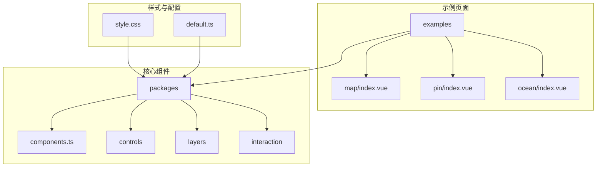
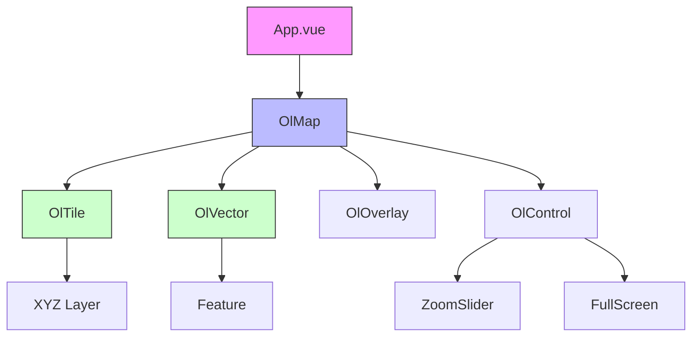
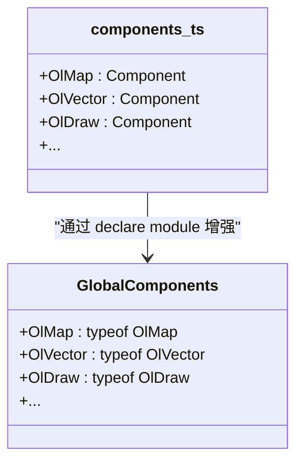
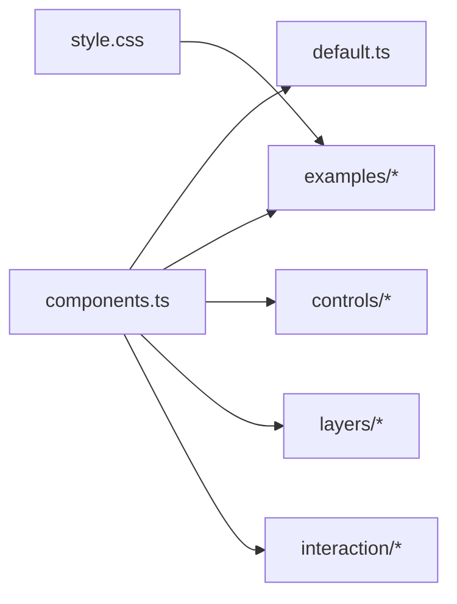

# CSS 与主题定制

<cite>
**本文档引用的文件**   
- [components.ts](file://src/packages/components.ts)
- [style.css](file://src/style.css)
- [pin/index.vue](file://src/examples/pin/index.vue)
- [ocean/index.vue](file://src/examples/ocean/index.vue)
- [default.ts](file://src/packages/default.ts)
</cite>

## 目录
1. [简介](#简介)
2. [项目结构](#项目结构)
3. [核心组件](#核心组件)
4. [架构概览](#架构概览)
5. [详细组件分析](#详细组件分析)
6. [依赖分析](#依赖分析)
7. [性能考虑](#性能考虑)
8. [故障排除指南](#故障排除指南)
9. [结论](#结论)

## 简介
本文档旨在详细介绍如何通过 CSS 变量和 scoped CSS 实现组件库的全局主题与局部样式定制。我们将探讨组件库暴露的 CSS 变量（如 `--ol-map-bg-color`）及其作用范围，指导开发者在项目中覆盖这些变量以实现品牌化设计。同时，演示如何使用 deep selectors 或 `:global` 修改深层嵌套组件的样式，以及如何通过 scoped CSS 精确控制特定页面中的组件外观。结合 `components.ts` 的注册机制，说明如何为自定义样式的组件变体创建别名并全局可用，实现可复用的 UI 主题包。

## 项目结构
本项目采用模块化组织方式，主要分为 `src/examples`（示例页面）、`src/packages`（核心组件包）和 `src/stories`（Storybook 组件文档）。核心组件集中于 `src/packages` 目录下，按功能划分为 `controls`、`layers`、`interaction` 等子模块。全局样式定义在 `src/style.css` 中，使用 `:root` 定义了基础的 CSS 变量和主题颜色。



**图示来源**
- [components.ts](file://src/packages/components.ts)
- [style.css](file://src/style.css)
- [default.ts](file://src/packages/default.ts)

**本节来源**
- [components.ts](file://src/packages/components.ts)
- [style.css](file://src/style.css)

## 核心组件
`components.ts` 是整个组件库的入口文件，负责统一导出所有 Vue 组件，并通过 TypeScript 的 `GlobalComponents` 接口实现全局类型声明，使所有以 `Ol` 开头的组件在模板中可直接使用而无需显式导入。

```typescript
import OlMap from "./map/index.vue";
import OlVector from "./layers/vector/index.vue";
import OlDraw from "./interaction/draw/draw.ts";

export {
  OlMap,
  OlVector,
  OlDraw,
  // ... 其他组件
};

declare module "vue" {
  export interface GlobalComponents {
    OlMap: typeof OlMap;
    OlVector: typeof OlVector;
    OlDraw: typeof OlDraw;
    // ... 其他组件类型
  }
}
```

该文件通过模块导入导出机制，将分散在各子目录中的组件聚合为一个统一的 API 表面，极大简化了组件的使用。

**本节来源**
- [components.ts](file://src/packages/components.ts#L1-L96)

## 架构概览
整个系统的架构围绕 Vue 3 的组合式 API 和组件化思想构建。`src/packages` 目录下的每个功能模块（如地图、图层、控件）都封装为独立的 Vue 组件。`components.ts` 作为聚合层，将这些组件注册为全局可用。`style.css` 提供全局 CSS 变量和基础样式，支持主题切换。示例页面（`examples`）则通过组合这些基础组件来展示具体功能。



**图示来源**
- [components.ts](file://src/packages/components.ts)
- [style.css](file://src/style.css)

## 详细组件分析

### 组件库与全局注册分析
`components.ts` 文件的核心作用是组件聚合与全局类型注入。它不包含任何业务逻辑，而是通过 `export` 语句重新导出从各个模块导入的组件。更重要的是，它利用 TypeScript 的模块增强（Module Augmentation）技术，向 Vue 的 `GlobalComponents` 接口注入了所有 `Ol*` 组件的类型，使得在 `.vue` 模板中可以直接使用 `<OlMap />` 而不会出现类型错误。



**图示来源**
- [components.ts](file://src/packages/components.ts#L1-L96)

### CSS 变量与主题定制分析
全局样式文件 `style.css` 使用 `:root` 伪类定义了应用的根级 CSS 变量，实现了基础的主题支持。例如，`color` 和 `background-color` 在 `:root` 和 `@media (prefers-color-scheme: light)` 查询中分别定义了深色和浅色模式的值。

```css
:root {
  color: rgba(255, 255, 255, 0.87);
  background-color: #242424;
}

@media (prefers-color-scheme: light) {
  :root {
    color: #213547;
    background-color: #ffffff;
  }
}
```

开发者可以通过在项目根组件或 `index.html` 中重写这些 `:root` 变量来自定义全局主题。例如，可以添加 `--ol-map-bg-color: #0000ff;` 来改变地图背景色。

**本节来源**
- [style.css](file://src/style.css#L1-L20)

### 局部样式与深度选择器分析
在特定示例页面中，如 `pin/index.vue`，使用了 `scoped` 样式和 `:deep()` 选择器来精确控制组件内部的样式。`scoped` 属性确保样式仅作用于当前组件，避免全局污染。`:deep()` 选择器则用于穿透子组件的样式封装，修改其内部元素。

```css
<style scoped>
.map-container {
  position: relative;
}
:deep(.pin-light-container) {
  width: 220px;
  border-radius: 10px;
}
:deep(.pin-light-title) {
  background: rgba(40, 153, 255, 0.8);
}
</style>
```

此代码片段展示了如何在 `pin` 示例中，将一个名为 `.pin-light-container` 的弹窗组件的宽度固定为 220px，并将其标题背景色设置为蓝色。`scoped` 保证了这些样式不会影响到其他页面的同名类，而 `:deep()` 成功地将样式应用到了被 `<slot>` 插入的子组件内部。

**本节来源**
- [pin/index.vue](file://src/examples/pin/index.vue#L53-L97)
- [ocean/index.vue](file://src/examples/ocean/index.vue#L53-L84)

## 依赖分析
组件库内部依赖关系清晰。`components.ts` 依赖于 `src/packages` 下所有具体组件的实现。`default.ts` 文件依赖于 `components.ts` 中导出的组件列表来构建默认插件集。示例页面（`examples`）则依赖于 `components.ts` 提供的全局组件。全局样式 `style.css` 被 `index.html` 引入，作用于整个应用。



**图示来源**
- [components.ts](file://src/packages/components.ts)
- [default.ts](file://src/packages/default.ts)
- [style.css](file://src/style.css)

**本节来源**
- [components.ts](file://src/packages/components.ts)
- [default.ts](file://src/packages/default.ts)

## 性能考虑
使用 CSS 变量进行主题定制是一种性能友好的方案，因为浏览器可以高效地处理变量的继承和更新。`scoped` 样式通过属性选择器实现，对性能影响极小。`:deep()` 选择器虽然会增加一定的选择器复杂度，但在现代浏览器中性能开销可以忽略不计。整体上，该方案在提供强大定制能力的同时，保持了良好的运行时性能。

## 故障排除指南
- **问题：全局组件在模板中提示未定义。**  
  **解决方案：** 确保 `components.ts` 已被正确引入。在 `main.ts` 中检查是否通过 `app.use()` 或直接导入 `components.ts` 来注册全局组件。

- **问题：`:deep()` 选择器样式未生效。**  
  **解决方案：** 检查子组件是否使用了 `scoped` 样式。如果子组件也使用了 `scoped`，可能需要在父组件的 `:deep()` 选择器中使用更具体的选择器，或在子组件中暴露特定的 CSS 变量供外部覆盖。

- **问题：CSS 变量在深色/浅色模式切换时未更新。**  
  **解决方案：** 确保变量定义在 `:root` 选择器下，并且媒体查询 `@media (prefers-color-scheme: light)` 的语法正确。

**本节来源**
- [components.ts](file://src/packages/components.ts)
- [style.css](file://src/style.css)
- [pin/index.vue](file://src/examples/pin/index.vue)

## 结论
通过 `components.ts` 的全局注册机制和 `style.css` 中的 CSS 变量，本项目实现了一套灵活且强大的主题与样式定制方案。开发者可以轻松地通过覆盖 CSS 变量来实现全局品牌化设计，并利用 `scoped` 和 `:deep()` 选择器对特定页面或组件进行精细化的样式调整。这种结合了全局配置与局部覆盖的模式，为构建可复用、可定制的 UI 组件库提供了优秀的实践范例。