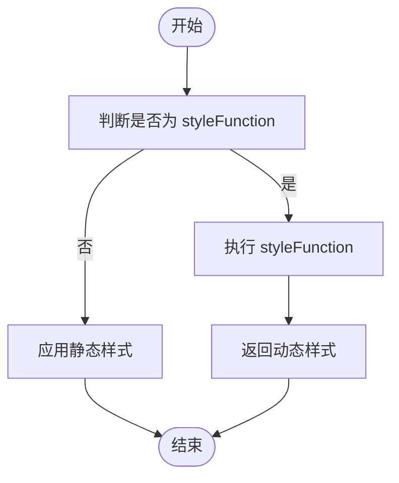
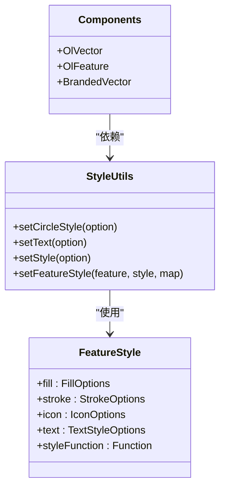

# 样式定制

<cite>
**本文档中引用的文件**  
- [Style.ts](file://src/packages/types/Style.ts#L1-L48)
- [style.ts](file://src/packages/utils/style.ts#L1-L135)
- [components.ts](file://src/packages/components.ts#L1-L96)
</cite>

## 目录
1. [介绍](#介绍)
2. [通过Props传递样式对象](#通过props传递样式对象)
3. [样式类型定义详解](#样式类型定义详解)
4. [工具函数解析](#工具函数解析)
5. [动态样式生成与应用](#动态样式生成与应用)
6. [CSS变量与主题化定制](#css变量与主题化定制)
7. [自定义图标、线条与填充模式](#自定义图标线条与填充模式)
8. [注册带自定义样式的组件变体](#注册带自定义样式的组件变体)

## 介绍
本节将全面阐述 `v3-ol-map` 组件库中的样式定制机制。通过分析核心类型定义和工具函数，指导开发者如何灵活地自定义地图图层、标记、矢量要素等元素的视觉表现，并实现品牌化UI设计。

## 通过props传递样式对象
在 `v3-ol-map` 中，大多数可视化组件（如 `OlVector`、`OlFeature`）支持通过 `style` prop 传入样式配置对象，以控制其外观。该对象遵循 `FeatureStyle` 接口定义，允许设置填充、描边、文本、图标等样式属性。

例如，在使用 `OlFeature` 时，可通过如下方式自定义样式：

```vue
<OlFeature :style="customStyle" />
```

其中 `customStyle` 是一个符合 `FeatureStyle` 类型的对象，可包含 `fill`、`stroke`、`text` 等字段。

**Section sources**
- [components.ts](file://src/packages/components.ts#L1-L96)
- [style.ts](file://src/packages/utils/style.ts#L1-L135)

## 样式类型定义详解
样式系统的类型定义位于 `src/packages/types/Style.ts`，提供了完整的类型支持。

### 核心接口
```ts
export interface StyleOptions {
  fill?: FillOptions;
  stroke?: StrokeOptions;
  icon?: IconOptions;
  image?: CircleOptions | RegularShape;
  text?: TextStyleOptions;
  circle?: CircleStyleOptions;
  shape?: RegularShapeStyleOptions;
  styleFunction?: StyleFunction;
}
```

### 文本样式选项
```ts
export interface TextStyleOptions extends defaultTextStyleOptions {
  fill?: FillOptions;
  backgroundFill?: FillOptions;
  stroke?: StrokeOptions;
  backgroundStroke?: StrokeOptions;
  text?: string;
}
```

### 圆形样式选项
```ts
export interface CircleStyleOptions extends Pick<CircleOptions, "radius"> {
  fill?: FillOptions;
  stroke?: StrokeOptions;
}
```

### 特征样式接口
```ts
export interface FeatureStyle extends FeatureStyleOptions {
  styleFunction?: (feature: FeatureLike, resolution: number, map: Map, style: Style) => Style | Array<Style> | void;
}
```

此接口允许传入一个函数，根据要素状态动态返回样式，适用于条件渲染或数据驱动样式。

**Section sources**
- [Style.ts](file://src/packages/types/Style.ts#L1-L48)

## 工具函数解析
`src/packages/utils/style.ts` 提供了多个用于创建和设置样式的工具函数。

### `setCircleStyle`：创建圆形样式
```ts
export const setCircleStyle = (option: CircleStyleOptions | undefined): Circle => {
  if (!option) {
    return new Circle({ radius: 2 });
  }
  const optionCircle = {
    radius: option.radius || 2,
    fill: new Fill(option.fill || { color: "blue" }),
    stroke: new Stroke(option.stroke || { color: "white" }),
  };
  return new Circle(optionCircle);
};
```
该函数用于创建 `ol/style/Circle` 实例，支持自定义半径、填充色和描边。

### `setText`：创建文本样式
```ts
export const setText = (option: TextStyleOptions): Text => {
  const defaultOption: defaultTextStyleOptions = {
    font: "14px sans-serif",
    padding: [2, 5, 2, 5],
    ...option,
  };
  const textStyle = new Text(defaultOption);
  if (option.text) textStyle.setText(option.text);
  if (validObjKey(option, "fill")) {
    const fillStyle = new Fill(option.fill);
    textStyle.setFill(fillStyle);
  }
  // ...其他样式设置
  return textStyle;
};
```
支持设置字体、颜色、背景、描边等文本属性。

### `setStyle`：创建完整样式对象
```ts
export const setStyle = (option: FeatureStyle) => {
  const style = new Style();
  if (validObjKey(option, "fill")) {
    style.setFill(new Fill(option.fill));
  } else {
    style.setFill(new Fill({ color: "rgba(67,126,255,0.15)" }));
  }
  if (validObjKey(option, "stroke")) {
    style.setStroke(new Stroke(option.stroke));
  } else {
    style.setStroke(new Stroke({ color: "rgba(67,126,255,1)", width: 1 }));
  }
  // 处理 icon, circle, text, shape 等
  return style;
};
```
这是核心函数，将 `FeatureStyle` 配置转换为 OpenLayers 的 `Style` 实例。

### `setFeatureStyle`：应用样式到要素
```ts
export const setFeatureStyle = (feature: Feature, style: FeatureStyle, map: Map) => {
  const featureStyle = setStyle(style);
  feature.setStyle(featureStyle);
  if (validObjKey(style, "styleFunction")) {
    feature.setStyle(function (feature, resolution) {
      return style.styleFunction && style.styleFunction(feature, resolution, map, featureStyle);
    });
  }
};
```
该函数不仅设置静态样式，还支持动态 `styleFunction`。

**Section sources**
- [style.ts](file://src/packages/utils/style.ts#L1-L135)

## 动态样式生成与应用
利用 `styleFunction` 可实现基于要素属性或地图状态的动态样式。例如：

```ts
const dynamicStyle: FeatureStyle = {
  styleFunction: (feature, resolution) => {
    const priority = feature.get('priority');
    let color;
    switch (priority) {
      case 'high': color = 'red'; break;
      case 'medium': color = 'orange'; break;
      default: color = 'green';
    }
    return new Style({
      fill: new Fill({ color }),
      stroke: new Stroke({ color: 'black', width: 1 })
    });
  }
};
```

这种方式适用于热力图、分类图层、条件高亮等场景。



**Diagram sources**
- [style.ts](file://src/packages/utils/style.ts#L100-L135)

## CSS变量与主题化定制
虽然核心样式由 JavaScript 控制，但可通过 CSS 变量实现主题化。建议在 `style.css` 中定义如下变量：

```css
:root {
  --primary-color: #437eff;
  --secondary-color: #ff6b6b;
  --text-color: #333;
  --bg-color: #fff;
}
```

然后在组件的 scoped CSS 中引用：

```vue
<style scoped>
.custom-control {
  background-color: var(--primary-color);
  color: var(--text-color);
}
</style>
```

对于 OpenLayers 原生 DOM 元素（如控件），也可通过覆盖类名样式进行定制。

**Section sources**
- [style.css](file://src/style.css#L1-L10)

## 自定义图标、线条与填充模式
### 自定义图标
通过 `icon` 属性使用自定义图像：

```ts
const iconStyle: FeatureStyle = {
  icon: {
    src: '/icons/custom-marker.png',
    scale: 0.5,
    anchor: [0.5, 1]
  }
};
```

### 自定义线条样式
使用 `lineDash` 实现虚线：

```ts
const dashedStyle: FeatureStyle = {
  stroke: {
    color: 'blue',
    width: 2,
    lineDash: [10, 5]
  }
};
```

### 自定义填充图案
OpenLayers 支持使用 Canvas 或 SVG 图案进行填充，可通过 `Fill` 的 `color` 设置渐变或图案。

```ts
const patternFill = new Fill({
  color: createPatternGradient() // 自定义图案生成函数
});
```

**Section sources**
- [style.ts](file://src/packages/utils/style.ts#L50-L80)

## 注册带自定义样式的组件变体
通过修改 `components.ts` 文件，可注册具有预设样式的组件变体，实现品牌化 UI。

### 步骤：
1. 创建自定义组件包装器（如 `BrandedVector.vue`）
2. 在其中预设默认样式
3. 在 `components.ts` 中导入并导出

```ts
// components.ts
import BrandedVector from "./layers/vector/BrandedVector.vue";

export {
  // ...原有组件
  BrandedVector
};

declare module "vue" {
  export interface GlobalComponents {
    // ...原有声明
    BrandedVector: typeof BrandedVector;
  }
}
```

这样即可在项目中使用 `<BrandedVector />`，自动应用品牌样式。



**Diagram sources**
- [components.ts](file://src/packages/components.ts#L1-L96)
- [style.ts](file://src/packages/utils/style.ts#L1-L135)
- [Style.ts](file://src/packages/types/Style.ts#L1-L48)