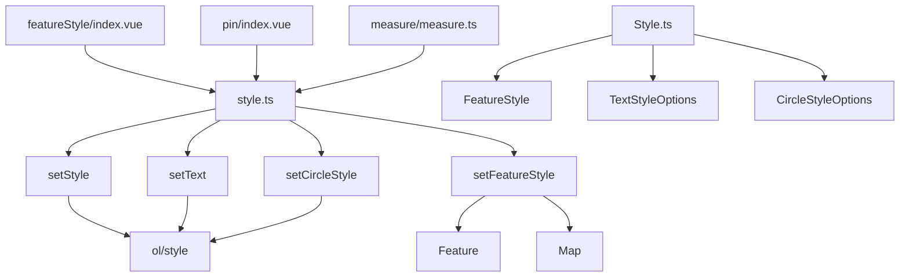
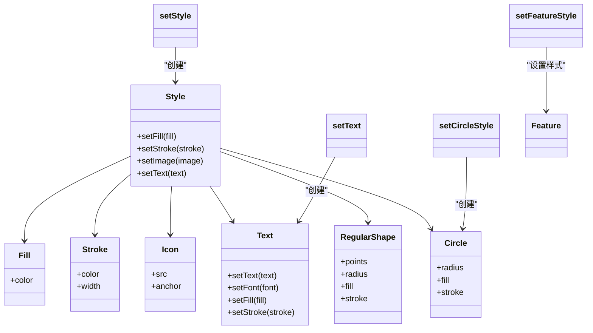
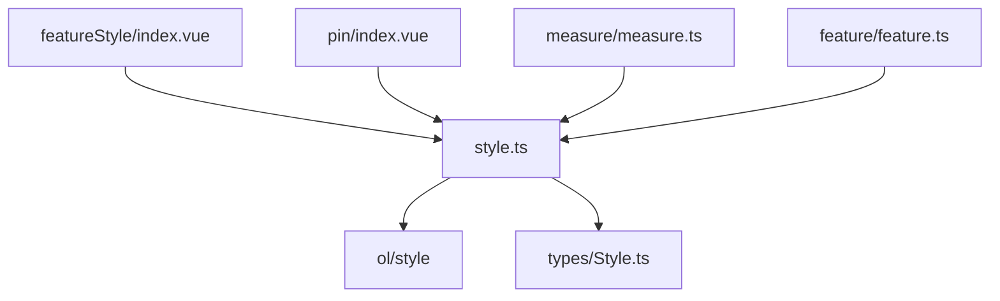

# 样式工具函数

<cite>
**本文档引用文件**  
- [style.ts](file://src/packages/utils/style.ts#L0-L135)
- [Style.ts](file://src/packages/types/Style.ts#L0-L47)
- [index.vue](file://src/examples/featureStyle/index.vue#L0-L97)
- [pin/index.vue](file://src/packages/interaction/pin/index.vue#L81-L89)
- [measure.ts](file://src/packages/interaction/measure/measure.ts#L166-L216)
- [feature.ts](file://src/packages/feature/feature.ts#L158-L185)
</cite>

## 目录
1. [简介](#简介)
2. [项目结构](#项目结构)
3. [核心组件](#核心组件)
4. [架构概览](#架构概览)
5. [详细组件分析](#详细组件分析)
6. [依赖分析](#依赖分析)
7. [性能考虑](#性能考虑)
8. [故障排除指南](#故障排除指南)
9. [结论](#结论)

## 简介
本文档深入解析 `utils/style.ts` 中提供的样式生成工具函数，包括 `setStyle`、`setText`、`setCircleStyle` 和 `setFeatureStyle`。这些函数用于构建 OpenLayers 地图应用中的矢量要素样式，支持填充、描边、图标、文本和几何形状的灵活配置。通过类型定义与实际用例结合，展示如何动态生成基于属性或缩放级别的复杂样式逻辑，提升代码可维护性与复用性。

## 项目结构
项目采用模块化设计，`src/packages/utils/style.ts` 提供核心样式构造能力，被多个交互组件（如 pin、measure）和示例页面（如 featureStyle）所引用。样式逻辑与类型定义分离，`types/Style.ts` 定义了完整的接口结构，确保类型安全。



**图示来源**  
- [style.ts](file://src/packages/utils/style.ts#L0-L135)
- [Style.ts](file://src/packages/types/Style.ts#L0-L47)

**本节来源**  
- [style.ts](file://src/packages/utils/style.ts#L0-L135)
- [Style.ts](file://src/packages/types/Style.ts#L0-L47)

## 核心组件
`utils/style.ts` 提供了四个主要函数：`setCircleStyle`、`setText`、`setStyle` 和 `setFeatureStyle`，分别用于创建圆形样式、文本样式、完整样式对象以及将样式应用于要素。

**本节来源**  
- [style.ts](file://src/packages/utils/style.ts#L0-L135)

## 架构概览
该工具集基于 OpenLayers 的 `ol/style` 模块构建，封装了 `Style`、`Fill`、`Stroke`、`Text`、`Icon`、`Circle` 和 `RegularShape` 类的实例化过程。通过组合式 API，开发者可以声明式地定义样式规则，并支持运行时动态更新。



**图示来源**  
- [style.ts](file://src/packages/utils/style.ts#L0-L135)
- [Style.ts](file://src/packages/types/Style.ts#L0-L47)

## 详细组件分析

### setCircleStyle 函数分析
该函数用于创建圆形图像样式，常用于点要素的默认图标。

```typescript
export const setCircleStyle = (option: CircleStyleOptions | undefined): Circle => {
  if (!option) {
    return new Circle({ radius: 2 });
  }
  const optionCircle = {
    radius: option.radius || 2,
    fill: new Fill(option.fill || { color: "blue" }),
    stroke: new Stroke(option.stroke || { color: "white" }),
  };
  return new Circle(optionCircle);
};
```

支持自定义半径、填充色和描边色，若未传参则返回默认小圆点。

**本节来源**  
- [style.ts](file://src/packages/utils/style.ts#L0-L26)

### setText 函数分析
该函数构建文本样式对象，支持字体、填充、描边、背景填充和背景描边等配置。

```typescript
export const setText = (option: TextStyleOptions): Text => {
  const defaultOption: defaultTextStyleOptions = {
    font: "14px sans-serif",
    padding: [2, 5, 2, 5],
    ...option,
  };
  const textStyle = new Text(defaultOption);
  if (option.text) textStyle.setText(option.text);
  if (validObjKey(option, "fill")) {
    const fillStyle = new Fill(option.fill);
    textStyle.setFill(fillStyle);
  }
  // 其他属性设置...
  return textStyle;
};
```

默认字体为 `14px sans-serif`，并提供 `padding` 默认值。通过 `validObjKey` 安全访问可选属性。

**本节来源**  
- [style.ts](file://src/packages/utils/style.ts#L28-L58)

### setStyle 函数分析
此为核心样式构造函数，整合所有样式组件（填充、描边、图标、圆形、文本、形状）。

```typescript
export const setStyle = (option: FeatureStyle) => {
  const style = new Style();
  if (validObjKey(option, "fill")) {
    style.setFill(new Fill(option.fill));
  } else {
    style.setFill(new Fill({ color: "rgba(67,126,255,0.15)" }));
  }
  if (validObjKey(option, "stroke")) {
    style.setStroke(new Stroke(option.stroke));
  } else {
    style.setStroke(new Stroke({ color: "rgba(67,126,255,1)", width: 1 }));
  }
  // 其他组件设置...
  return style;
};
```

对 `fill` 和 `stroke` 提供默认值，确保即使未配置也能渲染出可见样式。

**本节来源**  
- [style.ts](file://src/packages/utils/style.ts#L60-L122)

### setFeatureStyle 函数分析
该函数将样式应用到具体要素，并支持 `styleFunction` 实现动态样式逻辑。

```typescript
export const setFeatureStyle = (feature: Feature, style: FeatureStyle, map: Map) => {
  const featureStyle = setStyle(style);
  feature.setStyle(featureStyle);
  if (validObjKey(style, "styleFunction")) {
    feature.setStyle(function (feature, resolution) {
      return style.styleFunction && style.styleFunction(feature, resolution, map, featureStyle);
    });
  } else {
    feature.setStyle(featureStyle);
  }
};
```

`styleFunction` 接收要素、分辨率、地图实例和基础样式，可用于实现基于缩放级别或属性值的条件渲染。

**本节来源**  
- [style.ts](file://src/packages/utils/style.ts#L124-L134)

## 依赖分析
工具函数依赖 OpenLayers 样式类和项目内类型定义，被多个功能模块调用。



**图示来源**  
- [style.ts](file://src/packages/utils/style.ts#L0-L135)
- [Style.ts](file://src/packages/types/Style.ts#L0-L47)

**本节来源**  
- [style.ts](file://src/packages/utils/style.ts#L0-L135)
- [feature.ts](file://src/packages/feature/feature.ts#L158-L185)

## 性能考虑
- 所有样式对象在创建后缓存复用，避免重复实例化。
- `styleFunction` 在每次渲染时调用，应避免复杂计算。
- 使用 `validObjKey` 安全检查属性存在性，防止运行时错误。
- 图标缩放通过 `setScale` 动态调整，减少资源加载。

## 故障排除指南
- **问题：文本未显示**  
  检查 `text` 属性是否设置 `text` 字段，且 `setText()` 被正确调用。

- **问题：样式未生效**  
  确认 `feature.setStyle()` 被调用，且样式对象已正确构建。

- **问题：动态样式不更新**  
  确保 `styleFunction` 返回新的 `Style` 实例或修改现有实例后触发重绘。

- **问题：图标错位**  
  检查 `Icon` 的 `anchor` 和 `anchorXUnits`/`anchorYUnits` 配置是否正确。

**本节来源**  
- [style.ts](file://src/packages/utils/style.ts#L124-L134)
- [index.vue](file://src/examples/featureStyle/index.vue#L0-L97)

## 结论
`utils/style.ts` 提供了一套简洁高效的样式构造工具，通过类型安全和默认值机制降低了 OpenLayers 样式配置的复杂度。结合 `styleFunction` 可实现高度动态的可视化效果，适用于分级符号、层级细节切换等场景。建议在项目中统一使用该工具集以提升代码一致性与可维护性。