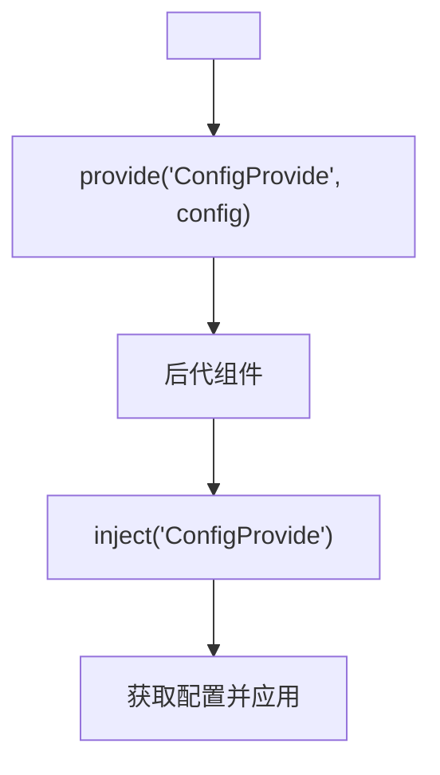
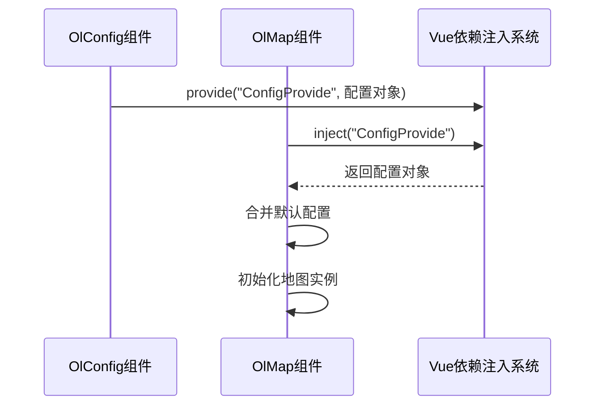

# 运行时配置

<cite>
**本文档中引用的文件**   
- [index.vue](file://src/packages/config/index.vue)
- [default.ts](file://src/packages/default.ts)
- [index.vue](file://src/examples/config/index.vue)
- [index.vue](file://src/packages/map/index.vue)
- [Map.ts](file://src/packages/types/Map.ts)
</cite>

## 目录
1. [运行时配置](#运行时配置)
2. [核心组件分析](#核心组件分析)
3. [配置注入机制](#配置注入机制)
4. [与OlMap的通信机制](#与olmap的通信机制)
5. [实际使用示例](#实际使用示例)
6. [适用场景与性能建议](#适用场景与性能建议)

## 核心组件分析

`OlConfig` 组件（位于 `src/packages/config/index.vue`）是本项目中实现运行时动态配置的核心组件。它通过 Vue 的依赖注入机制（`provide/inject`）将配置信息传递给子组件树中的地图组件，如 `OlMap`。

该组件的主要功能包括：
- 接收外部传入的配置对象（如天地图密钥、百度地图配置等）
- 在组件挂载后通过 `provide` 将配置暴露给后代组件
- 使用 `ref` 控制插槽内容的渲染时机，确保配置初始化完成后再渲染子组件

```vue
<script setup lang="ts">
import { ConfigProviderContext } from "@/packages";
import { onMounted, provide, ref } from "vue";

defineOptions({
  name: "OlConfig",
});
let rendered = ref(false);
const props = withDefaults(defineProps<ConfigProviderContext>(), {});
const init = async () => {
  console.log("init config", props);
  provide("ConfigProvide", props);
};

onMounted(async () => {
  init().then(() => {
    rendered.value = true;
  });
});
</script>

<template>
  <slot v-if="rendered" />
</template>
```

**Section sources**
- [index.vue](file://src/packages/config/index.vue#L1-L25)

## 配置注入机制

`OlConfig` 组件依赖于 `ConfigProviderContext` 类型，该类型定义在 `src/packages/default.ts` 文件中，是 `ConfigProviderProps` 的可选子集（`Partial`），允许开发者仅提供需要覆盖的配置项。

```ts
export type ConfigProviderContext = Partial<ConfigProviderProps>;
```

`ConfigProviderProps` 包含了多个地图服务的配置选项，如：
- **tdt**: 天地图配置，包含 `ak`（访问密钥）及各类图层URL模板
- **baidu**: 百度地图配置
- **amap**: 高德地图配置
- **map**: 地图全局默认视图、控件、交互等设置

当 `OlConfig` 被使用时，其 `props` 会被 `provide("ConfigProvide", props)` 注入到上下文中，后代组件可通过 `inject("ConfigProvide")` 获取这些配置。



**Diagram sources**
- [index.vue](file://src/packages/config/index.vue#L1-L25)
- [default.ts](file://src/packages/default.ts#L119-L121)

**Section sources**
- [default.ts](file://src/packages/default.ts#L32-L91)
- [default.ts](file://src/packages/default.ts#L119-L121)

## 与OlMap的通信机制

`OlMap` 组件（位于 `src/packages/map/index.vue`）是配置的实际消费者。它通过以下方式与 `OlConfig` 协作：

1. **双重注入机制**：优先使用局部注入的 `ConfigProvide`，若不存在则回退到全局注入的 `$OlMapConfig`。
   ```ts
   const configProvider: ConfigProviderContext | undefined = inject("ConfigProvide", undefined);
   const $OlMapConfig: ConfigProviderContext | undefined = configProvider ?? inject("$OlMapConfig", undefined);
   ```

2. **配置合并**：在初始化地图时，将注入的配置与默认配置合并，优先使用用户提供的值。
   ```ts
   const config = $OlMapConfig || defaultOlMapConfig;
   const view: View | undefined = $OlMapConfig ? { ...config.map?.view } : undefined;
   ```

3. **双向数据绑定**：虽然 `OlConfig` 本身不直接监听 `OlMap` 的状态变化，但通过 Vue 的响应式系统和事件机制（如 `changeZoom` 事件），实现了配置与地图状态的间接同步。



**Diagram sources**
- [index.vue](file://src/packages/map/index.vue#L1-L218)
- [index.vue](file://src/packages/config/index.vue#L1-L25)

**Section sources**
- [index.vue](file://src/packages/map/index.vue#L1-L218)

## 实际使用示例

在 `src/examples/config/index.vue` 中提供了一个典型用例：

```vue
<script setup lang="ts">
const config = {
  tdt: {
    ak: "316cf152e80bd8a121b23746a5803c8b", // 天地图密钥
  },
};
</script>

<template>
  <div class="container">
    <!-- 组件形式注入，优先级高于全局设置 -->
    <ol-config :tdt="config.tdt">
      <ol-map target="map1" class="map" width="50%">
        <ol-tile tile-type="TDT"></ol-tile>
      </ol-map>
    </ol-config>
    <!-- 在main中设置的全局变量-->
    <ol-map target="map2" class="map" width="50%">
      <ol-tile tile-type="TDT"></ol-tile>
    </ol-map>
  </div>
</template>
```

此示例展示了两种配置方式：
1. **局部配置**：通过 `<ol-config>` 包裹地图，提供特定配置（如天地图AK），优先级更高。
2. **全局配置**：在 `main.ts` 中通过 `app.use(OlConfig, { ... })` 设置，适用于所有未被局部覆盖的地图实例。

**Section sources**
- [index.vue](file://src/examples/config/index.vue#L1-L29)

## 适用场景与性能建议

### 适用场景
- **开发与调试**：快速切换地图服务、调整视图参数、测试不同图层组合。
- **多环境部署**：根据不同环境（开发、测试、生产）动态注入不同的地图服务密钥。
- **用户自定义配置**：允许终端用户在运行时调整地图显示偏好（如默认图层、缩放级别）。

### 性能影响与优化建议
- **性能开销**：`OlConfig` 的初始化和依赖注入机制引入了轻微的运行时开销，主要体现在组件挂载阶段。
- **生产环境优化**：建议在生产环境中移除或禁用 `OlConfig` 的动态配置能力，改用编译时配置或环境变量注入，以减少运行时判断和依赖注入的开销。
- **最佳实践**：
  - 在开发环境中启用 `OlConfig` 以方便调试。
  - 在生产构建中通过 Tree-shaking 移除未使用的配置模块。
  - 避免在频繁更新的组件中使用 `OlConfig`，以防不必要的重渲染。

**Section sources**
- [index.vue](file://src/packages/config/index.vue#L1-L25)
- [index.vue](file://src/examples/config/index.vue#L1-L29)
- [default.ts](file://src/packages/default.ts#L119-L162)