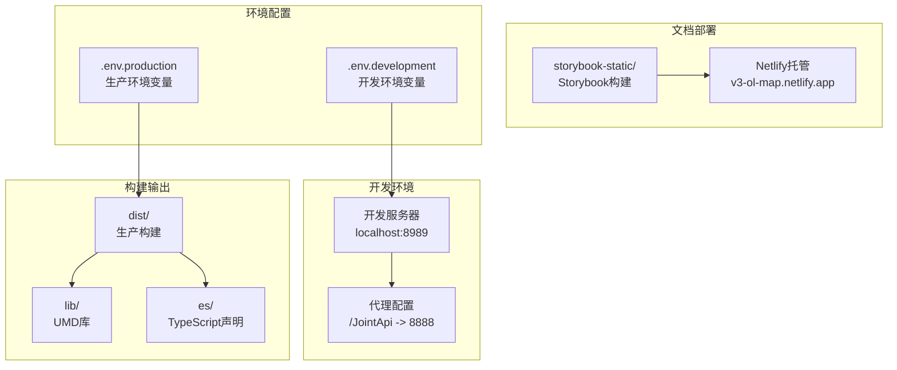
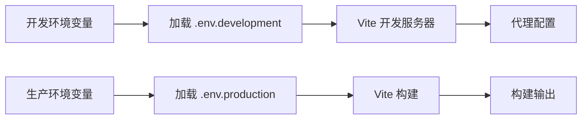
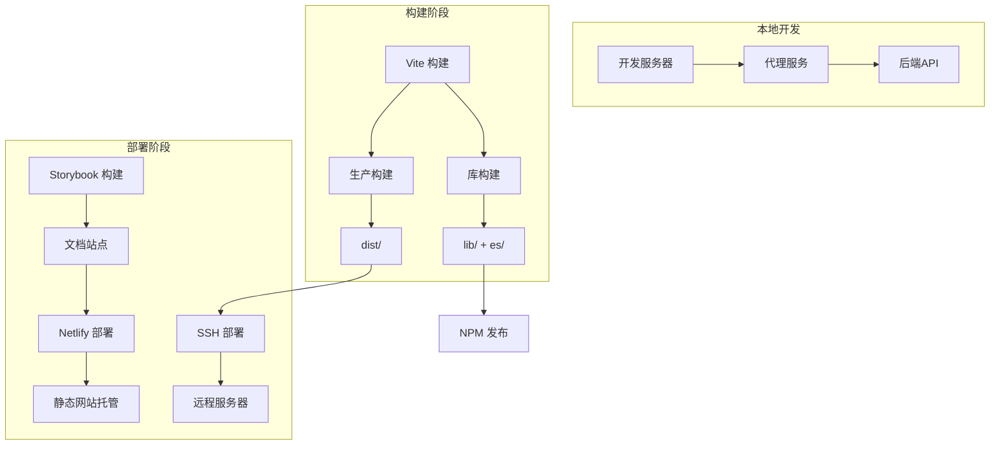
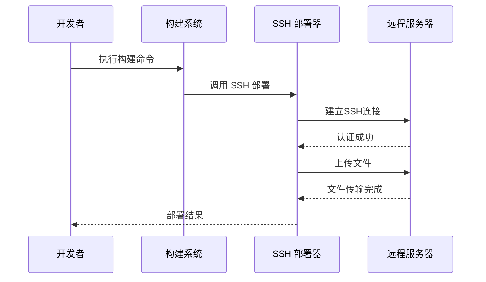
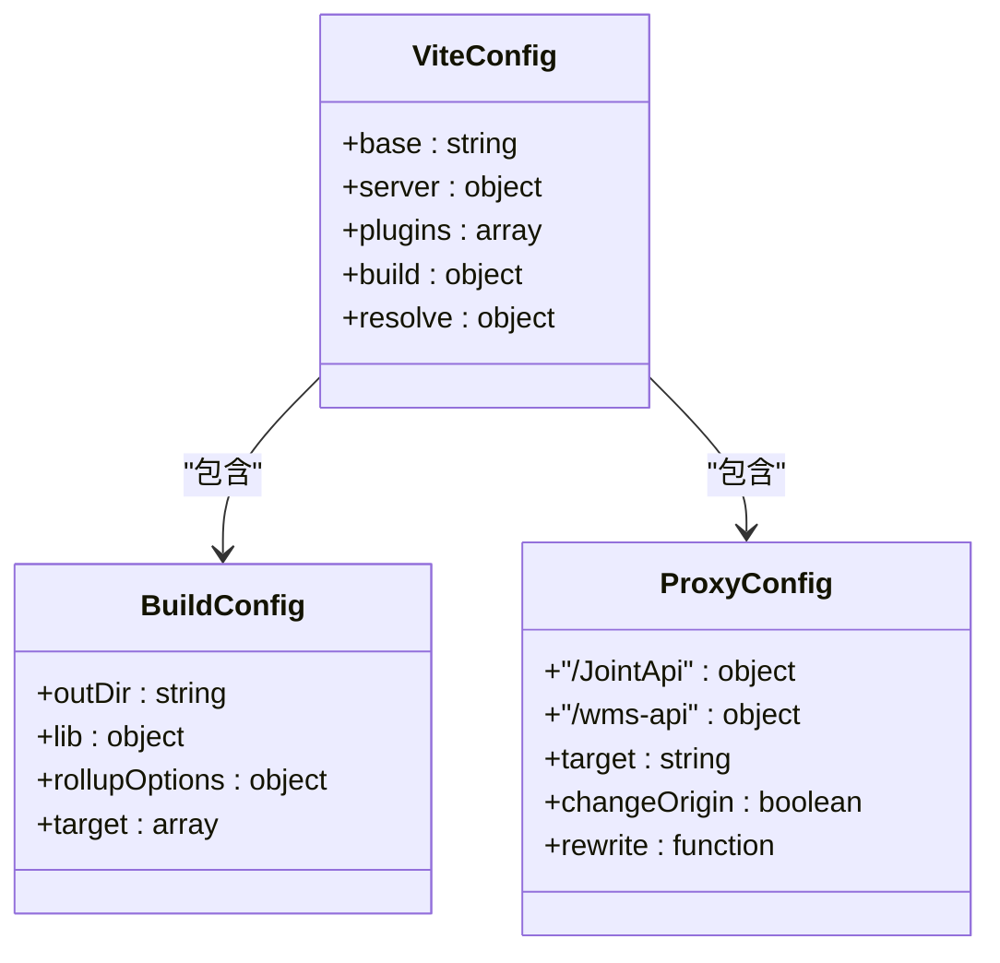
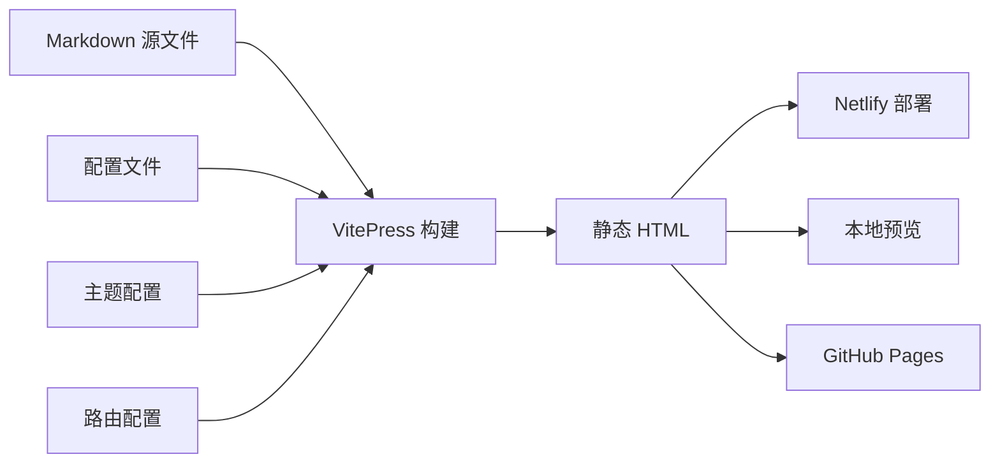
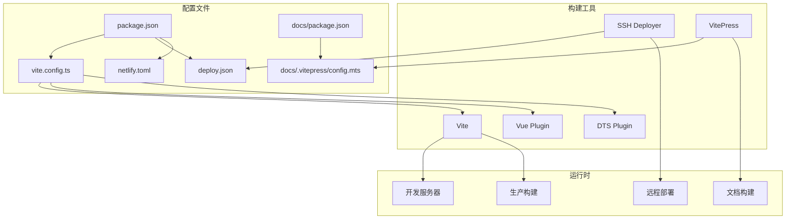

# 部署配置

<cite>
**本文档引用的文件**
- [deploy.json](file://deploy.json)
- [netlify.toml](file://netlify.toml)
- [package.json](file://package.json)
- [vite.config.ts](file://vite.config.ts)
- [.env.development](file://.env.development)
- [.env.production](file://.env.production)
- [docs/.vitepress/config.mts](file://docs/.vitepress/config.mts)
- [docs/package.json](file://docs/package.json)
</cite>

## 目录
1. [简介](#简介)
2. [项目结构](#项目结构)
3. [核心部署组件](#核心部署组件)
4. [架构概览](#架构概览)
5. [详细组件分析](#详细组件分析)
6. [依赖关系分析](#依赖关系分析)
7. [性能考虑](#性能考虑)
8. [故障排除指南](#故障排除指南)
9. [结论](#结论)

## 简介

本项目是一个基于 Vue 3 和 OpenLayers 的地图组件库，提供了完整的部署配置解决方案。项目包含多种部署方式，包括本地开发服务器、生产构建、Storybook 文档站点部署以及 Netlify 静态网站托管。

## 项目结构

项目采用多环境、多部署目标的架构设计：



**图表来源**
- [vite.config.ts](file://vite.config.ts#L37-L98)
- [package.json](file://package.json#L14-L26)

**章节来源**
- [vite.config.ts](file://vite.config.ts#L1-L99)
- [package.json](file://package.json#L1-L82)

## 核心部署组件

### 构建配置系统

项目使用 Vite 作为主要构建工具，支持多种构建模式：

| 构建模式 | 输出目录 | 主要用途 | 关键特性 |
|---------|----------|----------|----------|
| development | dist/ | 开发调试 | 热重载、源码映射、开发代理 |
| lib | lib/ | UMD 库发布 | 外部化依赖、命名导出 |
| production | dist/ | 生产部署 | 代码压缩、资源优化 |

### 环境变量管理

项目采用分环境配置策略：



**图表来源**
- [.env.development](file://.env.development#L1-L12)
- [.env.production](file://.env.production#L1-L10)

**章节来源**
- [.env.development](file://.env.development#L1-L12)
- [.env.production](file://.env.production#L1-L10)

## 架构概览

项目部署架构采用多层次设计，支持多种部署场景：



**图表来源**
- [vite.config.ts](file://vite.config.ts#L6-L36)
- [deploy.json](file://deploy.json#L1-L11)
- [netlify.toml](file://netlify.toml#L1-L29)

## 详细组件分析

### SSH 自动部署配置

项目实现了基于 SSH 的自动化部署流程：



**图表来源**
- [deploy.json](file://deploy.json#L1-L11)
- [package.json](file://package.json#L26-L26)

#### 部署配置详解

| 配置项 | 值 | 描述 |
|--------|-----|------|
| outputDir | storybook-static | 源代码构建输出目录 |
| dest.host | 172.16.34.132 | 目标服务器IP地址 |
| dest.port | 22 | SSH端口号 |
| dest.username | root | 连接用户名 |
| dest.password | 123@qwe | 连接密码 |
| dest.path | /home/application/v3-ol-map | 远程部署路径 |

**章节来源**
- [deploy.json](file://deploy.json#L1-L11)

### Netlify 静态网站托管

项目配置了完整的 Netlify 托管方案：

```mermaid
flowchart TD
A[源代码] --> B[构建命令]
B --> C[构建输出]
C --> D[静态文件]
D --> E[Netlify 部署]
F[环境变量] --> G[NODE_VERSION=20]
H[基础路径] --> I[base = "/docs"]
J[发布目录] --> K[publish = ".vitepress/dist"]
G --> B
H --> B
I --> B
J --> B
```

**图表来源**
- [netlify.toml](file://netlify.toml#L1-L29)

#### Netlify 配置要点

| 配置项 | 值 | 作用 |
|--------|-----|------|
| NODE_VERSION | 20 | 指定 Node.js 版本 |
| base | /docs | 应用的基础路径 |
| publish | .vitepress/dist | 静态文件发布目录 |
| command | pnpm run docs:build | 构建命令 |
| cache-control | max-age=31536000 | 资源缓存策略 |
| x-robots-tag | noindex | 搜索引擎索引控制 |

**章节来源**
- [netlify.toml](file://netlify.toml#L1-L29)

### Vite 构建配置

项目使用 Vite 实现高效的构建流程：



**图表来源**
- [vite.config.ts](file://vite.config.ts#L37-L98)

#### 构建配置特点

1. **多环境支持**：通过 `mode` 参数区分开发和生产环境
2. **代理配置**：支持 API 代理转发，解决跨域问题
3. **插件系统**：集成 Vue、TypeScript 类型生成等插件
4. **别名配置**：提供便捷的模块导入路径

**章节来源**
- [vite.config.ts](file://vite.config.ts#L1-L99)

### 文档站点部署

项目文档使用 VitePress 构建，支持多种部署方式：



**图表来源**
- [docs/.vitepress/config.mts](file://docs/.vitepress/config.mts#L1-L112)
- [docs/package.json](file://docs/package.json#L1-L17)

**章节来源**
- [docs/.vitepress/config.mts](file://docs/.vitepress/config.mts#L1-L112)
- [docs/package.json](file://docs/package.json#L1-L17)

## 依赖关系分析

项目部署配置之间的依赖关系：



**图表来源**
- [package.json](file://package.json#L14-L26)
- [vite.config.ts](file://vite.config.ts#L78-L86)

**章节来源**
- [package.json](file://package.json#L1-L82)

## 性能考虑

### 构建性能优化

1. **代码分割**：利用 Vite 的动态导入实现按需加载
2. **资源压缩**：生产环境下自动压缩 JavaScript 和 CSS
3. **缓存策略**：Netlify 配置了长期缓存策略
4. **Tree Shaking**：通过 ES6 模块系统实现无用代码剔除

### 部署性能优化

1. **CDN 加速**：Netlify 提供全球 CDN 分发
2. **HTTP/2 支持**：现代浏览器协议优化
3. **Gzip 压缩**：自动启用压缩传输
4. **懒加载**：文档内容按需加载

## 故障排除指南

### 常见部署问题

| 问题类型 | 症状 | 解决方案 |
|----------|------|----------|
| SSH 连接失败 | 权限被拒绝 | 检查用户名密码配置 |
| 端口占用 | 连接超时 | 修改 SSH 端口或防火墙设置 |
| 资源加载失败 | 404 错误 | 验证 base 路径配置 |
| 代理配置错误 | API 跨域 | 检查代理规则和目标地址 |
| 构建失败 | 编译错误 | 确认 Node.js 版本兼容性 |

### 环境变量配置检查

确保 `.env.development` 和 `.env.production` 文件中的关键变量正确配置：

- `VITE_BASE_URL`: 应用的基础 URL
- `VITE_JOINT_API_URL`: API 代理前缀
- `VITE_MAP_URL`: 地图服务地址

**章节来源**
- [.env.development](file://.env.development#L6-L11)
- [.env.production](file://.env.production#L5-L9)

## 结论

本项目提供了完整的部署配置解决方案，涵盖了从开发到生产的各个环节。通过合理的配置管理和多环境支持，项目能够适应不同的部署需求。

### 主要优势

1. **多部署模式支持**：同时支持本地开发、生产部署、文档托管
2. **自动化程度高**：通过脚本和配置实现一键部署
3. **环境隔离**：清晰的开发和生产环境分离
4. **性能优化**：内置多种性能优化策略

### 最佳实践建议

1. **安全配置**：在生产环境中使用更安全的认证方式
2. **监控配置**：添加部署后的健康检查机制
3. **回滚策略**：建立快速回滚的部署流程
4. **日志记录**：完善部署过程的日志记录