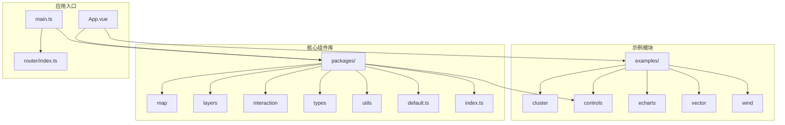
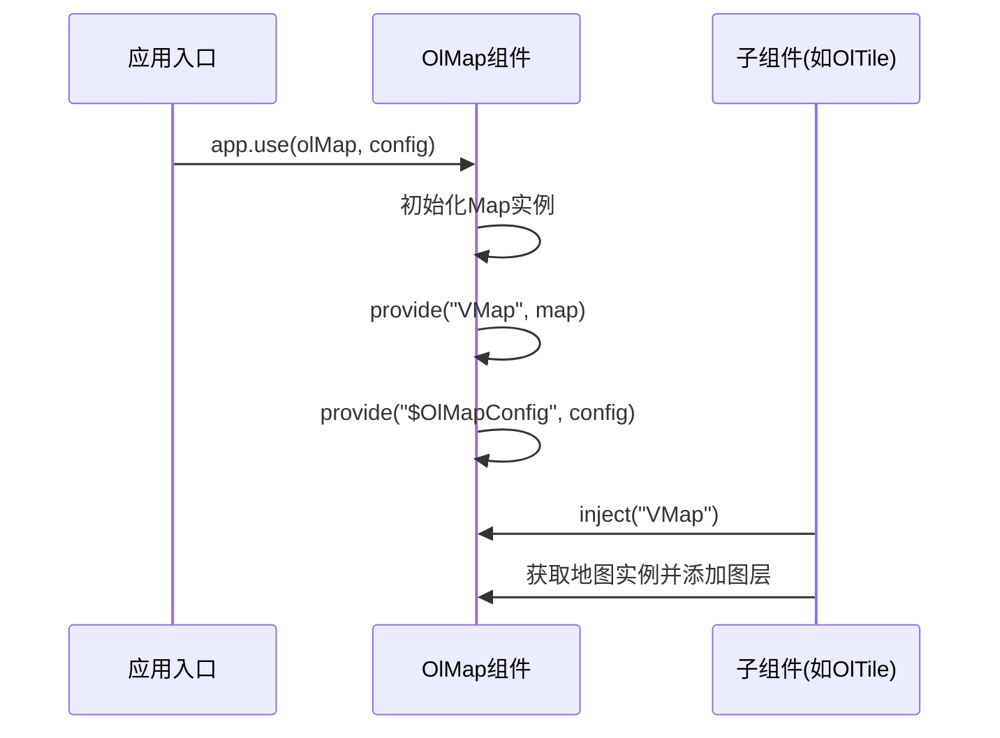

# 项目概述

<cite>
**本文档引用文件**  
- [README.md](file://README.md#L1-L130)
- [main.ts](file://src/main.ts#L1-L24)
- [index.ts](file://src/packages/index.ts#L1-L8)
- [default.ts](file://src/packages/default.ts#L1-L163)
- [map/index.ts](file://src/packages/map/index.ts#L1-L6)
- [map/index.vue](file://src/packages/map/index.vue#L1-L218)
- [types/Map.ts](file://src/packages/types/Map.ts#L1-L27)
</cite>

## 目录
1. [项目概述](#项目概述)
2. [项目结构](#项目结构)
3. [核心架构与设计思想](#核心架构与设计思想)
4. [技术栈与依赖集成](#技术栈与依赖集成)
5. [全局配置与依赖注入机制](#全局配置与依赖注入机制)
6. [核心组件分析：地图容器（OlMap）](#核心组件分析：地图容器（olmap）)
7. [初始化流程与配置注入](#初始化流程与配置注入)
8. [适用场景与功能特性](#适用场景与功能特性)
9. [学习路径与开发建议](#学习路径与开发建议)

## 项目结构

本项目采用模块化分层结构，主要分为 `src/examples`（示例）、`src/packages`（核心组件库）和 `src/router`（路由管理）三大模块。`src/packages` 是整个项目的核心，封装了基于 Vue 3 和 OpenLayers 的地图组件、交互、图层、控制等模块。



**图示来源**  
- [项目结构](file://#L1-L200)

## 核心架构与设计思想

### 插件化设计
项目采用 Vue 插件机制，通过 `app.use()` 全局注册所有地图组件。`src/packages/default.ts` 中定义了 `makeInstaller` 函数，统一管理所有组件的安装流程。

### Composition API 与响应式系统
所有组件均基于 Vue 3 的 `<script setup>` 语法和 Composition API 构建，利用 `ref`、`computed`、`provide/inject` 等能力实现状态管理与跨层级通信。

### 解构式 API 设计
项目核心设计原则是“**尽量使用 OpenLayers 原生 API，通过 props 传递参数**”。为简化配置，对 OpenLayers 的复杂对象（如 `View`、`source`）进行解构，允许开发者直接传入 `Options` 而非实例对象。

例如：
```vue
<ol-map :view="{ center: [0, 0], zoom: 2 }" />
```
而非：
```ts
const view = new View({ center: [0, 0], zoom: 2 });
const map = new Map({ view });
```

这种设计极大提升了开发体验，降低了使用门槛。

**本节来源**  
- [README.md](file://README.md#L15-L60)
- [src/packages/map/index.vue](file://src/packages/map/index.vue#L1-L218)

## 技术栈与依赖集成

| 技术 | 版本 | 说明 |
|------|------|------|
| **Vue** | 3.4.27 | 前端框架，使用 Composition API 和响应式系统 |
| **TypeScript** | 支持 | 提供类型安全与开发提示 |
| **Vite** | 支持 | 构建工具，提供快速启动与热更新 |
| **OpenLayers** | v10 | 地图引擎，提供地图渲染、图层、交互等核心能力 |
| **ol-echarts** | 集成 | 支持 ECharts 数据可视化叠加 |
| **ol-wind** | 集成 | 支持风场数据可视化 |

项目通过 `src/packages/index.ts` 统一导出所有组件、工具和类型，支持完整引入或按需引入。

```ts
// 完整引入
app.use(olMap, config);

// 按需引入
import { OlMap, OlTile } from "v3-ol-map";
```

**本节来源**  
- [README.md](file://README.md#L1-L10)
- [package.json](file://package.json#L1-L20)

## 全局配置与依赖注入机制

项目通过 `provide/inject` 实现全局配置的传递，避免层层传递 props。

### 配置结构
在 `src/packages/default.ts` 中定义了默认配置 `defaultOlMapConfig`，包含：
- `tdt`: 天地图 AK 及图层 URL 模板
- `baidu`: 百度地图 AK 及图层 URL
- `amap`: 高德地图配置
- `map`: 默认地图视图（center、zoom）

### 依赖注入实现
`makeInstaller` 函数在 `app.use(olMap, config)` 时：
1. 将用户配置与默认配置合并
2. 通过 `app.provide("$OlMapConfig", config)` 注入全局配置
3. 子组件通过 `inject("$OlMapConfig")` 获取配置

```ts
export const makeInstaller = (components: Plugin[] = []) => {
  const install = (app: App, options?: ConfigProviderContext) => {
    // ...组件注册
    app.provide("$OlMapConfig", mergedConfig);
  };
  return { install };
};
```

此机制确保所有地图组件可共享统一的地图中心、缩放级别、地图服务密钥等信息。

**本节来源**  
- [src/packages/default.ts](file://src/packages/default.ts#L1-L163)
- [src/main.ts](file://src/main.ts#L1-L24)

## 核心组件分析：地图容器（OlMap）

`OlMap` 是整个地图系统的核心容器组件，封装了 OpenLayers 的 `Map` 实例。

### 组件属性（Props）
继承自 `VMap` 类型（定义于 `types/Map.ts`），支持 OpenLayers `MapOptions` 的所有属性，包括：
- `view`: 视图配置（center、zoom、projection 等）
- `layers`: 图层数组
- `controls`: 控件（缩放、比例尺等）
- `interactions`: 交互行为（拖拽、缩放等）
- `width/height`: 容器尺寸

### 事件系统
组件绑定 OpenLayers 原生事件，并通过 `emit` 暴露给父组件：
- `load`: 地图初始化完成
- `changeZoom`: 缩放级别变化
- `click/dblclick`: 鼠标事件
- `movestart/moveend`: 地图移动事件

### 方法暴露（defineExpose）
通过 `defineExpose` 向外暴露实用方法：
- `getMap()`: 获取原生 OpenLayers Map 实例
- `getLayerById(id)`: 根据 ID 获取图层
- `panTo(options)`: 平滑移动到指定位置
- `flyTo(options)`: 飞行动画到指定位置
- `readFeatures(geojson)`: 读取 GeoJSON 特征

### provide 机制
通过 `provide("VMap", map)` 将地图实例传递给子组件（如图层、控件），实现父子组件协作。



**图示来源**  
- [src/packages/map/index.vue](file://src/packages/map/index.vue#L1-L218)
- [src/packages/types/Map.ts](file://src/packages/types/Map.ts#L1-L27)

**本节来源**  
- [src/packages/map/index.vue](file://src/packages/map/index.vue#L1-L218)
- [src/packages/types/Map.ts](file://src/packages/types/Map.ts#L1-L27)

## 初始化流程与配置注入

### 初始化步骤
1. 在 `main.ts` 中调用 `app.use(olMap, config)`
2. `makeInstaller` 执行 `install` 函数
3. 合并默认配置与用户配置
4. 通过 `app.provide` 注入 `$OlMapConfig`
5. 注册所有地图组件（OlMap、OlTile 等）

### 配置注入示例
```ts
// src/main.ts
app.use(olMap, {
  tdt: { ak: "88e2f1d5ab64a7477a7361edd6b5f68a" },
  map: {
    view: {
      zoom: 8,
      center: [118.125827, 24.637526]
    }
  }
});
```

子组件可通过 `inject("$OlMapConfig")` 获取该配置，自动应用天地图 AK 和默认视图。

**本节来源**  
- [src/main.ts](file://src/main.ts#L1-L24)
- [src/packages/default.ts](file://src/packages/default.ts#L1-L163)

## 适用场景与功能特性

### 主要功能
- **地图展示**：支持天地图、百度、高德等在线地图
- **图层管理**：支持瓦片、矢量、热力图、风场、WMS/WFS 等图层
- **交互操作**：支持绘制、测量、拖拽旋转缩放、要素编辑
- **数据可视化**：集成 ECharts、WebGL 矢量渲染
- **控件支持**：缩放滑块、全屏、比例尺、鹰眼图、鼠标位置
- **高级功能**：路径规划、掩膜、多地图联动、TIFF 栅格解析

### 典型应用场景
- 地理信息管理系统（GIS）
- 数据大屏可视化
- 智慧城市、交通监控
- 气象、环境监测
- 物流路径规划

**本节来源**  
- [README.md](file://README.md#L1-L130)
- [项目结构](file://#L1-L200)

## 学习路径与开发建议

### 初学者路径
1. 阅读 [官方文档](https://v3-ol-map.netlify.app/)
2. 运行 `src/examples` 中的示例（如 `map/index.vue`）
3. 学习 `OlMap` 基础用法
4. 尝试添加 `OlTile`、`OlVector` 图层
5. 使用 `OlDraw` 进行绘制交互

### 高级开发者建议
- 深入阅读 `src/packages/types` 中的类型定义
- 理解 `provide/inject` 在组件通信中的作用
- 自定义组件时继承 `VMap` 类型保持一致性
- 利用 `defineExpose` 暴露原生 OpenLayers API
- 注意性能优化：合理使用 `shallowRef`、避免频繁重绘

**本节来源**  
- [README.md](file://README.md#L1-L130)
- [src/examples](file://src/examples#L1-L200)