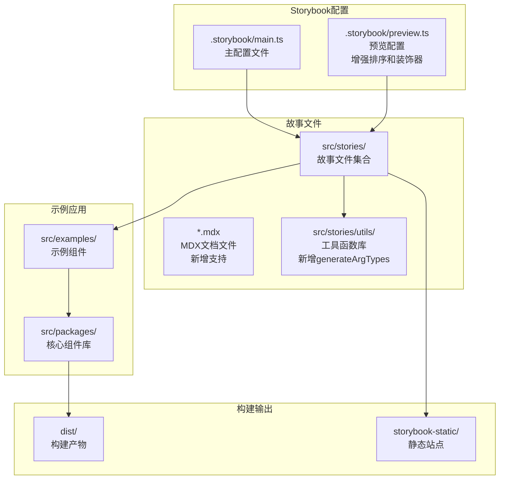
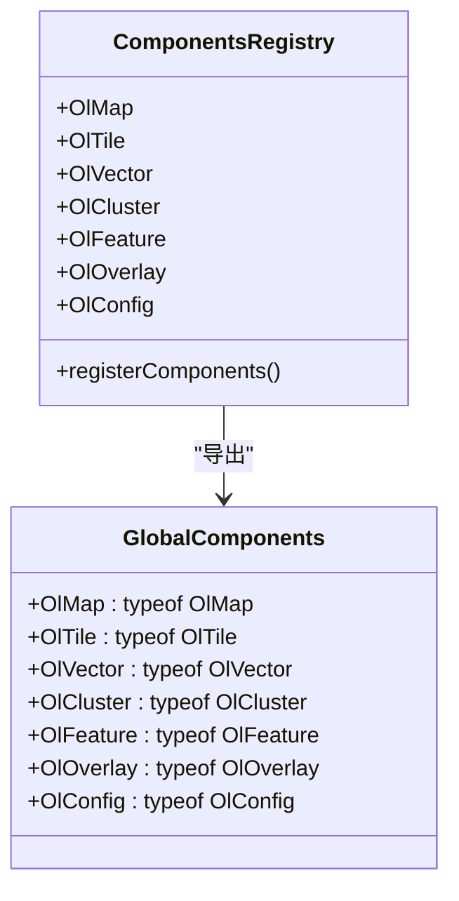
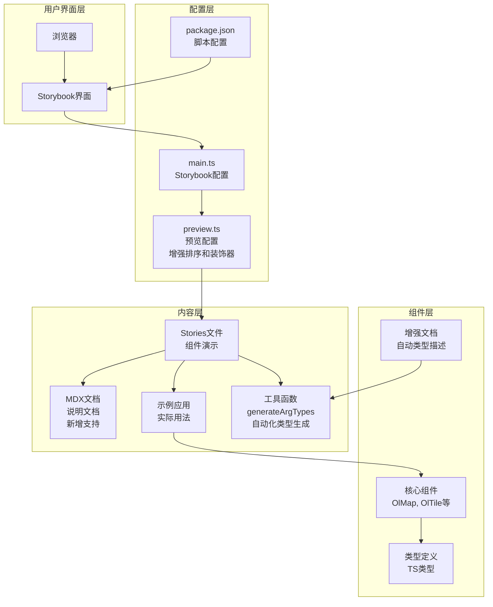
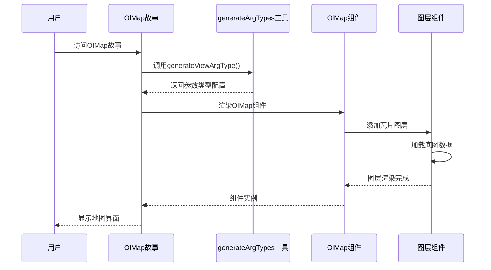
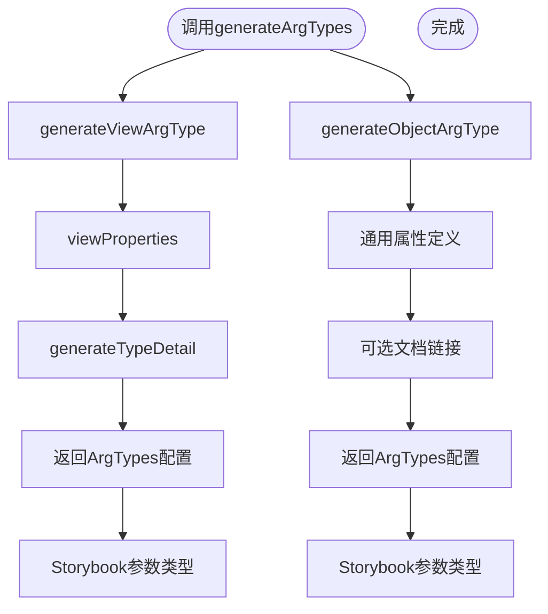
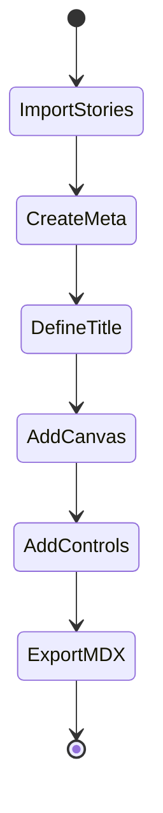
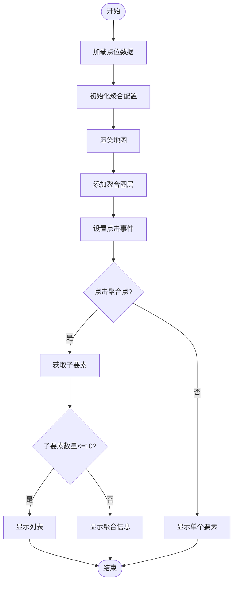
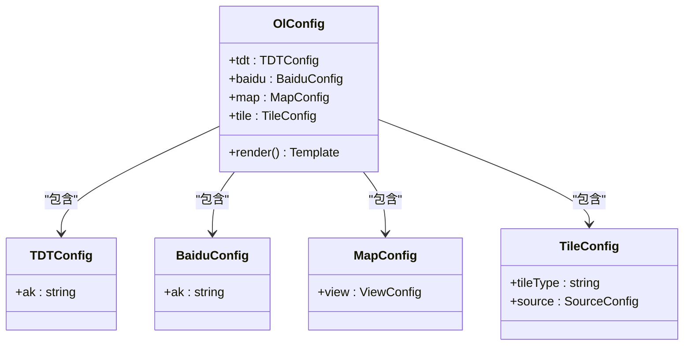
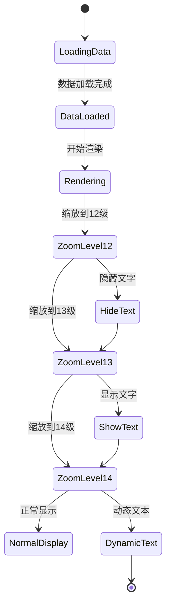
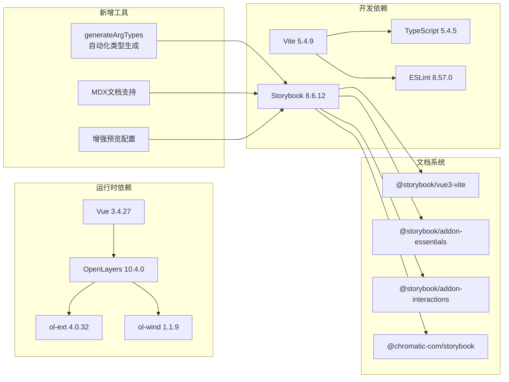

# Storybook文档系统

<cite>
**本文档引用的文件**
- [.storybook/main.ts](file://.storybook/main.ts)
- [.storybook/preview.ts](file://.storybook/preview.ts)
- [package.json](file://package.json)
- [src/packages/index.ts](file://src/packages/index.ts)
- [src/packages/components.ts](file://src/packages/components.ts)
- [src/stories/OlMap.stories.ts](file://src/stories/OlMap.stories.ts)
- [src/stories/OlCluster.stories.ts](file://src/stories/OlCluster.stories.ts)
- [src/stories/OlConfig.stories.ts](file://src/stories/OlConfig.stories.ts)
- [src/stories/OlFeature.stories.ts](file://src/stories/OlFeature.stories.ts)
- [src/stories/OlOverlay.stories.ts](file://src/stories/OlOverlay.stories.ts)
- [src/stories/OlTile.stories.ts](file://src/stories/OlTile.stories.ts)
- [src/stories/OlVector.stories.ts](file://src/stories/OlVector.stories.ts)
- [src/stories/OlConfig.mdx](file://src/stories/OlConfig.mdx)
- [src/stories/OlMap.mdx](file://src/stories/OlMap.mdx)
- [src/stories/utils/generateArgTypes.ts](file://src/stories/utils/generateArgTypes.ts)
- [src/examples/map/index.vue](file://src/examples/map/index.vue)
- [src/examples/cluster/index.vue](file://src/examples/cluster/index.vue)
- [src/examples/config/index.vue](file://src/examples/config/index.vue)
- [src/examples/featureStyle/index.vue](file://src/examples/featureStyle/index.vue)
</cite>

## 更新摘要
**变更内容**
- 新增 generateArgTypes 工具函数用于自动化参数类型生成，提升 Storybook 开发体验
- 新增 OlMap.mdx MDX 文档支持，提供更丰富的文档展示功能
- 优化 preview.ts 配置，增强故事排序和装饰器功能
- 扩展组件参数类型系统，提供更精确的类型描述和文档生成

## 目录
1. [简介](#简介)
2. [项目结构](#项目结构)
3. [核心组件](#核心组件)
4. [架构概览](#架构概览)
5. [详细组件分析](#详细组件分析)
6. [依赖关系分析](#依赖关系分析)
7. [性能考虑](#性能考虑)
8. [故障排除指南](#故障排除指南)
9. [结论](#结论)

## 简介

这是一个基于Vue 3和OpenLayers的地图组件库的Storybook文档系统。该系统提供了完整的组件开发、测试和文档展示功能，支持多种地图组件如瓦片图层、矢量图层、聚合图层等的可视化演示。最新更新引入了自动化参数类型生成工具和MDX文档支持，显著提升了开发体验和文档质量。

## 项目结构

该项目采用模块化的组织方式，主要包含以下关键目录：

**图表来源**
- [.storybook/main.ts:1-19](file://.storybook/main.ts#L1-L19)
- [.storybook/preview.ts:1-24](file://.storybook/preview.ts#L1-L24)
- [src/stories/utils/generateArgTypes.ts:1-99](file://src/stories/utils/generateArgTypes.ts#L1-L99)

**章节来源**
- [.storybook/main.ts:1-19](file://.storybook/main.ts#L1-L19)
- [.storybook/preview.ts:1-24](file://.storybook/preview.ts#L1-L24)

## 核心组件

该系统的核心组件包括：

### 主要组件导出
- **OlMap**: 地图容器组件
- **OlTile**: 瓦片图层组件
- **OlVector**: 矢量图层组件  
- **OlCluster**: 聚合图层组件
- **OlFeature**: 地理要素组件
- **OlOverlay**: 覆盖物组件
- **OlConfig**: 配置组件

### 组件注册机制
系统通过统一的组件注册表实现所有组件的集中管理：

**图表来源**
- [src/packages/components.ts:1-97](file://src/packages/components.ts#L1-L97)

**章节来源**
- [src/packages/components.ts:1-97](file://src/packages/components.ts#L1-L97)
- [src/packages/index.ts:1-9](file://src/packages/index.ts#L1-L9)

## 架构概览

该Storybook文档系统采用分层架构设计，确保了良好的可维护性和扩展性。最新更新增强了工具函数支持和文档生成能力：

**图表来源**
- [.storybook/main.ts:1-19](file://.storybook/main.ts#L1-L19)
- [.storybook/preview.ts:1-24](file://.storybook/preview.ts#L1-L24)
- [package.json:14-26](file://package.json#L14-L26)
- [src/stories/utils/generateArgTypes.ts:1-99](file://src/stories/utils/generateArgTypes.ts#L1-L99)

## 详细组件分析

### OlMap组件故事

OlMap作为核心地图容器组件，提供了基础的地图展示功能。最新更新引入了自动化参数类型生成：

**图表来源**
- [src/stories/OlMap.stories.ts:1-35](file://src/stories/OlMap.stories.ts#L1-L35)
- [src/stories/utils/generateArgTypes.ts:56-68](file://src/stories/utils/generateArgTypes.ts#L56-L68)

**章节来源**
- [src/stories/OlMap.stories.ts:1-35](file://src/stories/OlMap.stories.ts#L1-L35)

### generateArgTypes 工具函数

新增的自动化参数类型生成工具提供了强大的类型系统支持：

**图表来源**
- [src/stories/utils/generateArgTypes.ts:1-99](file://src/stories/utils/generateArgTypes.ts#L1-L99)

**章节来源**
- [src/stories/utils/generateArgTypes.ts:1-99](file://src/stories/utils/generateArgTypes.ts#L1-L99)

### OlMap.mdx MDX文档支持

新增的MDX文档提供了更丰富的文档展示功能：

**图表来源**
- [src/stories/OlMap.mdx:1-19](file://src/stories/OlMap.mdx#L1-L19)

**章节来源**
- [src/stories/OlMap.mdx:1-19](file://src/stories/OlMap.mdx#L1-L19)

### OlCluster聚合组件故事

聚合组件展示了大数据量点位的聚合显示功能：

**图表来源**
- [src/examples/cluster/index.vue:67-98](file://src/examples/cluster/index.vue#L67-L98)

**章节来源**
- [src/stories/OlCluster.stories.ts:1-33](file://src/stories/OlCluster.stories.ts#L1-L33)
- [src/examples/cluster/index.vue:1-160](file://src/examples/cluster/index.vue#L1-L160)

### OlConfig配置组件故事

配置组件提供了灵活的地图配置选项：

**图表来源**
- [src/stories/OlConfig.mdx:25-47](file://src/stories/OlConfig.mdx#L25-L47)

**章节来源**
- [src/stories/OlConfig.stories.ts:1-34](file://src/stories/OlConfig.stories.ts#L1-L34)
- [src/stories/OlConfig.mdx:1-65](file://src/stories/OlConfig.mdx#L1-L65)
- [src/examples/config/index.vue:1-32](file://src/examples/config/index.vue#L1-L32)

### OlFeature要素组件故事

要素组件展示了地理要素的样式定制功能：

**图表来源**
- [src/examples/featureStyle/index.vue:53-78](file://src/examples/featureStyle/index.vue#L53-L78)

**章节来源**
- [src/stories/OlFeature.stories.ts:1-66](file://src/stories/OlFeature.stories.ts#L1-L66)
- [src/examples/featureStyle/index.vue:1-98](file://src/examples/featureStyle/index.vue#L1-L98)

### OlTile瓦片组件故事

瓦片组件展示了多种底图源的切换功能：

**章节来源**
- [src/stories/OlTile.stories.ts:1-78](file://src/stories/OlTile.stories.ts#L1-L78)

### OlVector矢量组件故事

矢量组件展示了矢量数据的渲染能力：

**章节来源**
- [src/stories/OlVector.stories.ts:1-33](file://src/stories/OlVector.stories.ts#L1-L33)

### OlOverlay覆盖物组件故事

覆盖物组件展示了交互式覆盖物的实现：

**章节来源**
- [src/stories/OlOverlay.stories.ts:1-33](file://src/stories/OlOverlay.stories.ts#L1-L33)

## 依赖关系分析

该系统采用模块化依赖管理，主要依赖关系如下：

**图表来源**
- [package.json:28-45](file://package.json#L28-L45)
- [package.json:46-80](file://package.json#L46-L80)
- [src/stories/utils/generateArgTypes.ts:1-99](file://src/stories/utils/generateArgTypes.ts#L1-L99)

**章节来源**
- [package.json:1-82](file://package.json#L1-L82)

## 性能考虑

### 构建优化
- 使用Vite进行快速构建和热重载
- 启用TypeScript编译优化
- 支持按需加载和代码分割

### 运行时优化
- OpenLayers的瓦片缓存机制
- 聚合算法优化大数据量显示
- 按需渲染和懒加载策略

### Storybook优化
- 组件级别的缓存机制
- 文档生成的增量更新
- 预览环境的性能监控
- **新增** 自动化参数类型生成减少手动配置开销

### 开发体验优化
- **新增** 自动生成的参数类型描述提升开发效率
- **新增** MDX文档支持提供更丰富的文档展示
- **新增** 增强的故事排序功能改善导航体验
- **新增** 统一的装饰器配置确保一致的展示效果

## 故障排除指南

### 常见问题及解决方案

**Storybook启动失败**
- 检查Node.js版本兼容性
- 确认端口6006未被占用
- 验证依赖包完整性

**组件渲染异常**
- 检查OpenLayers版本兼容性
- 验证地图配置参数正确性
- 确认网络资源可访问性

**构建错误**
- 清理node_modules重新安装
- 检查TypeScript配置文件
- 验证Vite配置正确性

**参数类型生成错误**
- **新增** 检查generateArgTypes工具函数的类型定义
- **新增** 确认TS类型声明文件的完整性
- **新增** 验证参数类型映射的准确性

**MDX文档显示异常**
- **新增** 检查MDX文件的语法正确性
- **新增** 验证Story导入路径的准确性
- **新增** 确认组件渲染函数的正确性

**章节来源**
- [package.json:24-26](file://package.json#L24-L26)

## 结论

该Storybook文档系统为OpenLayers地图组件库提供了完整的开发和展示平台。通过模块化的架构设计、丰富的组件示例和完善的配置管理，开发者可以高效地创建、测试和文档化各种地图功能。

**最新更新亮点**：
- **自动化参数类型生成**：通过generateArgTypes工具函数，实现了从TypeScript类型定义到Storybook参数类型的自动转换，显著提升了开发效率和文档质量
- **MDX文档支持**：新增的MDX文档格式提供了更丰富的文档展示能力，支持复杂的文档结构和交互式内容
- **增强的预览配置**：优化的preview.ts配置提供了更好的故事排序和装饰器功能，改善了用户体验
- **统一的开发体验**：通过工具函数和配置优化，实现了更一致和高效的开发流程

系统支持从基础地图展示到复杂的空间分析应用，为地图应用开发提供了强有力的技术支撑。新增的功能进一步提升了系统的可维护性和扩展性，为未来的功能开发奠定了坚实的基础。