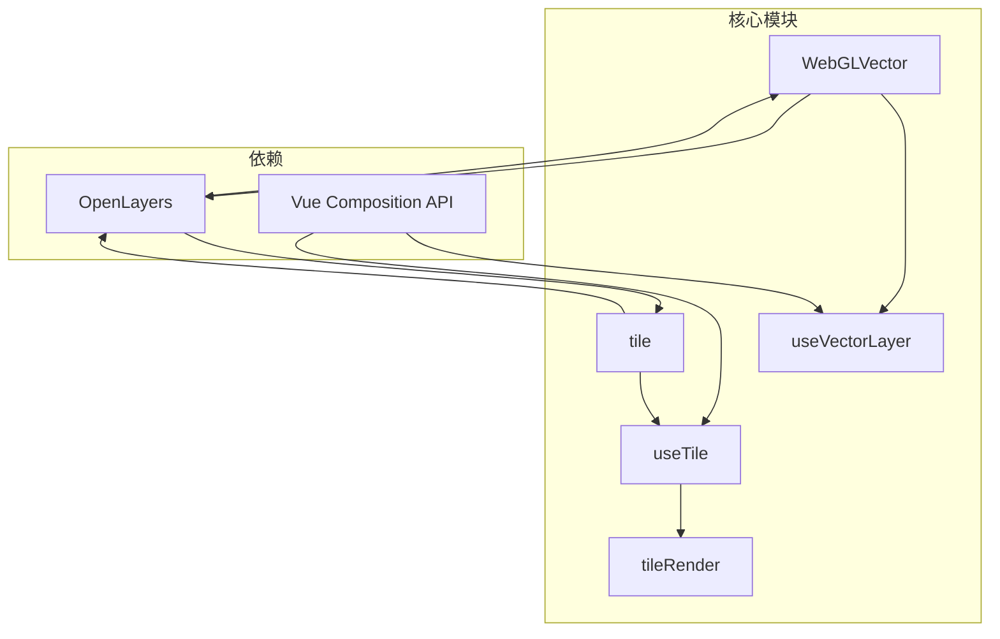
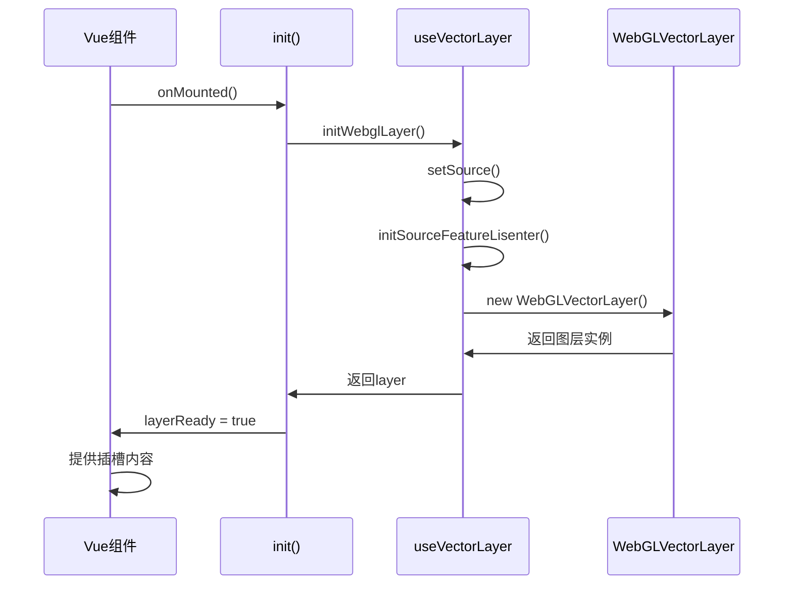
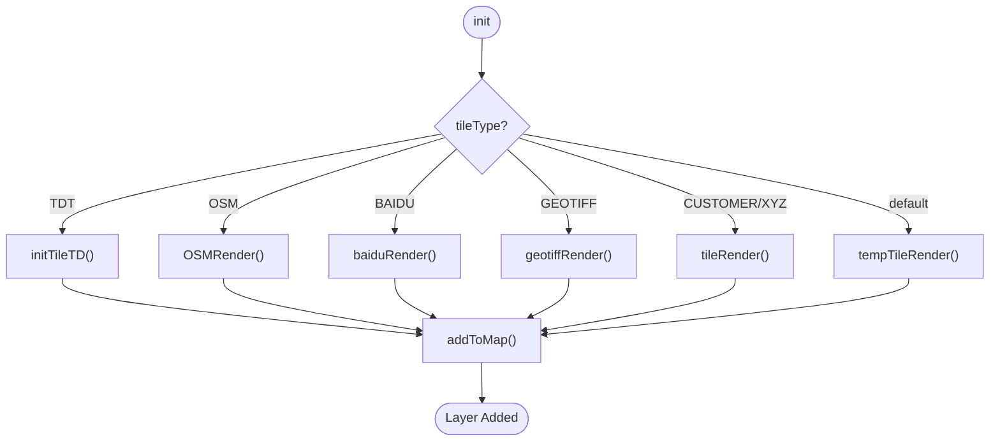

# 性能优化

<cite>
**本文档中引用的文件**  
- [index.vue](file://src/packages/layers/WebGLVector/index.vue#L1-L104)
- [useTile.ts](file://src/packages/layers/tile/useTile.ts#L1-L327)
- [tileRender.ts](file://src/packages/layers/tile/tileRender.ts#L1-L96)
- [vector.ts](file://src/packages/hooks/vector.ts#L37-L299)
</cite>

## 目录
1. [引言](#引言)
2. [项目结构分析](#项目结构分析)
3. [核心组件分析](#核心组件分析)
4. [WebGL渲染机制详解](#webgl渲染机制详解)
5. [瓦片图层加载与缓存优化](#瓦片图层加载与缓存优化)
6. [图层管理与事件优化](#图层管理与事件优化)
7. [内存泄漏防范与资源释放](#内存泄漏防范与资源释放)
8. [性能监控与调优实践](#性能监控与调优实践)

## 引言
本文档旨在为 `v3-ol-map` 项目提供全面的性能优化指南，重点围绕 `OlWebglVector` 组件实现大规模矢量数据的高效渲染。通过深入分析 WebGL 渲染机制、瓦片加载策略、图层管理及事件处理，结合实际代码示例，帮助开发者提升地图应用的响应速度与用户体验。

## 项目结构分析
项目采用模块化设计，主要功能集中在 `src/packages` 目录下，按功能划分为 `layers`、`hooks`、`controls` 等子模块。其中，`layers/WebGLVector` 负责矢量数据的高性能渲染，`tile` 模块处理瓦片图层的加载与渲染，`hooks` 提供可复用的逻辑封装。



**图示来源**  
- [index.vue](file://src/packages/layers/WebGLVector/index.vue#L1-L104)
- [useTile.ts](file://src/packages/layers/tile/useTile.ts#L1-L327)
- [tileRender.ts](file://src/packages/layers/tile/tileRender.ts#L1-L96)

## 核心组件分析
### OlWebglVector 组件分析
`OlWebglVector` 是基于 OpenLayers 的 `WebGLVectorLayer` 封装的高性能矢量图层组件，适用于渲染大量矢量要素。

#### 组件初始化流程


**图示来源**  
- [index.vue](file://src/packages/layers/WebGLVector/index.vue#L1-L104)
- [vector.ts](file://src/packages/hooks/vector.ts#L37-L299)

**本节来源**  
- [index.vue](file://src/packages/layers/WebGLVector/index.vue#L1-L104)
- [vector.ts](file://src/packages/hooks/vector.ts#L37-L299)

#### 关键属性与方法
- **props**:  
  - `layerId`: 图层唯一标识  
  - `visible`: 图层可见性  
  - `source`: 数据源配置  
  - `layerStyle`: WebGL 样式对象  
- **emit 事件**:  
  - `singleclick`, `pointermove`: 鼠标交互事件  
  - `featuresloadstart/end`: 数据加载状态  
  - `modifyend`, `translateend`: 编辑操作完成  
- **expose 方法**:  
  - `getFeatureById(id)`: 按ID获取要素  
  - `removeFeatureById(id)`: 删除指定要素  
  - `getSource()`: 获取数据源实例  

## WebGL渲染机制详解
### WebGL 与 Canvas 渲染对比
| 特性 | Canvas 2D | WebGL |
|------|----------|-------|
| 渲染方式 | CPU 主导，逐像素绘制 | GPU 并行计算，批量处理 |
| 性能瓶颈 | 大量要素时重绘慢 | 初始编译开销大，后续高效 |
| 内存占用 | 中等 | 较高（显存） |
| 适用场景 | 少量动态要素 | 大规模静态/动态矢量数据 |

### 着色器逻辑与数据批量处理
`WebGLVectorLayer` 利用 OpenGL ES 着色器语言（GLSL）在 GPU 上执行渲染逻辑。其核心优势在于：
- **批量处理**: 所有要素数据以数组形式上传至 GPU，通过顶点着色器统一处理
- **样式表达式**: 支持基于属性的动态样式计算，如颜色、大小随数据变化
- **高效更新**: 仅需更新变化的数据缓冲区，避免全量重绘

在 `useVectorLayer.ts` 中，`initWebglLayer` 函数负责创建 `WebGLVectorLayer` 实例，并将 `props.layerStyle` 作为样式配置传入：

```ts
const initWebglLayer = () => {
  source.value = setSource();
  webGLLayer.value = new WebGLVectorLayer({
    ...props,
    source: source.value,
    style: styleOptions, // WebGLStyle 对象
  });
  init(webGLLayer.value);
  return Promise.resolve(webGLLayer.value);
};
```

该样式对象遵循 OpenLayers 的扁平化样式规范，支持条件渲染与性能优化。

## 瓦片图层加载与缓存优化
### useTile 与 tileRender 协作机制
`useTile.ts` 是瓦片图层的通用初始化逻辑，根据 `tileType` 调用不同的渲染函数（如 `tileRender`, `baiduRender` 等）。



**图示来源**  
- [useTile.ts](file://src/packages/layers/tile/useTile.ts#L1-L327)
- [tileRender.ts](file://src/packages/layers/tile/tileRender.ts#L1-L96)

### 缓存与重用策略
- **TileGrid 缓存**: `getTileGrid` 函数复用自定义瓦片网格配置，避免重复创建
- **图层组管理**: 天地图、高德等底图使用 `LayerGroup` 组合多个子图层，便于统一控制
- **懒加载**: 仅在 `init()` 调用时创建图层，延迟资源消耗
- **清除机制**: `clearTile()` 显式移除图层并清理引用，防止内存泄漏

## 图层管理与事件优化
### 减少重绘策略
- **合理设置 zIndex**: 避免不必要的图层叠加重绘
- **控制可见性**: 使用 `setVisible(false)` 隐藏非活跃图层，而非移除
- **批量操作**: 在 `watch` 中合并多个属性变更，减少触发次数

### 事件监听器管理
- **按需绑定**: 仅在需要交互时启用 `modify`、`translate` 等编辑功能
- **及时清理**: `dispose()` 函数通过 `unByKey()` 移除所有事件监听
- **避免重复绑定**: 使用 `watchEffect` 和 `shallowRef` 确保监听器唯一性

```ts
const dispose = () => {
  eventRender.value.forEach(listenerKey => {
    unByKey(listenerKey); // 清理 OpenLayers 事件
  });
};
```

## 内存泄漏防范与资源释放
### 动态图层生命周期管理
- **onMounted**: 调用 `init()` 创建图层并添加至地图
- **onBeforeUnmount**: 调用 `dispose()` 清理事件与资源
- **watch source 变更**: 当 `props.source` 变化时，先清除旧图层再重建

```ts
watch(
  () => props.source,
  () => {
    layer.value?.getSource()?.clear();
    if (layer.value) map.removeLayer(layer.value);
    init(); // 重建图层
  },
);
```

### 资源释放最佳实践
1. **显式调用 dispose()**: 在组件卸载前确保执行
2. **避免闭包引用**: 不在事件回调中引用外部大对象
3. **使用 shallowRef**: 对图层实例使用 `shallowRef`，避免深层响应式开销
4. **定期检查**: 使用浏览器内存分析工具检测对象残留

## 性能监控与调优实践
### 帧率监控示例
可通过 `requestAnimationFrame` 监控渲染帧率：

```ts
let frameCount = 0;
let lastTime = performance.now();
let fps = 0;

function updateFPS() {
  const now = performance.now();
  frameCount++;
  if (now - lastTime >= 1000) {
    fps = Math.round((frameCount * 1000) / (now - lastTime));
    console.log(`FPS: ${fps}`);
    frameCount = 0;
    lastTime = now;
  }
  requestAnimationFrame(updateFPS);
}

// 启动监控
updateFPS();
```

### 性能评估建议
- **首次加载时间**: 测量从地图初始化到首屏瓦片渲染完成的时间
- **交互响应延迟**: 记录平移、缩放操作的帧率变化
- **内存占用趋势**: 观察长时间运行后的内存增长情况
- **GPU 使用率**: 利用浏览器开发者工具查看 WebGL 上下文性能

### 调优建议
- **数据分片**: 对超大规模矢量数据采用分块加载（如矢量瓦片）
- **简化样式**: 避免复杂着色器计算，优先使用预定义颜色
- **按需加载**: 根据视图范围动态加载/卸载图层
- **使用 worker**: 将数据解析等耗时操作移至 Web Worker

**本节来源**  
- [index.vue](file://src/packages/layers/WebGLVector/index.vue#L1-L104)
- [useTile.ts](file://src/packages/layers/tile/useTile.ts#L1-L327)
- [tileRender.ts](file://src/packages/layers/tile/tileRender.ts#L1-L96)
- [vector.ts](file://src/packages/hooks/vector.ts#L37-L299)