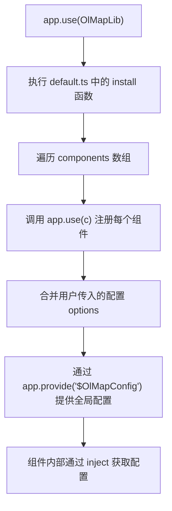
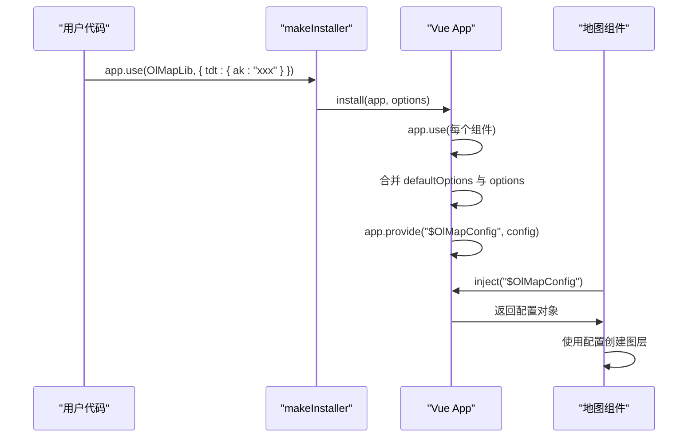
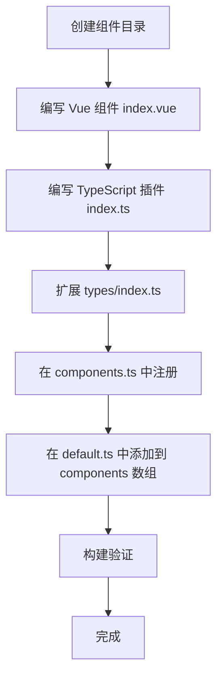

# 扩展开发

<cite>
**本文档中引用的文件**  
- [src/packages/components.ts](file://src/packages/components.ts)
- [src/packages/index.ts](file://src/packages/index.ts)
- [src/packages/default.ts](file://src/packages/default.ts)
- [src/packages/utils/projection.ts](file://src/packages/utils/projection.ts)
</cite>

## 目录
1. [项目结构概述](#项目结构概述)  
2. [组件注册机制详解](#组件注册机制详解)  
3. [全局配置注入原理](#全局配置注入原理)  
4. [自定义坐标系转换实现](#自定义坐标系转换实现)  
5. [新增组件开发流程示例](#新增组件开发流程示例)

## 项目结构概述

本项目是一个基于 OpenLayers 的 Vue 地图组件库，采用模块化设计，核心功能封装在 `src/packages` 目录下。主要结构包括：

- **components**: 各类地图图层、控件、交互组件的 Vue 组件实现
- **controls**: 地图控件（如缩放、全屏、比例尺等）
- **layers**: 各类地图图层（瓦片、矢量、热力图等）
- **interaction**: 用户交互功能（绘制、测量、拖拽等）
- **utils**: 工具函数，包括投影转换、样式处理等
- **types**: TypeScript 类型定义
- **default.ts**: 全局安装器和默认配置
- **components.ts**: 全局组件导出与类型声明
- **index.ts**: 库的主入口文件

该结构支持灵活扩展，开发者可基于现有模式新增自定义组件或服务。

**Section sources**  
- [src/packages/components.ts](file://src/packages/components.ts)
- [src/packages/default.ts](file://src/packages/default.ts)

## 组件注册机制详解

### 组件导出与全局注册

`src/packages/components.ts` 文件负责将所有组件进行统一导出，并通过 Vue 的 `GlobalComponents` 声明实现 Volar 的类型支持，使组件在模板中可自动识别。

```ts
import OlMap from "./map/index.vue";
import OlTile from "./layers/tile/index.vue";
import OlVector from "./layers/vector/index.vue";
// ... 其他组件导入

export {
  OlMap,
  OlTile,
  OlVector,
  // ... 导出所有组件
};

// 为 Volar 提供全局组件类型声明
declare module "vue" {
  export interface GlobalComponents {
    OlMap: typeof OlMap;
    OlTile: typeof OlTile;
    OlVector: typeof OlVector;
    // ... 每个组件的类型声明
  }
}
```

此机制允许开发者在任意 `.vue` 文件中直接使用 `<OlMap />` 等标签，无需手动导入。

### 组件注册流程

`src/packages/index.ts` 是库的主入口，其内容如下：

```ts
import installer from "./default";

export * from "./components";        // 导出所有组件
export * as utils from "./utils";    // 导出工具函数
export * from "./types";             // 导出类型
export * from "./default";           // 导出默认配置

export default installer;           // 默认安装器
```

当用户通过 `app.use(OlMapLib)` 使用该库时，实际调用的是 `default.ts` 中的 `makeInstaller` 函数。

#### 组件注册流程图



**Diagram sources**  
- [src/packages/index.ts](file://src/packages/index.ts#L1-L9)
- [src/packages/default.ts](file://src/packages/default.ts#L100-L160)

**Section sources**  
- [src/packages/components.ts](file://src/packages/components.ts#L1-L96)
- [src/packages/index.ts](file://src/packages/index.ts#L1-L9)

## 全局配置注入原理

### 默认配置定义

`src/packages/default.ts` 中定义了 `defaultOptions`，包含天地图（TDT）、百度地图（Baidu）、高德地图（AMap）等服务的 URL 模板和密钥（ak）。

```ts
const defaultOptions: ConfigProviderProps = {
  tdt: {
    ak: "",
    Normal: "https://t0.tianditu.gov.cn/DataServer?T=vec_w&X={x}&Y={y}&L={z}&tk=",
    Satellite: "https://t0.tianditu.gov.cn/DataServer?T=img_w&X={x}&Y={y}&L={z}&tk=",
    // ...
  },
  baidu: {
    ak: "",
    Normal: "https://maponline1.bdimg.com/tile/?qt=vtile&x={x}&y={y}&z={z}&styles=pl&scaler=1&udt=20220113&from=jsapi2_0",
    // ...
  },
  amap: {
    Normal: "http://webrd01.is.autonavi.com/appmaptile?lang=zh_cn&size=1&scale=1&style=8&x={x}&y={y}&z={z}",
    // ...
  },
};
```

### 配置注入机制

通过 `makeInstaller` 函数创建插件安装器，支持用户传入自定义配置：

```ts
export const makeInstaller = (components: Plugin[] = []) => {
  const install = (app: App, options?: ConfigProviderContext) => {
    components.forEach(c => app.use(c));
    
    let config: ConfigProviderProps = defaultOptions;
    if (options) {
      // 合并用户配置
      if (options.tdt) {
        config.tdt = { ...defaultOptions.tdt, ...options.tdt };
      }
      if (options.baidu) {
        config.baidu = { ...defaultOptions.baidu, ...options.baidu };
      }
      config.amap = { ...defaultOptions.amap, ...options.amap };
      config.map = { ...options.map };
    }

    // 使用 provide 提供全局配置
    app.provide("$OlMapConfig", {
      map: config.map,
      TDT: config.tdt,
      Baidu: config.baidu,
      AMap: config.amap,
    });
  };

  return { install };
};
```

组件内部可通过 `inject('$OlMapConfig')` 获取配置，实现服务地址的动态切换。

#### 配置注入流程图



**Diagram sources**  
- [src/packages/default.ts](file://src/packages/default.ts#L50-L160)

**Section sources**  
- [src/packages/default.ts](file://src/packages/default.ts#L1-L163)

## 自定义坐标系转换实现

### 投影注册与转换

`src/packages/utils/projection.ts` 文件负责注册自定义投影系统（如 GCJ-02、BD-09、EPSG:4490 等），并定义坐标转换函数。

核心步骤：

1. 使用 `proj4.defs()` 定义投影参数
2. 创建 `Projection` 实例
3. 使用 `addProjection()` 注册投影
4. 使用 `addCoordinateTransforms()` 定义坐标转换函数

```ts
import proj4 from "proj4";
import { register } from "ol/proj/proj4.js";

// 定义投影
proj4.defs("EPSG:4490", "+proj=longlat +ellps=GRS80 +no_defs +type=crs");

// 注册 proj4
register(proj4);

// 创建投影实例
const projection4490 = new Projection({
  code: "EPSG:4490",
  units: "degrees",
  axisOrientation: "neu",
});

// 注册投影
addProjection(projection4490);

// 定义坐标转换
addCoordinateTransforms(
  "EPSG:4326",
  "EPSG:4490",
  coord => proj4("EPSG:4326", "EPSG:4490", coord),
  coord => proj4("EPSG:4490", "EPSG:4326", coord)
);
```

### 特殊坐标系支持

- **GCJ-02（高德坐标）**: 通过 `ll2gcj02mc` 等函数实现 WGS84 与 GCJ-02 之间的转换
- **BD-09（百度坐标）**: 支持百度墨卡托投影与标准投影的互转
- **EPSG:3395（海图投影）**: 支持海图专用的墨卡托投影

### 动态投影切换

在地图容器中可通过 `setView` 指定不同投影：

```ts
map.setView(new View({
  projection: 'EPSG:4490', // 或 'GCJ:02', 'BD:09'
  center: [116.4, 39.9],
  zoom: 10
}));
```

OpenLayers 会自动使用注册的转换函数进行坐标处理。

#### 投影转换架构图

```mermaid
graph TB
A["proj4.defs()"] --> B["定义投影参数"]
B --> C["new Projection()"]
C --> D["addProjection()"]
D --> E["addCoordinateTransforms()"]
E --> F["OpenLayers 自动转换"]
G["WGS84 (EPSG:4326)"] < --> |proj4 转换| H["CGCS2000 (EPSG:4490)"]
G < --> |ll2gcj02mc| I["GCJ-02 (高德)"]
I < --> |gcj02mc2bmerc| J["BD-09 (百度)"]
H < --> |proj4| K["Web墨卡托 (EPSG:3857)"]
K < --> |proj4| L["海图投影 (EPSG:3395)"]
```

**Diagram sources**  
- [src/packages/utils/projection.ts](file://src/packages/utils/projection.ts#L1-L163)

**Section sources**  
- [src/packages/utils/projection.ts](file://src/packages/utils/projection.ts#L1-L163)

## 新增组件开发流程示例

### 步骤 1：创建新组件目录

在 `src/packages/layers/` 下创建新组件目录，例如 `customLayer`：

```
src/packages/layers/customLayer/
├── index.vue
└── index.ts
```

### 步骤 2：编写 Vue 组件

`customLayer/index.vue`：

```vue
<script lang="ts">
import { defineComponent } from "vue";
import type { PropType } from "vue";
import type { Options } from "./types";

export default defineComponent({
  name: "OlCustomLayer",
  props: {
    options: {
      type: Object as PropType<Options>,
      required: true
    }
  },
  setup(props) {
    // 实现自定义图层逻辑
    return () => <div>Custom Layer</div>;
  }
});
</script>
```

### 步骤 3：编写 TypeScript 插件

`customLayer/index.ts`：

```ts
import { App } from "vue";
import CustomLayer from "./index.vue";

export default {
  install(app: App) {
    app.component(CustomLayer.name, CustomLayer);
  }
};
```

### 步骤 4：扩展类型定义

在 `src/packages/types/index.ts` 中添加类型：

```ts
export interface CustomLayer {
  options: {
    url: string;
    layerName: string;
  };
}
```

### 步骤 5：注册到全局组件

1. 在 `src/packages/components.ts` 中添加导入和导出：

```ts
import OlCustomLayer from "./layers/customLayer/index.vue";

export {
  // ... 其他组件
  OlCustomLayer
}

declare module "vue" {
  export interface GlobalComponents {
    // ... 其他组件
    OlCustomLayer: typeof OlCustomLayer;
  }
}
```

2. 在 `src/packages/default.ts` 的 `components` 数组中添加：

```ts
import OlCustomLayer from "./layers/customLayer/index.ts";

const components: Plugin[] = [
  // ... 其他组件
  OlCustomLayer
];
```

### 步骤 6：构建验证

运行 `npm run build` 或 `pnpm build`，检查是否生成正确的类型声明和打包文件。

### 新增组件流程图



**Diagram sources**  
- [src/packages/components.ts](file://src/packages/components.ts)
- [src/packages/default.ts](file://src/packages/default.ts)

**Section sources**  
- [src/packages/components.ts](file://src/packages/components.ts)
- [src/packages/default.ts](file://src/packages/default.ts)
- [src/packages/utils/projection.ts](file://src/packages/utils/projection.ts)