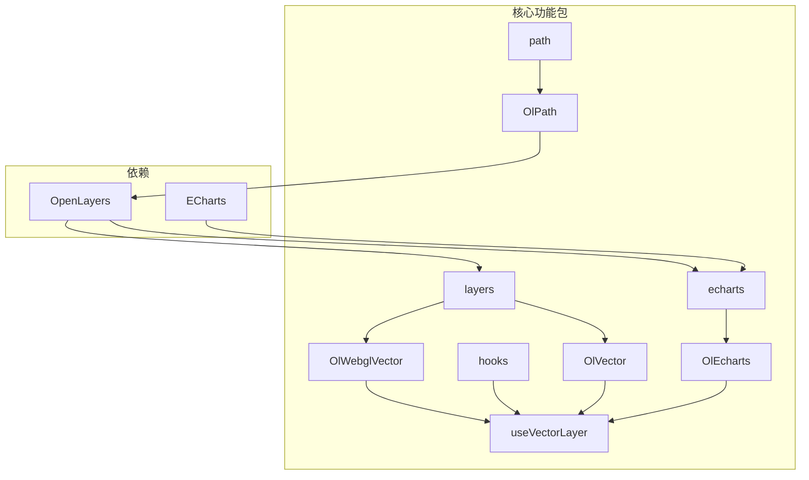
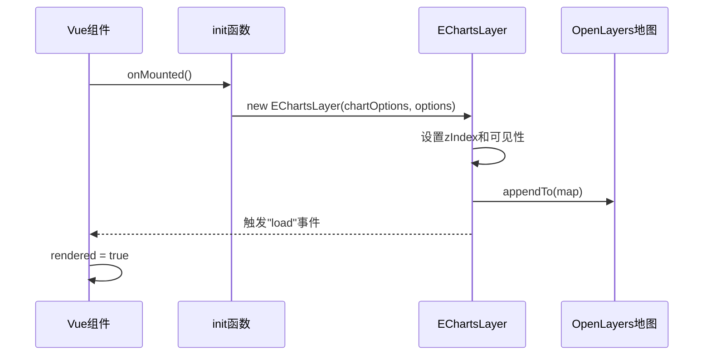
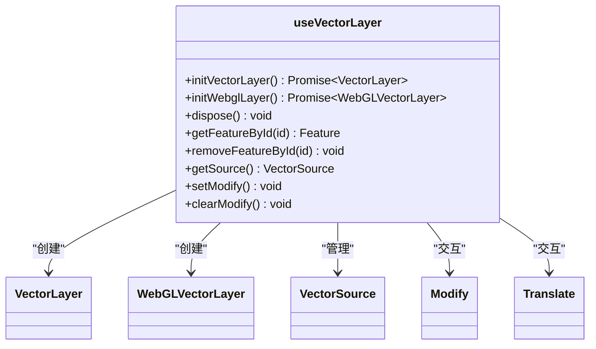
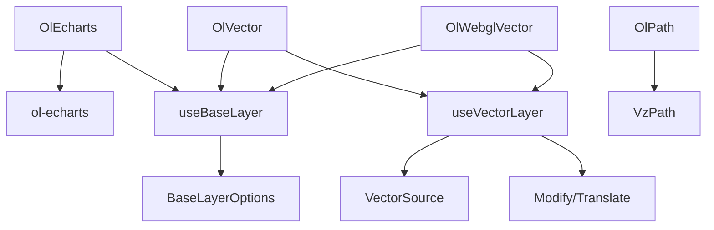

# 自定义集成

<cite>
**本文档引用的文件**
- [index.vue](file://src/packages/echarts/index.vue#L1-L62)
- [vector.ts](file://src/packages/hooks/vector.ts#L1-L302)
- [path.ts](file://src/packages/path/path.ts#L1-L188)
- [Echarts.ts](file://src/packages/types/Echarts.ts#L1-L26)
- [Path.ts](file://src/packages/types/Path.ts#L1-L37)
</cite>

## 目录
1. [简介](#简介)
2. [项目结构](#项目结构)
3. [核心组件](#核心组件)
4. [架构概览](#架构概览)
5. [详细组件分析](#详细组件分析)
6. [依赖关系分析](#依赖关系分析)
7. [性能考量](#性能考量)
8. [故障排除指南](#故障排除指南)
9. [结论](#结论)

## 简介
本文档旨在深入分析 `v3-ol-map` 项目中关键的自定义集成组件，重点解析 `OlEcharts` 组件如何实现 OpenLayers 地图与 ECharts 图表的深度联动，`useVectorLayer` 自定义 Hook 如何复用矢量图层逻辑，以及 `OlPath` 组件如何实现轨迹回放动画。文档将结合代码实现、数据流和设计模式，为开发者提供构建复杂交互式地图应用的详细指导。

## 项目结构
项目采用基于功能的模块化结构，核心功能被组织在 `src/packages` 目录下。主要模块包括：
- **echarts**: 集成 ECharts 的地图图层组件。
- **hooks**: 存放可复用的组合式函数（如 `useVectorLayer`）。
- **layers**: 各种地图图层的具体实现（如矢量图层、WebGL 矢量图层）。
- **path**: 轨迹回放功能的实现。
- **types**: 定义项目中使用的 TypeScript 接口和类型。

这种结构清晰地分离了功能、逻辑和类型定义，提高了代码的可维护性和可复用性。



**Diagram sources**
- [src/packages/echarts/index.vue](file://src/packages/echarts/index.vue#L1-L62)
- [src/packages/hooks/vector.ts](file://src/packages/hooks/vector.ts#L1-L302)
- [src/packages/layers/vector/index.vue](file://src/packages/layers/vector/index.vue#L1-L104)
- [src/packages/path/path.ts](file://src/packages/path/path.ts#L1-L188)

## 核心组件
本节将深入分析 `OlEcharts`、`useVectorLayer` 和 `OlPath` 三个核心组件的实现机制。

### OlEcharts 组件分析
`OlEcharts` 组件是 OpenLayers 与 ECharts 的桥梁，它利用 `ol-echarts` 库将 ECharts 实例作为地图的一个图层进行渲染。

**Section sources**
- [index.vue](file://src/packages/echarts/index.vue#L1-L62)
- [Echarts.ts](file://src/packages/types/Echarts.ts#L1-L26)

#### 初始化与生命周期
组件在 `onMounted` 钩子中调用 `init` 函数进行初始化。该函数创建一个 `EChartsLayer` 实例，并将其附加到通过依赖注入获取的 OpenLayers 地图实例上。`EChartsLayer` 的构造函数接收 `chartOptions`（ECharts 配置）和 `options`（图层选项）。



**Diagram sources**
- [index.vue](file://src/packages/echarts/index.vue#L25-L40)

#### 属性监听与动态更新
组件使用 `watch` 函数监听 `visible`、`zIndex` 和 `chartOptions` 属性的变化，实现动态更新：
- **visible**: 监听后调用 `layer.setVisible()` 方法。
- **zIndex**: 监听后调用 `layer.setZIndex()` 方法。
- **chartOptions**: 深度监听后调用 `layer.setChartOptions()` 方法，实现图表数据的实时刷新。

```typescript
watch(() => props.visible, val => layer.value?.setVisible(val));
watch(() => props.zIndex, val => layer.value?.setZIndex(val));
watch(() => props.chartOptions, val => layer.value?.setChartOptions(val), { deep: true });
```

#### 事件机制
组件通过 `emit("load")` 在 ECharts 图表加载完成后通知父组件，允许父组件在其上添加子组件或执行其他操作。

### useVectorLayer Hook 分析
`useVectorLayer` 是一个自定义 Hook，封装了创建和管理 OpenLayers 矢量图层（包括普通矢量图层和 WebGL 矢量图层）的通用逻辑，实现了高度的代码复用。

**Section sources**
- [vector.ts](file://src/packages/hooks/vector.ts#L1-L302)
- [baseLayer/index.ts](file://src/packages/layers/baseLayer/index.ts#L1-L125)

#### 核心功能
该 Hook 接收 `props`（图层配置）和 `emit`（事件发射函数），返回一系列用于操作图层和数据源的函数。



**Diagram sources**
- [vector.ts](file://src/packages/hooks/vector.ts#L1-L302)

#### 图层初始化
Hook 提供了 `initVectorLayer` 和 `initWebglLayer` 两个异步函数来初始化不同类型的图层。它们都执行以下步骤：
1.  **创建数据源 (Source)**: 根据 `props.source` 配置创建 `VectorSource`。支持从 URL 加载 GeoJSON、TopoJSON 等格式的数据。
2.  **设置样式 (Style)**: 根据 `props.layerStyle` 或 `props.featureStyle` 设置图层样式。`featureStyle` 允许为每个要素提供动态样式。
3.  **创建图层 (Layer)**: 使用创建好的数据源和样式创建 `VectorLayer` 或 `WebGLVectorLayer` 实例。
4.  **初始化 (init)**: 将图层添加到地图，绑定事件监听器（如单击、悬停），并设置修改、平移等交互功能。

#### 事件处理
Hook 将 OpenLayers 的原生事件（如 `singleclick`, `pointermove`）进行封装和转发。它通过 `map.on()` 监听事件，并在触发时调用 `emit`，将事件和相关的要素（通过 `getFeatureAtPixel` 获取）传递给父组件。

```typescript
const eventHandler = (listenerKey, evt) => {
  const feature = getFeatureAtPixel(evt.pixel);
  emit(listenerKey, evt, feature);
};
```

#### 交互功能
Hook 集成了 `Modify` 和 `Translate` 交互，允许用户编辑要素的几何形状或移动要素。通过 `props.modify` 和 `props.translate` 开关来控制这些功能的启用和禁用。

### OlPath 组件分析
`OlPath` 组件用于实现轨迹回放功能，支持动画播放、暂停、速度控制等。

**Section sources**
- [path.ts](file://src/packages/path/path.ts#L1-L188)
- [Path.ts](file://src/packages/types/Path.ts#L1-L37)

#### 初始化与播放控制
组件在 `onMounted` 时调用 `init` 函数，使用传入的 `path` 数据和 `options` 创建一个 `VzPath` 实例。该实例负责管理动画逻辑。

```mermaid
flowchart TD
A[onMounted] --> B{path数据存在?}
B --> |是| C[创建VzPath实例]
C --> D[设置轨迹/已过路径样式]
D --> E[绑定事件监听器]
E --> F[发射"load"事件]
F --> G{autoPlay?}
G --> |是| H[调用start()]
G --> |否| I[等待手动调用]
```

**Diagram sources**
- [path.ts](file://src/packages/path/path.ts#L65-L100)

#### 状态管理与方法暴露
组件通过 `expose` 将关键的控制方法暴露给父组件，包括：
- **start() / stop() / pause() / resume()**: 控制动画的播放状态。
- **setSpeed(speed)**: 设置播放速度。
- **setPercent(percent)**: 跳转到指定的播放进度。
- **getPaths() / setPaths(paths)**: 获取或更新轨迹数据。

这些方法直接代理了内部 `VzPath` 实例的方法，实现了清晰的接口。

#### 属性监听
组件监听 `visible` 和 `labelVisible` 属性，通过操作地图图层组（`LayerGroup`）中特定图层的可见性来控制轨迹线和标签的显示与隐藏。

```typescript
watch(() => props.visible, newVal => {
  const pathGroup = collection.find(item => item.get("type") === "vzTrackPath");
  pathGroup?.setVisible(newVal);
});
```

## 依赖关系分析
项目中的组件和 Hook 之间存在清晰的依赖关系，体现了分层和复用的设计思想。



**Diagram sources**
- [src/packages/echarts/index.vue](file://src/packages/echarts/index.vue#L1-L62)
- [src/packages/layers/vector/index.vue](file://src/packages/layers/vector/index.vue#L1-L104)
- [src/packages/layers/WebGLVector/index.vue](file://src/packages/layers/WebGLVector/index.vue#L1-L103)
- [src/packages/path/path.ts](file://src/packages/path/path.ts#L1-L188)

## 性能考量
- **OlEcharts**: `ol-echarts` 库负责处理坐标系的对齐和同步，性能取决于 ECharts 图表的复杂度和数据量。`deep: true` 的监听器在数据量大时可能成为性能瓶颈。
- **useVectorLayer**: 使用 `shallowRef` 管理图层和数据源实例，避免了不必要的深层响应式开销。WebGL 矢量图层 (`WebGLVectorLayer`) 在处理大量数据时性能优于普通矢量图层。
- **OlPath**: 动画的性能取决于轨迹点的数量和插值算法的效率。`VzPath` 内部的实现是关键。

## 故障排除指南
- **ECharts 图表不显示**: 检查 `chartOptions` 是否正确传递，确保 `rendered` 为 `true` 后才渲染子组件。
- **矢量要素不显示**: 检查 `layer-style` 或 `featureStyle` 是否配置，控制台会输出警告信息。
- **轨迹回放无反应**: 确保 `path` 属性提供了正确的轨迹数据数组。
- **交互功能失效**: 检查 `props.modify` 或 `props.translate` 是否为 `true`，并确认图层已正确添加到地图。

## 结论
通过对 `OlEcharts`、`useVectorLayer` 和 `OlPath` 组件的分析，可以看出该项目通过组合式 API 和自定义 Hook 实现了高度模块化和可复用的代码结构。`OlEcharts` 成功地将 ECharts 集成到地图中，`useVectorLayer` 抽象了矢量图层的通用逻辑，而 `OlPath` 则提供了功能完整的轨迹回放解决方案。这些组件共同为构建复杂的交互式地理空间应用奠定了坚实的基础。