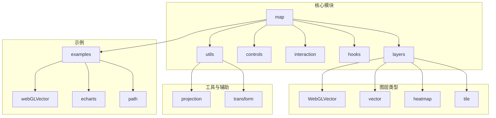
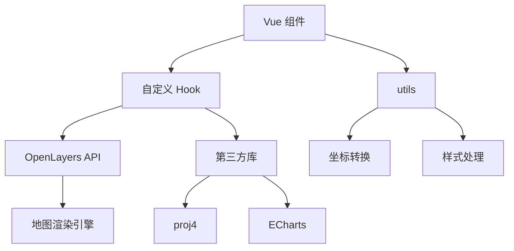
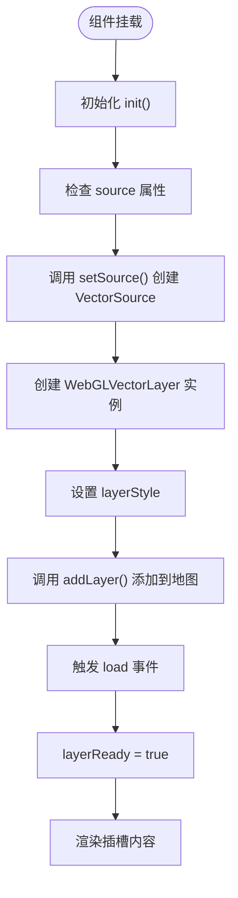
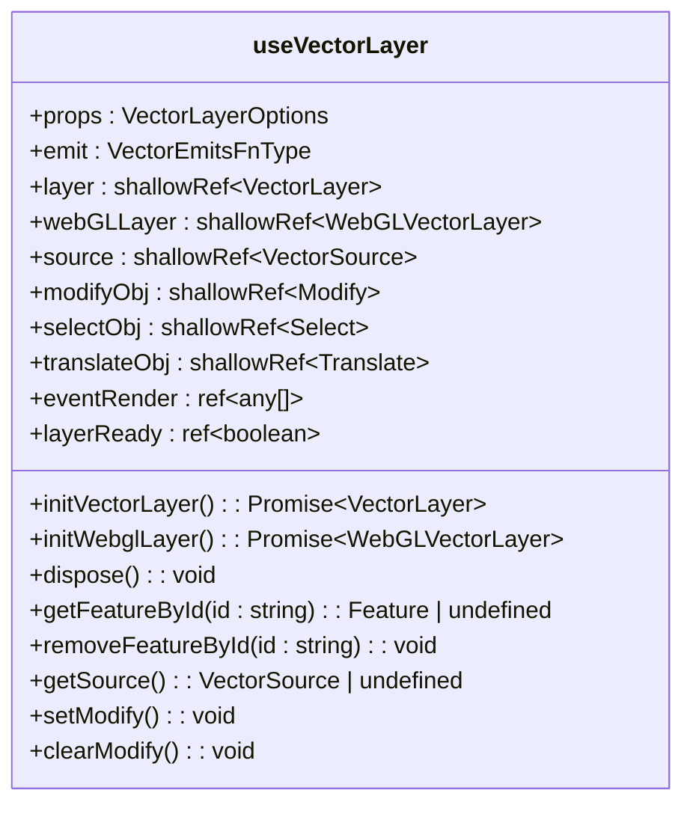
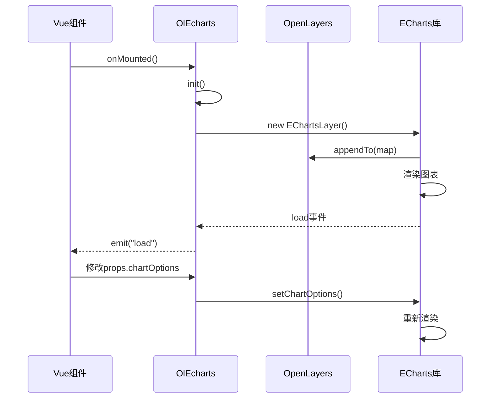
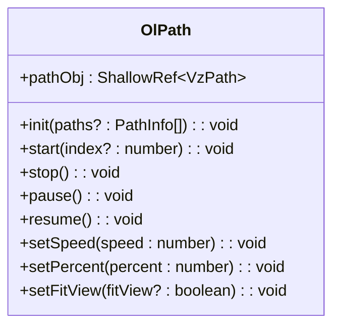
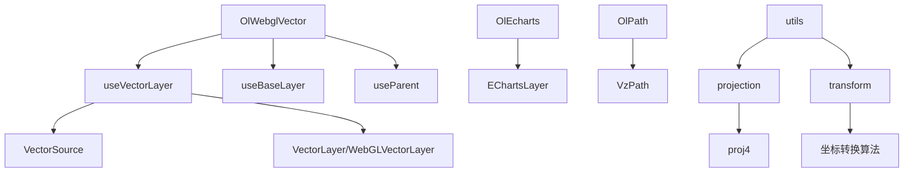

# 高级用法

<cite>
**本文档中引用的文件**  
- [vector.ts](file://src/packages/hooks/vector.ts#L1-L303)
- [WebGLVector/index.vue](file://src/packages/layers/WebGLVector/index.vue#L1-L105)
- [echarts/index.vue](file://src/packages/echarts/index.vue#L1-L64)
- [path/path.ts](file://src/packages/path/path.ts#L1-L189)
- [utils/projection.ts](file://src/packages/utils/projection.ts#L1-L164)
- [utils/transform.ts](file://src/packages/utils/transform.ts#L1-L459)
- [index.ts](file://src/packages/index.ts#L1-L9)
</cite>

## 目录
1. [简介](#简介)
2. [项目结构](#项目结构)
3. [核心组件](#核心组件)
4. [架构概览](#架构概览)
5. [详细组件分析](#详细组件分析)
6. [依赖分析](#依赖分析)
7. [性能优化建议](#性能优化建议)
8. [扩展组件库功能](#扩展组件库功能)
9. [结论](#结论)

## 简介
本文档旨在为高级开发者提供一份深入的进阶使用指南，涵盖基于 OpenLayers 的 `v3-ol-map` 项目中复杂功能的实现方法。内容包括大规模矢量数据渲染优化、地图与 ECharts 图表联动、轨迹回放动画控制、自定义 Hook 复用、坐标系动态切换、性能调优及组件库扩展等高级主题。

## 项目结构
项目采用模块化设计，主要功能组件集中于 `src/packages` 目录下，按功能划分为 `controls`、`layers`、`hooks`、`utils` 等子模块。`src/examples` 目录提供了各功能的使用示例。



**图源**
- [project_structure](file://#L1-L100)

## 核心组件
本项目的核心功能由多个可复用的 Vue 组件和 Hook 构成，主要包括：
- **OlWebglVector**: 基于 WebGL 的高性能矢量图层组件
- **OlEcharts**: 集成 ECharts 的地图可视化组件
- **OlPath**: 轨迹回放与动画控制组件
- **useVectorLayer**: 管理矢量图层逻辑的自定义 Hook
- **definedProjection**: 坐标系转换与投影定义工具

## 架构概览
系统采用分层架构，上层为 Vue 组件，中层为业务逻辑 Hook 和工具函数，底层依赖 OpenLayers 和第三方库（如 proj4、ECharts）。



**图源**
- [vector.ts](file://src/packages/hooks/vector.ts#L1-L303)
- [utils/projection.ts](file://src/packages/utils/projection.ts#L1-L164)
- [utils/transform.ts](file://src/packages/utils/transform.ts#L1-L459)

## 详细组件分析

### OlWebglVector 组件分析
`OlWebglVector` 组件用于处理大规模矢量数据的高性能渲染，通过 WebGL 技术显著提升渲染效率。

#### 组件实现流程图


**图源**
- [WebGLVector/index.vue](file://src/packages/layers/WebGLVector/index.vue#L1-L105)

**节源**
- [WebGLVector/index.vue](file://src/packages/layers/WebGLVector/index.vue#L1-L105)

### useVectorLayer Hook 分析
`useVectorLayer` 是一个核心自定义 Hook，封装了矢量图层的创建、事件绑定、交互管理等通用逻辑。

#### 类图


**图源**
- [vector.ts](file://src/packages/hooks/vector.ts#L1-L303)

**节源**
- [vector.ts](file://src/packages/hooks/vector.ts#L1-L303)

### OlEcharts 组件分析
`OlEcharts` 组件实现了地图与 ECharts 可视化图表的无缝集成，支持动态数据更新和图层控制。

#### 序列图


**图源**
- [echarts/index.vue](file://src/packages/echarts/index.vue#L1-L64)

**节源**
- [echarts/index.vue](file://src/packages/echarts/index.vue#L1-L64)

### OlPath 组件分析
`OlPath` 组件提供轨迹回放的完整控制功能，包括播放、暂停、速度调节等。

#### 功能方法调用图


**图源**
- [path/path.ts](file://src/packages/path/path.ts#L1-L189)

**节源**
- [path/path.ts](file://src/packages/path/path.ts#L1-L189)

## 依赖分析
项目依赖关系清晰，各模块职责分明。



**图源**
- [vector.ts](file://src/packages/hooks/vector.ts#L1-L303)
- [WebGLVector/index.vue](file://src/packages/layers/WebGLVector/index.vue#L1-L105)
- [echarts/index.vue](file://src/packages/echarts/index.vue#L1-L64)
- [path/path.ts](file://src/packages/path/path.ts#L1-L189)

**节源**
- [vector.ts](file://src/packages/hooks/vector.ts#L1-L303)
- [WebGLVector/index.vue](file://src/packages/layers/WebGLVector/index.vue#L1-L105)
- [echarts/index.vue](file://src/packages/echarts/index.vue#L1-L64)
- [path/path.ts](file://src/packages/path/path.ts#L1-L189)

## 性能优化建议

### 图层加载策略
- 对于大规模矢量数据，优先使用 `OlWebglVector` 组件。
- 合理设置 `source` 的 `url` 和 `formatOptions`，避免一次性加载过多数据。
- 利用 `featuresloadstart` 和 `featuresloadend` 事件实现加载状态提示。

### 事件监听器管理
- 在组件卸载时 (`onBeforeUnmount`) 调用 `dispose()` 方法清除所有事件监听。
- 避免在 `watch` 中创建未清理的监听器。

### 内存泄漏防范
- 使用 `shallowRef` 和 `ref` 时注意及时释放引用。
- 移除图层时确保调用 `map.removeLayer()`。
- 定期检查 `source` 中的要素数量，必要时进行清理。

### 自定义 Hook 复用
`useVectorLayer` 提供了 `initVectorLayer`、`initWebglLayer`、`dispose` 等方法，可在自定义组件中直接复用，避免重复实现图层管理逻辑。

```typescript
import useVectorLayer from "@/packages/hooks/vector.ts";

const { initVectorLayer, dispose } = useVectorLayer(props, emit);
// 在自定义组件中调用
const layer = await initVectorLayer();
// 组件销毁时调用
dispose();
```

## 扩展组件库功能

### 新增自定义图层
1. 在 `src/packages/layers` 下创建新目录，如 `customLayer`。
2. 创建 `index.vue` 和 `index.ts` 文件，实现组件逻辑。
3. 在 `src/packages/components.ts` 中注册组件。
4. 在 `src/packages/index.ts` 中导出组件。

### 坐标系转换高级应用
通过 `utils/projection.ts` 和 `utils/transform.ts` 可实现不同投影间的动态切换。

#### 支持的坐标系转换
```mermaid
graph LR
A[WGS84] --> |wgs84togcj02| B[GCJ-02]
A --> |wgs84tobd09| C[BD-09]
B --> |gcj02towgs84| A
B --> |gcj02tobd09| C
C --> |bd09towgs84| A
C --> |bd09togcj02| B
D[EPSG:3857] < --> |sphericalMercator| A
B < --> |mc2gcj02mc/gcj02mc2mc| D
C < --> |smerc2bmerc/bmerc2smerc| D
```

**节源**
- [utils/projection.ts](file://src/packages/utils/projection.ts#L1-L164)
- [utils/transform.ts](file://src/packages/utils/transform.ts#L1-L459)

## 结论
本文档详细介绍了 `v3-ol-map` 项目的高级用法，涵盖了从性能优化、组件集成到功能扩展的多个方面。通过深入理解 `useVectorLayer` 等自定义 Hook 的实现，开发者可以高效地复用底层逻辑，构建复杂地图应用。同时，项目良好的模块化设计为功能扩展提供了便利。